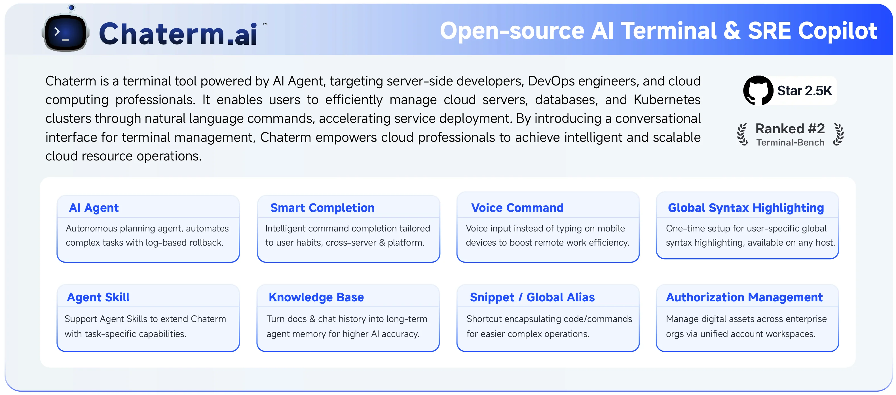
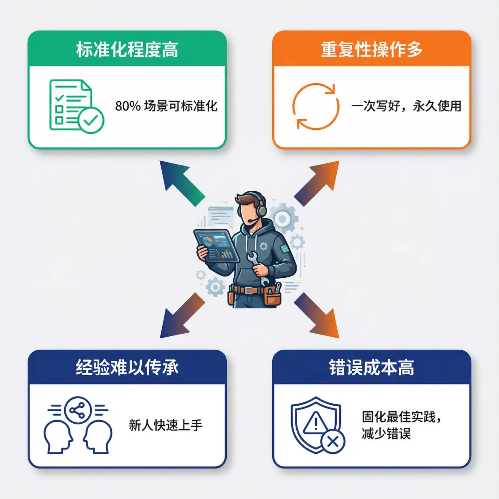
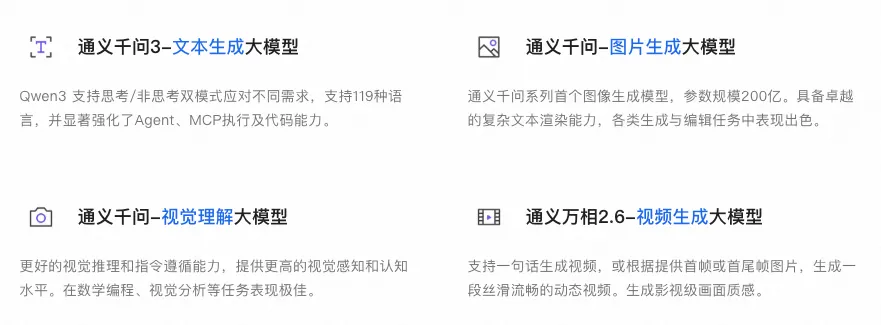
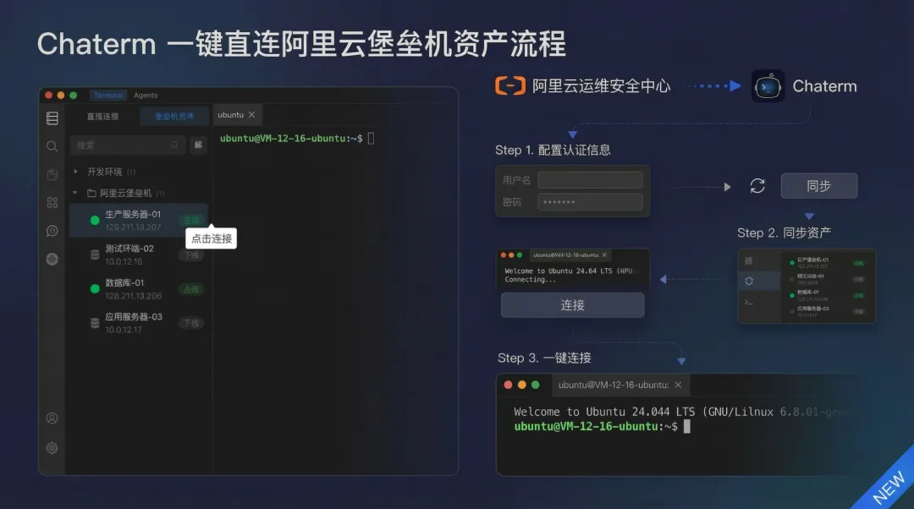

By integrating the Qwen model, Chaterm Agent Skills can package DevOps experience into executable skills, allowing the AI ​​assistant to automatically execute standard processes.

Leveraging the powerful semantic understanding, command generation, and agent task planning capabilities of the Qwen model, Chaterm provides users with a intelligent DevOps experience, enabling rapid troubleshooting and recovery based on past experience when failures occur.


---

## A real troubleshooting experience at 3 AM

Last Wednesday at 3 AM, I was woken up by an alert from my cloud monitoring system.

“【Confluence System】 http://192.168.0.1:8090/pages/#all-updates inaccessible!”

I groggily turned on my computer, connected to the cloud server via Chaterm, and started typing commands: netstat -nplut, top, systemctl status confluence, tail -f… Looking at the screen full of output, I rubbed my eyes and analyzed the problem, spending 20 minutes before finally finding the issue: the system load was too high in the early morning, causing an abnormal shutdown. The automatic backup gzip process was constantly consuming resources, causing the system service to repeatedly fail to restart.

【Inner monologue】If I had a special skill at the time, I probably could have fixed it in 3 minutes.


This is what we'll be discussing today: Skills. It's not just another AI concept, but a tool that truly helps you "package" your operational experience into actionable skills. Today, we'll start by explaining what Skills are, how they work, how to write a good Skill, and finally, we'll implement them in a real-world Alibaba Cloud-based operational scenario using Chaterm.

## Introduction to Chaterm Skills

### What is Chaterm?

Chaterm is an open-source AI-powered smart terminal and SSH client. It aims to reconstruct the traditional command-line experience through natural language interaction. Its goal is to become your intelligent DevOps co-pilot. Currently, it supports multiple environments including Mac, Windows, Linux, iOS, and Android. Chaterm aims to solve pain points in large-scale cloud operations such as batch operations, complex troubleshooting, and difficult security management. It directly embeds AI Agent capabilities into the terminal, creating a "conversational terminal management tool" to help server-side developers, DevOps engineers, and cloud computing professionals achieve intelligent and large-scale management of cloud resources.



### What are Skills?

The concept of **Skills** was first proposed by Anthropic. Simply put, it allows users to encapsulate their professional knowledge, operational procedures, and best practices into Skills, which AI can then automatically recognize and execute.

As this approach has matured and gained widespread acceptance within the community, Skills have become a standard extension specification supported by most AI coding and AI tools.

From Claude Code, Qoder, Cursor to Chaterm, many AI tools have implemented their own Skills systems based on this specification.

Chaterm is no exception. Based on this specification, it allows operations engineers to encapsulate daily checklists, application/database deployment processes, troubleshooting processes, performance optimization steps, etc., on Alibaba Cloud into Skills. In this way, the AI ​​assistant is no longer a **general assistant**, but a truly business-understanding **expert assistant**.

### Standard Structure of Skills

A Skill typically exists as a folder containing three main items:

A user manual (SKILL.md), an operation script, and reference materials.

| Content | Purpose |
| --- | --- | 
| SKILL.md | Clearly describes the process using natural language (including contextual information such as use cases, usage methods, usage steps, and precautions)
| Script | The specific script code that the Agent can execute

Reference | Referenced documents, referenced templates, and related contextual file information

You can think of a Skill as a packaged "skill book." It encapsulates the domain knowledge, operational procedures, tools, and best practices needed to complete a specific task. When AI faces a corresponding request, it can execute the task autonomously and methodically, like an experienced expert.

In short: If you compare an Agent to a brain with great potential, then Skills are like a series of reusable "skill manuals" for that brain. With them, an Agent can transform from a "jack-of-all-trades" into a "master" in a specific domain.

Each SKILL.md file follows the following format:

```
---
name: skill-name
description: Skill description
---

# Skill Title

## Workflow Step
[Detailed workflow and commands]
```

It's that simple. AI sees the skill and knows what to do.

### How do Chaterm Skills work?


In Chaterm, the Skills workflow is as follows:

**1. Loading Phase:** When Chaterm starts, it scans the Skills directory and reads all SKILL.md files.

**2. Injection Phase:** Enabled Skills are injected into the AI's system prompts, informing the AI ​​which skills are available.

**3. Recognition Phase:** When you submit a request, the AI ​​analyzes it to determine if a particular Skill is needed.

**4. Execution Phase:** If a match is found, the AI ​​calls the `use_skill` tool to obtain the complete Skill content and then executes it according to the workflow.

The entire process is transparent to the user. You only need to say "Check the Confluence system status on Alibaba Cloud ECS," and the AI ​​will automatically recognize and use the `Confluence-health-check` Skill.

### Why Chaterm Skills are Suitable for Operations and Maintenance Scenarios



Operations and maintenance (O&M) work has several characteristics that make Skills particularly valuable:

### 1. High Standardization

System health checks, application middleware/database service deployment, log analysis, and troubleshooting all have relatively standardized processes. A senior O&M operator's manual can often cover 80% of scenarios.

### 2. Many Repetitive Operations

You might need to check system status, deploy services, analyze logs, and troubleshoot problems every day. Describing the process again each time is too tedious. Skills allows you to "write it once, use it forever."

### 3. Difficulty in Passing on Experience

How can a newcomer, Li, quickly learn from the troubleshooting experience of veteran Wang? Writing documentation? Reading code? Neither is as effective as giving them a Skill and letting them follow the AI's instructions.

### 4. High Cost of Errors

Incorrect operations in the production environment can have serious consequences. Skills solidify best practices, reducing human error.


## Implementing a Chaterm Skill in an Alibaba Cloud Operations Scenario

No amount of theory is as effective as hands-on practice. Below, I'll guide you through the complete process from Skill creation to usage.

### Scenario: Creating a "Confluence System Anomaly Check" Skill

Assume you have deployed Confluence on an Alibaba Cloud ECS instance and frequently encounter system anomalies. You want to create a dedicated skill to check and handle these issues.

### Step 1: Planning the Skill

First, clarify:

**Name:** confluence-health-check;

**Description:** Check the Confluence system status, including service status, service ports, CPU, memory, disk, and logs;

### Step 2: Designing the Workflow of SKILL.md

```
---
name: confluence-health-check
description: Check the Confluence system status, including service status, service ports, CPU, memory, disk, and logs.
---

# Confluence System Check

## Workflow

### Step 1: Check Service Status and Port

# Switch to Root Privileges
sudo su -

# Service Status
systemctl status confluence
netstat -nplut | grep 8090
netstat -nplut | grep 8091


### Step Two: Check System Resources

# CPU and Memory
top -bn1 | head -20
free -h
uptime

# Memory usage

free -h

# Disk usage

df -h

### Step 3: Check processes and logs

# Process status
ps aux | grep confluence | grep -v grep


### Step 5: Check System Logs

View error messages in the system log and Confluence log:

# Confluence-related errors in the system log

journalctl -u confluence -p err --no-pager | tail -20

# Confluence application log

tail -50 /var/atlassian/application-data/confluence/log/atlassian-confluence.log 2>/dev/null

# Check recent errors

grep -i "error\|exception\|fail" /var/atlassian/application-data/confluence/log/*.log 2>/dev/null | tail -30

## After collecting data, analyze it according to the following criteria:

### 1. Service Status

- Normal status: `systemctl status` displays `active (running)`

- Abnormal status: If it displays `inactive`, `failed`, or... `dead`, requires immediate action.

### 2. Port Status

- Port 8090: Must be in `LISTEN` state.

- Port 8091: Must be in `LISTEN` state if HTTPS is enabled.

### 3. CPU Usage

- Average Load: Should be less than the number of CPU cores.

- CPU Utilization: Should be below 50% during normal operation.

### 4. Memory Usage

- Available Memory: Should be greater than 10% of total memory.

### 5. Disk Usage

- System Disk (/): Available space should be greater than 10%.

- Data Directory (/data): Available space should be greater than 10%.

### 6. Process Status

- Number of Processes: Typically, there should be multiple Java processes (main process + worker processes).

- Process Resource Usage: If a single process uses excessively high resources, there may be a memory leak or performance issue.

### 7. Log Analysis

- Error Log: Check for recurring error patterns

- Exception Information: Pay attention to critical exceptions such as `OutOfMemoryError` and `ConnectionException`.
```

### Step 3: Create a Skill in Chaterm

**Method A: Create via UI**

1. Open Chaterm

2. Click the settings icon on the left → Select “Skills”

3. Click the “Create Skill” button in the upper right corner

4. Fill out the form:

**Name:** confluence-health-check

**Description:** Checks the Confluence system status, including service status, service port, CPU, memory, and disk

**Content:** Copy the complete Skill content above (starting from ---)

5. Click “Create”


**Method B: Direct File Creation**

1. Click the "Open Folder" button on the Skills page.

2. Create a new folder named confluence-health-check.

3. Create a file named SKILL.md in this folder.

4. Copy the Skill content into the file.

5. Return to the Chaterm and click the "Reload" button.

### Step 4: Using the Skill

After creation, in the Chaterm dialog window, you can directly describe your requirements:

``Check the Confluence system status on Alibaba Cloud ECS```

AI will automatically recognize and use the confluence-health-check Skill, performing the operation according to the workflow.


### Step 5: Optimization and Iteration

After using it a few times, you might find:

- Some commands are too slow and need optimization.

- Some execution command items are missing and need to be added.

- The execution steps are incomplete and need adjustment.

At this point, you can:

1. Edit the Skill file (directly modify the file in the Skills directory).

2. Reload Skills.

3. Test again.

This is the advantage of Skills: it can be continuously optimized and gets better with use.

## Technical Implementation of Chaterm Skills

Here we'll look at the technical implementation of Chaterm.

**Chaterm Skills：**

Skills Storage Structure

In a Chapter, Skills are stored in the user data directory:

```
~/Library/Application Support/Chaterm/skills/
├── confluence-health-check/
│   └── SKILL.md
├── log-analyzer/
│   └── SKILL.md
└── mysql-deploy/
    ├── SKILL.md
    ├── scripts/
    │   └── db_init.py
    └── references/
        └── workflow.md
```

Each Skill is a folder, and it must contain a SKILL.md file. You can also put resource files there, such as scripts and templates.

**Skills Loading Mechanism**

When Chatem starts, it will:

1. Parse each SKILL.md file:

- Extract the frontmatter (name, description)

- Read the complete content

- Scan resource files

2. Register with the system:

- Store in an in-memory Map

- Load the enabled status from the database

- Inject system hints into the AI

**Skills Triggering Mechanism**

When the AI ​​receives your request:

**1. Analyze the task:** Understand what you want to do

**2. Match Skills:** See which of the available Skills' descriptions matches your needs

**3. Call tools:** If a match is found, call the `use_skill` tool, passing in the Skill name

**4. Retrieve content:** The system returns the complete Skill content (including workflow, analysis guidelines, etc.)

**5. Execute the process:** The AI ​​calls other tools (such as...) according to the steps in the Skill. The `execute_command` command completes the task.

The entire process is automatic; you don't need to manually specify which skill to use.

### Chaterm Integration with the Qwen Large-Scale Model:

The Qwen Large-Scale Model is a massively multi-scale language model independently developed by Alibaba Group. It boasts powerful language understanding, multi-language support, code generation, and logical reasoning capabilities. As the largest global open-source model family, it is widely used by hundreds of thousands of developers worldwide. Qwen has repeatedly ranked highly in authoritative international benchmarks such as Gartner, IDC, Forrester, and Omdia, achieving internationally advanced performance levels.

Currently, the Qwen Large-Scale Model and Chaterm have joined forces, integrating Qwen-Plus and Qwen-Turbo as recommendation models in Chaterm's Chat, Command, and Agent modes. The provided AI Agent capabilities are directly embedded into the terminal and combined with the powerful capabilities of the Qwen Large-Scale Model to create a "conversational terminal management tool." This helps server-side developers, DevOps engineers, and cloud computing professionals achieve intelligent and large-scale management of cloud resources, ushering in a new paradigm for cloud operations and maintenance.



Qwen recently launched its latest flagship inference model, Qwen3-Max-Thinking, which has significantly improved in factual knowledge, complex reasoning, instruction compliance, alignment with human preferences, and agent capabilities. In 19 authoritative benchmark tests, its performance rivals top models such as GPT-5.2-Thinking, Claude-Opus-4.5, and Gemini 3 Pro. Qwen3-Max-Thinking is now available on Alibaba Cloud's Bailian Platform and Qwen Chat for users to quickly experience.


## One-click direct connection to Alibaba Cloud Bastion Host assets via Chaterm


Beyond Agent Skills, Chaterm lets you say goodbye to traditional methods and achieve true "one-click connection".

The traditional method requires:

- Open the Alibaba Cloud console → Locate the asset → Copy the IP → Configure SSH → Enter the password → Connect...

Now, **Chaterm supports one-click connection**.



**Features:**

Refresh and synchronize the asset list for more efficient management.

Click on an asset to connect directly, no manual configuration required.

Automatic management of security credentials, eliminating repetitive input.

**Configuration Method:**

1. Configure Alibaba Cloud Bastion Host authentication information in Chaterm.

2. Refresh and synchronize the bastion host asset list.

3. Click on the asset to quickly connect.

**Chaterm makes Alibaba Cloud Bastion Host asset management simpler and more efficient.**


## How to Use Chaterm Skills Effectively

Writing skills doesn't start from scratch; there are many existing resources to refer to.

### Skills Standard Specification

Skills follow an open standard specification. Understanding the specification helps in writing more compatible skills.

**Core Requirements:**

Must include a frontmatter (name and description)

Support resource files (scripts, referenced documentation, etc.)

### Skills Community Resources

Anthropic Skills examples: https://github.com/anthropics/skills

Chaterm Skills examples for operations and maintenance scenarios: https://github.com/chaterm/terminal-skills

Many other repositories on GitHub provide Skills examples, which will not be listed here.

You can use these examples to:

1. Directly copy and use them in Chaterm

2. Modify them to your own version

3. Learn their structure and syntax

### Summary: What has Chaterm Agent Skills changed?


Let's return to the initial scene at 3 AM.

**Before:**

- Manually executing commands

- Finding problems from a pile of output

- Relying on personal experience

- Easily overlooking key checks

- Having to start over every time

**Now:**

- AI automates standard processes

- Generates structured diagnostic reports

- Follows team best practices

- Complete checks, no omissions

- Created once, used permanently

Skills isn't meant to replace operations engineers, but rather to make the AI ​​assistant truly your "expert assistant." It solidifies your experience, allowing the team to share it and enabling newcomers to quickly get started.

Most importantly, Skills is open and customizable. You can create your own Skills based on your needs. Start by solving real-world problems and gradually build your Skills library.

### Next Steps

1. **Try Chaterm:** If you haven't used it before, download and try it from https://chaterm.cn/download/

2. **View Examples:** View the official Skills examples on GitHub.

3. **Create Your First Skill:** Start with your most frequently used operations and write a simple skill.

4. **Share and Collaborate:** Share your Skills in the community or learn from others.

The value of Skills lies in their use. Start writing your first Skill now!!!

### Related Websites:


Chaterm Website: https://chaterm.ai

Aliyun Bailian: https://www.aliyun.com/product/bailian

Qwen Chat: https://chat.qwen.ai

GitHub Repository: https://github.com/chaterm/Chaterm

Skills Examples: https://github.com/chaterm/terminal-skills