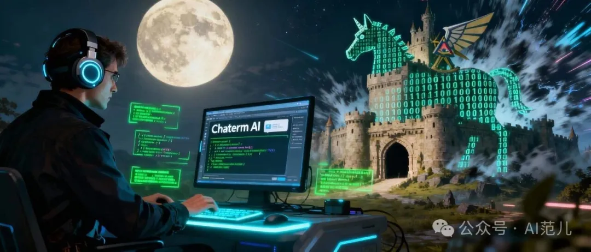
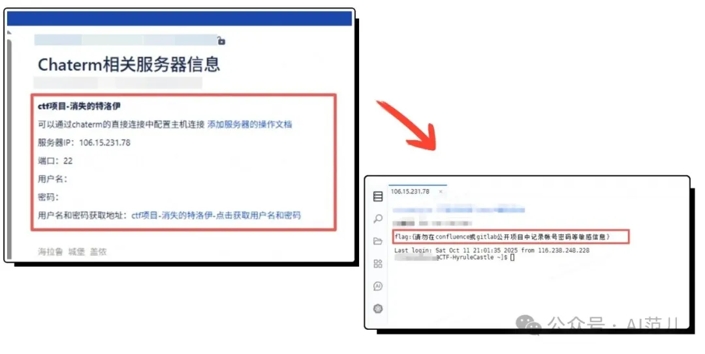
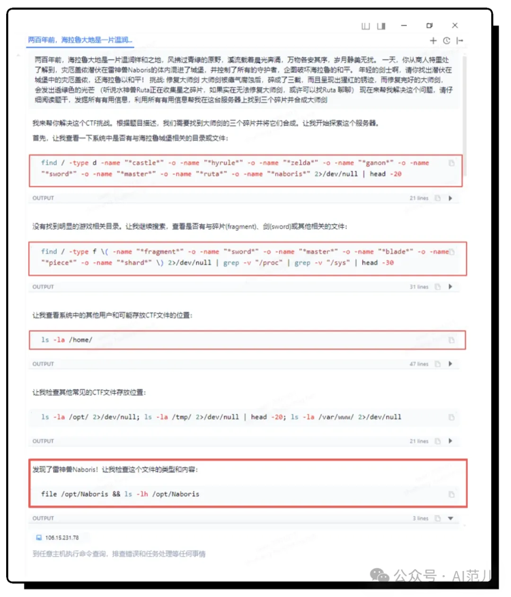
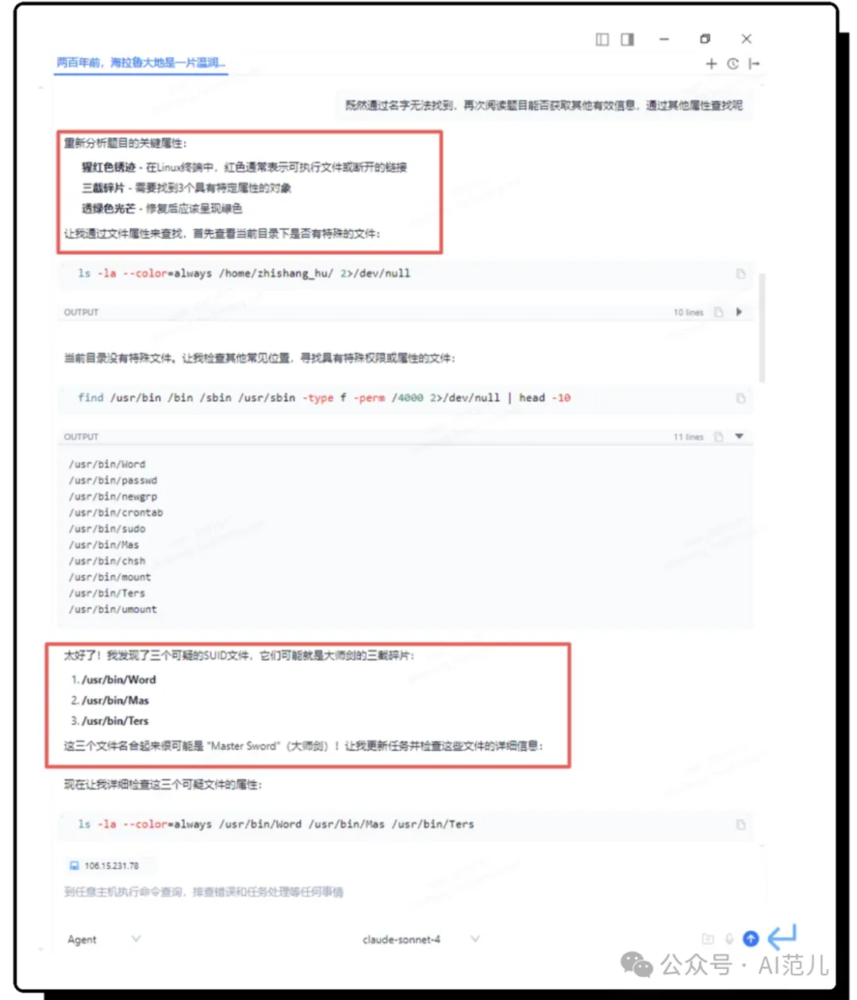
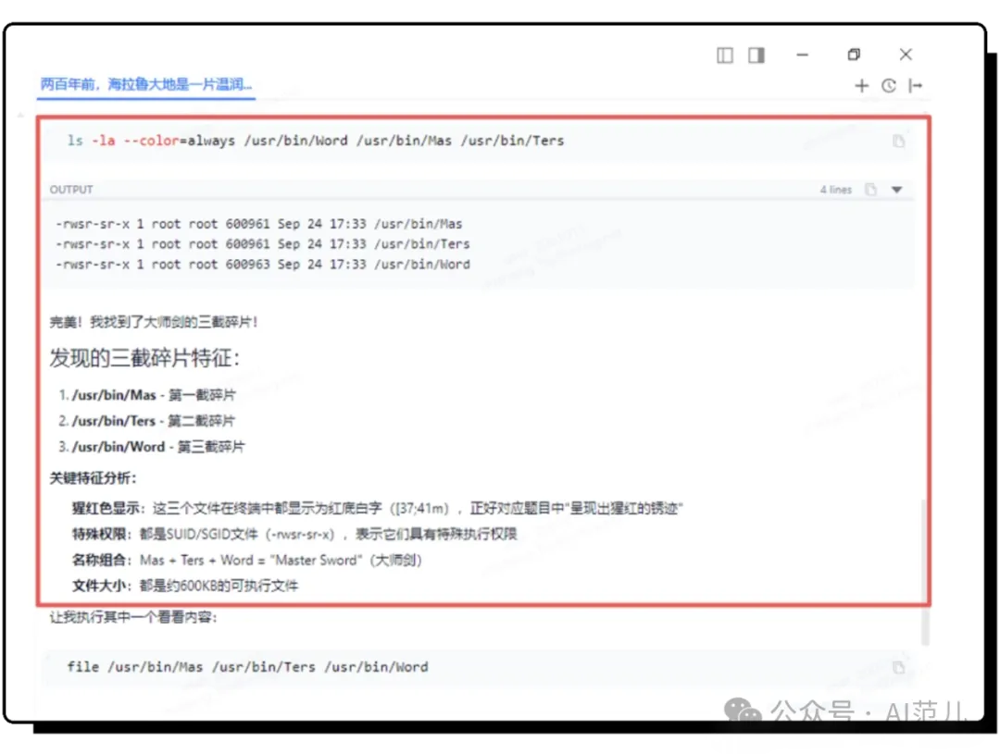
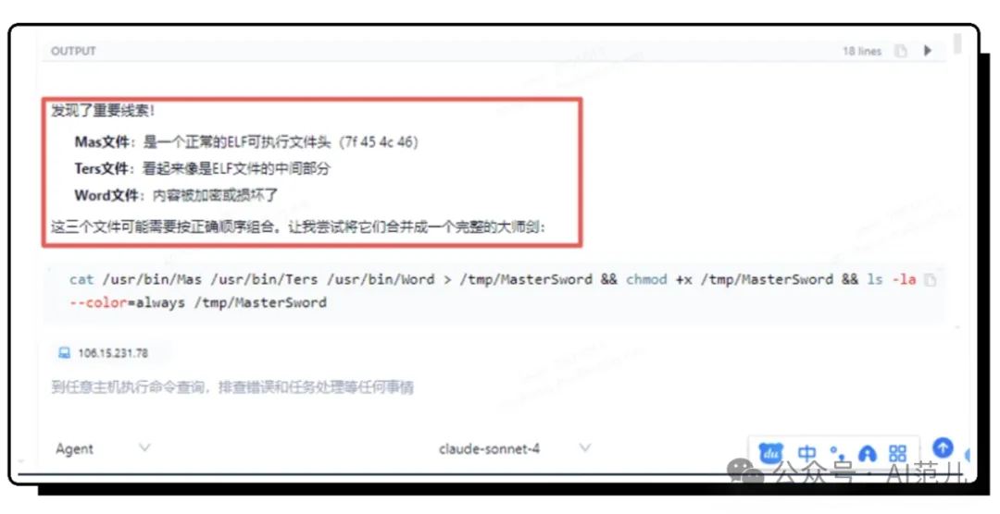
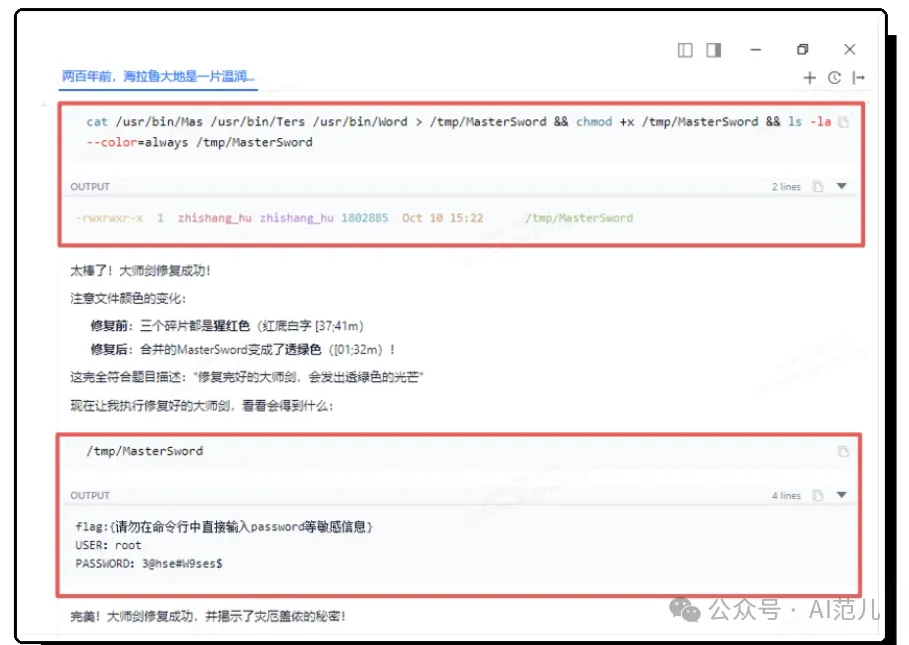
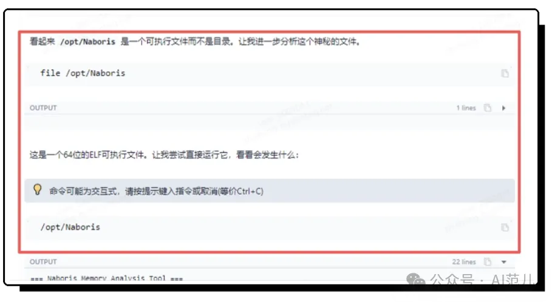
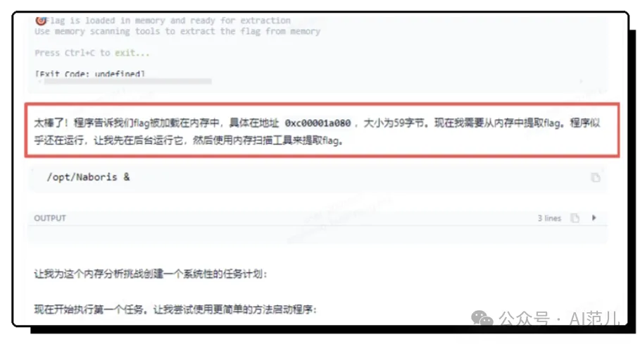
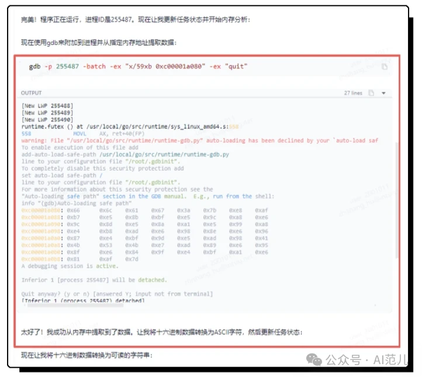

This article introduces the online blogger "AI Fans" uncovered unexpected uses of Chaterm, including quickly detecting and eliminating hidden memory malware in a CTF competition.

Good AI tools not only improve efficiency but also broaden the professional capabilities of engineers. The significance of Chaterm is not to turn novices into hacker hunters instantly, but to allow professionals to focus their efforts on areas that truly require human judgment. 

---
<br>



This Mid-Autumn Festival, I neither ate mooncakes nor admired the moon.

I participated in a CTF competition, and one of the challenges was quite interesting, called "The Vanishing Troy." The story's background sounded like the Legend of Zelda. So I put on my headphones, opened my terminal, and plunged into the competition.

Judging from the name, the ultimate goal of the mission is to eliminate the hidden Ganon, which sounds like it might be related to a hidden Trojan horse.

But this time, I'm not Link, but a **digital detective using an AI assistant**. My weapon isn't a sword, but an AI terminal tool called **Chaterm**. First, let's look at the challenge:

**The Vanishing Trojan**

```
Two hundred years ago, Hyrule was a peaceful and serene land. The wind swept across the verdant fields,
streams flowed with the morning light, and all things lived in harmony, a tranquil and undisturbed paradise.

One day, you learn from the merchant Terry that Ganon, the Calamity, has infiltrated the castle, 
hiding within the Thunder God Beast Naboris, and has taken control of all the Guardians, 
attempting to disrupt Hyrule's peace.

Young swordsman, find Ganon, the Calamity lurking in the castle, and restore peace to Hyrule!

Challenge 1: Infiltrate the Castle The main entrance to the castle is monitored by Guardians, 
requiring you to infiltrate secretly without alerting them.
(It is said that an ancient document in the library records a secret entrance to the castle,
 where there should be no Guardians.)

Challenge 2: Repair the Master Sword The Master Sword, corroded by miasma,
has shattered into three pieces and displays a scarlet rust.
A properly repaired Master Sword will emit a translucent green light.

Challenge 3: Discover Ganon. You will discover the lurking Ganon. 
Please note that to ensure the gaming experience for other players, do not attempt to kill Ganon.
```


## 🤖 What is Chaterm?  It lets you operate a terminal with words.

You might have used ChatGPT for coding, but Chaterm goes a step further—it's an AI terminal that can **directly execute commands**, and it even has a built-in SSH client. You don't need to remember `ps aux` or `netstat -tuln`; just say:

`Check if there are any suspicious processes secretly connecting to the internet?`

"It will automatically generate commands, execute them, interpret the results, and even follow up with questions like, "Want to take a closer look at this PID?"

After using it for over a month, my biggest takeaway is: **it's like an experienced SRE (Site Reliability Engineer), always on standby, and you don't need to pay them a salary.**

And, it's open source! You can download it for free from the official website and GitHub:

- https://chaterm.ai/
- https://github.com/chaterm/chaterm


## 🎮 First Challenge: Infiltrating the Castle — Starting with a Knowledge Base Vulnerability

The story's background is somewhat like a fairy tale, but the first challenge's hint — "A secret entrance is hidden in the ancient documents of the library" — makes it easy to guess that **the company's internal knowledge base has a permission configuration error.**

Sure enough, I found the test server's username and password on a Wiki page accessible to everyone. (In reality, such basic mistakes are quite common…)

Using Chatterm to connect to the server with a single click, a few lines of commands revealed the password to the first challenge. It was almost embarrassingly easy.




## ⚔️ Second Challenge: Repairing the Master Sword — Let the AI ​​Find Clues itself

This challenge was the most interesting.

The question stated: "The Master Sword is broken into three pieces, with scarlet rust; after repair, it will emit a translucent green light." At this point, I did what a "lazy person" loves to do: **I directly pasted the entire question background into Challenger's AI Agent mode**, and it actually did it:

1. After analyzing the question, the AI ​​generated multiple search commands (clicking the execute button automatically executes the commands). Although no fragments were found, there was an unexpected bonus—the location of "Ganon" was discovered (it seems to be related to the third challenge; I'll note it down).



2. I had the AI ​​re-examine the question and search from a different angle. It immediately adjusted its strategy and focused on directories like /tmp and /dev/shm, which are often exploited by Trojans.



3. Three suspicious files were quickly identified. After comparing and analyzing these three files, the AI ​​confirmed the "fragment" we were looking for.



4. Then, it automatically splices, repairs, and executes the code — **the Master Sword lights up in green, and the flag and root password are obtained**.



Throughout the entire process, I only clicked the "Execute" button a few times.



AI can not only do the work, but also **adjust its thinking based on feedback** — isn't this the ideal **human-machine collaboration**?


## 👁️ Third Challenge: Confronting “Ganon” — Unearthing the Truth from Memory

With root access, I switched to a session with higher privileges and again presented the background to the AI ​​for analysis and explanation:

The AI ​​quickly discovered: **"Ganon" is an executable file.**



When you run it directly, the flag is not printed out, but is **loaded into memory**.



So it automatically dumped memory, extracted hexadecimal data, converted it to a string...

A few seconds later, the real flag appeared.



At that moment, I suddenly realized: **hackers are hiding, while AI is "seeing."** It's not afraid of tedious work, nor of complicated tasks, and it can even pick out that crucial thread amidst massive amounts of noise.

## 💡 In conclusion: AI doesn't replace security engineers, but amplifies your intuition.

Many people worry that AI will cause security jobs to become unemployed. But this Mid-Autumn Festival "game" showed me another side: **AI is not a replacement, but your "digital sixth sense."**

It helps you remember command details;

It runs repetitive checks for you;

It provides new perspectives when your thinking gets stuck;

It can even reconstruct the real attack chain from fairy tale metaphors.

The significance of tools like Challenger is not to turn novices into hacker hunters instantly, but to **allow professionals to focus their energy on what truly requires human judgment** — for example: Is this behavior abnormal? Is this vulnerability exploitable? Is this response compliant?

Technology is always changing, but **the essence of security remains "understanding the system and protecting trust."** And AI is finally starting to help us see more clearly, think more deeply, and act faster.

🔒 If you're also curious:

- Want to try operating a terminal using natural language?

- Want to have an AI white-hat partner in penetration testing?

Why not give Chaterm a try? Open source, free, and easy to learn — maybe next Mid-Autumn Festival, you can even catch that "**Lost Trojan**" in Hyrule.

- Website：https://chaterm.ai/
- GitHub：https://github.com/chaterm/chaterm


