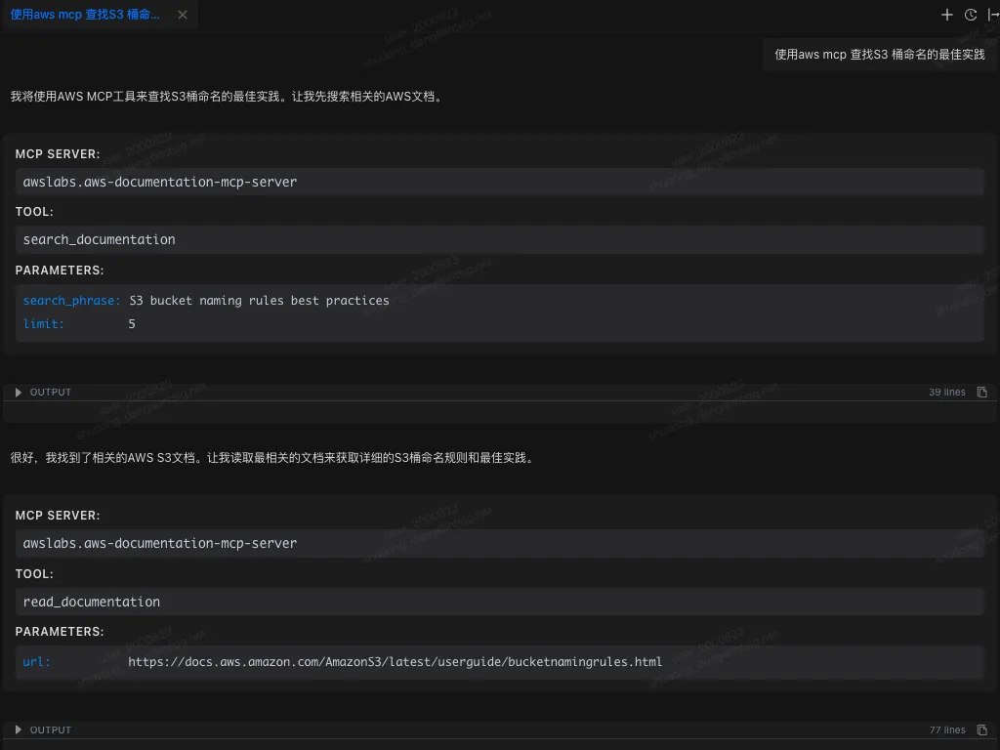
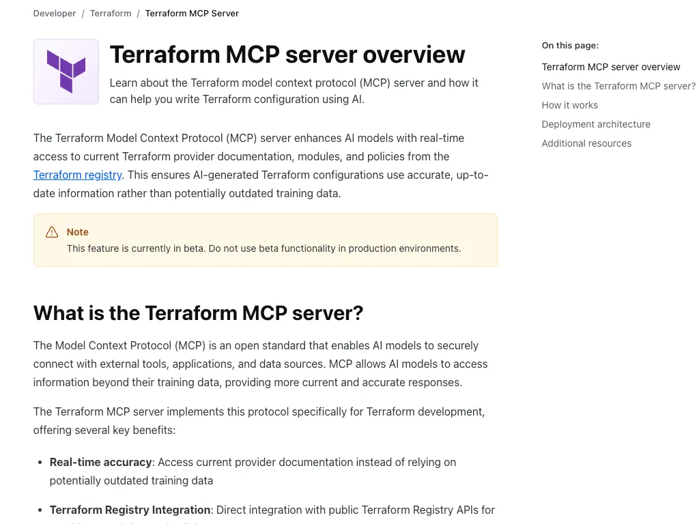
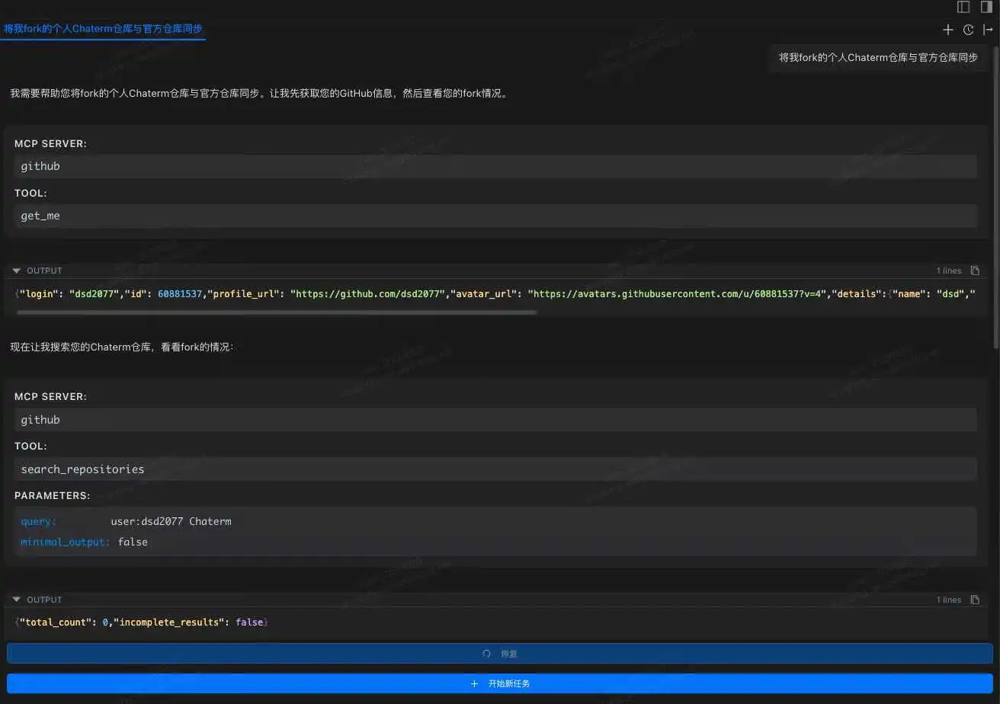

This article selects 10 representative MCP servers, spanning core scenarios such as infrastructure and cloud resource management, containerization and orchestration operation and maintenance, software development and CI/CD, observability and fault management, and data layer access and operation.

This enables engineers to understand and execute tasks through natural language, thereby building higher-level intelligent workflows and achieving a unified work experience centered around the Terminal.

---

### Introduction

The daily work of DevOps engineers often spans the entire software lifecycle, from code writing to system operation and maintenance. Whether it's coding and building during the development phase, or subsequent release, deployment, and operation and maintenance, it requires constant switching between different systems and tools.

In practice, this disconnect is particularly pronounced: continuous integration and delivery typically rely on tools like GitHub and Jenkins; infrastructure and resource management are handled on cloud platforms such as AWS and Alibaba Cloud; service deployment and orchestration are handled by Docker and Kubernetes; and in the operations and maintenance phase, systems like Grafana and Sentry are needed for monitoring and issue tracking. The tools themselves aren't complex, but the frequent context switching continuously consumes engineers' time and attention.

Behind this entire process, the Terminal remains the core and most frequently used entry point for DevOps engineers. How to further simplify workflows and reduce tool switching costs around the Terminal has become a key issue in improving DevOps efficiency.

The emergence of MCP (Model Context Protocol) offers a new approach to this problem. Through the MCP Server, AI can access different platforms and tools, unifying operational capabilities previously scattered across various systems into a single context. Leveraging AI's understanding and execution capabilities, engineers have the opportunity to directly complete a series of operations such as building, deployment, and operations within the Terminal, achieving a unified work experience centered around the Terminal.

In this direction, Chatterm, as an open-source AI Terminal tool, has taken the lead in supporting the MCP protocol, providing a practical case study for the "AI + Terminal" DevOps work model.

### What is an MCP Server?


**MCP** is an open-source protocol standard designed to provide a unified way for AI applications to connect to external systems. Through MCP, AI applications such as Claude or ChatGPT can securely and standardizedly access various data sources (such as local files and databases), tools (such as search engines and calculators), and workflows (such as customized suggestion chains), thereby expanding their information acquisition and task execution capabilities.

It can be compared to the **"USB-C port" of the AI ​​field**: Just as USB-C provides a universal physical connection standard for electronic devices, MCP defines a universal communication protocol and data exchange specification for the interaction between AI applications and external services. This positioning makes it a key infrastructure for building modular, scalable AI agents.

> The above is the core definition of MCP. For technical details regarding the protocol, it is recommended to consult its official documentation (https://modelcontextprotocol.io/docs/getting-started/intro) for a deeper understanding.

### How to Choose the Best MCP Server

Thousands of MCP server implementations exist in community repositories such as "[Awesome MCP Servers](https://github.com/punkpeye/awesome-mcp-servers)". To select the server best suited to your needs from numerous options, it is recommended to evaluate it based on the following core criteria:

- **Scenario Suitability**: Assess whether the server is built around services you use daily or plan to integrate. Can its tools automate the most common or time-consuming tasks in your work? The core value of an MCP server lies in its ability to automate specific business processes.

- **Core Tools**: Carefully review the list of tools provided by the server. Different implementations have different focuses; ensure that its tools cover your key needs.

- **Implementation Status**: Prioritize MCP servers officially released and maintained by the service provider, as this typically indicates better stability, security, and continuous updates. If no official version exists, consider the popularity (e.g., number of GitHub stars), activity level, and documentation completeness of community implementations.

- **Communication Protocol**: MCP supports two main [communication methods](https://modelcontextprotocol.io/docs/learn/architecture#transport-layer): - **Stdio Transport**: Suitable for locally deployed servers, inter-process communication, low latency. - **HTTP Transport**: Suitable for remote servers, generally simpler to configure, requires no complex local environment, and does not consume local computing resources.

Choose based on your deployment environment (local or cloud) and network conditions. Generally, if an HTTP implementation exists, HTTP is preferred.

### Top 10 MCP Servers Recommended to Improve DevOps/SRE Workflows

To improve the efficiency and focus of DevOps/SRE engineers in their work, this article selects 10 representative MCP servers as the analysis objects. These tools have a solid foundation in terms of stability, functional maturity, and real-world application scenarios.

In terms of capability coverage, they span multiple key aspects of the DevOps/SRE workflow, including Infrastructure as Code (IaC) and cloud resource management, containerization and orchestration platform operation and maintenance, software development and CI/CD processes, system observability and fault management, and data layer access and manipulation, essentially covering the core scenarios of daily work.

Technically, these MCP servers attempt to expose operational capabilities that originally relied on complex command lines or graphical interfaces to AI in the form of structured interfaces, enabling AI to understand and execute tasks through natural language, thereby building a higher level of intelligent workflow.

The following sections will introduce the core functions, applicable scenarios, and respective advantages and limitations of these ten MCP servers one by one.

It should be noted that all of the above MCP servers can be imported and used in the open-source AI Terminal tool Chaterm. Corresponding configuration examples are provided at the end of the article for readers to experience.

#### Infrastructure and Cloud Services

**1. AWS Platform MCP Servers**



AWS officially provides a **complete set** of dedicated MCP servers, allowing AI assistants to directly access **AWS documentation**, **best practices**, and **cloud resources**. Through these servers, AI applications can perform common cloud infrastructure management tasks, such as manipulating resources using the AWS CLI or Cloud Control API, managing EC2 instances, ECS/EKS container clusters, or querying services like IAM, RDS, and S3. The AWS website states that MCP servers significantly improve the quality and accuracy of model output because the model can obtain the latest documentation and service information within the context. Furthermore, AWS MCP servers encapsulate common infrastructure-as-code (such as CDK and Terraform) processes into AI-callable tools, increasing automation.

- **Features and Applicable Scenarios:** AWS MCP servers include document query services, infrastructure management services, and security scanning services, enabling AI to perform operations such as AWS resource creation, configuration, and auditing in natural language. For example, you can query the latest AWS API reference, generate Cloud Formation templates, or monitor EKS cluster status.

- **Advantages:** Provides real-time alignment with official AWS documentation, preventing models from responding with outdated information; a unified interface supports multiple AWS services (EC2, S3, Lambda, RDS, etc.), significantly reducing integration complexity; built-in best practices and security checks improve code quality and compliance.

- **Communication Protocol:** Different MCP servers have different connection methods.

- **Community/Commercial Support:** Implemented by AWS (open source)

- **Official Documentation/Project Address:** [https://awslabs.github.io/mcp/installation](https://awslabs.github.io/mcp/installation) [https://github.com/awslabs/mcp](https://github.com/awslabs/mcp)

Besides AWS, other cloud service providers also offer corresponding MCP services.

- Azure: [https://github.com/microsoft/azure-devops-mcp](https://github.com/microsoft/azure-devops-mcp)

- Aliyun: [https://github.com/aliyun/alibaba-cloud-ops-mcp-server](https://github.com/aliyun/alibaba-cloud-ops-mcp-server)

- Cloudflare: [https://github.com/cloudflare/mcp-server-cloudflare](https://github.com/cloudflare/mcp-server-cloudflare)

**2. HashiCorp Terraform MCP Server**



The HashiCorp Terraform MCP Server introduces MCP support for Terraform configuration management. This server allows AI models to access provider documentation, modules, and policies in the Terraform Registry in real time, thereby generating accurate Terraform configurations instead of relying on outdated training data. The HashiCorp documentation states that the Terraform MCP server integrates with the public Registry API, supporting **finding module inputs and outputs**, **referencing Sentinel policies**, and **managing Terraform Cloud (HCP/TFE) organizations and workspaces**.

- **Features and Applications:** The AI ​​can query the latest Terraform provider documentation, sample code, and policy rules through the MCP server; it can also automatically create, update, or delete workspaces, variables, and tags in the Terraform Cloud environment. This is particularly useful for writing and reviewing infrastructure code, where the AI ​​assistant can generate best-practice-compliant configuration snippets or execution plan analyses.

- **Advantages:** Eliminates knowledge gaps caused by Terraform version updates, ensuring that generated IaC content is always synchronized with the latest Registry. Supports access to private Registries and team environments (HCP/TFE), suitable for teams of all sizes.

- **Communication Protocol:** HTTP + STDIO

- **Community/Commercial Support:** Officially maintained by HashiCorp (open source)

- **Official Documentation/Project Address:** [https://developer.hashicorp.com/terraform/mcp-server/deploy](https://developer.hashicorp.com/terraform/mcp-server/deploy) [https://github.com/hashicorp/terraform-mcp-server](https://github.com/hashicorp/terraform-mcp-server)

**3. Pulumi Platform MCP Server**


Pulumi has launched the MCP server, enabling AI assistants to access resources in the Pulumi Cloud and delegate tasks to Pulumi Neo for automated execution. Pulumi documentation states that the MCP server allows AI to **query stacks and their resources within a Pulumi organization**, **search cloud resources across organizations**, and **generate and manage infrastructure code using information from the Pulumi Registry**.

- **Features and Applications:** Through the MCP interface, AI can **retrieve Pulumi Stack status, resource lists, policy compliance reports**, etc.; it can also manage organization members, modify infrastructure configurations, and trigger automated deployments (Pulumi Neo). This makes infrastructure development more conversational and traceable. For example, it can ask, "List all AWS EC2 instances in my organization" or "Generate GCP virtual machine configurations based on my needs."

- **Advantages:** Supports multi-language IaC (TypeScript, Python, etc.), and AI can directly generate cross-cloud Pulumi code. Integrates Pulumi's best practices and policy checks, improving code quality and avoiding manual deployment errors.

- **Communication Protocol**: HTTP

- **Community/Commercial Support:** Implemented and maintained by the official Pulumi team (not open source)

- **Official Documentation/Project Address**: [https://www.pulumi.com/docs/iac/guides/ai-integration/mcp-server/](https://www.pulumi.com/docs/iac/guides/ai-integration/mcp-server/)

**4. Kubernetes MCP Server**


The Kubernetes MCP server is developed and implemented by the community, allowing users to manage and monitor the Kubernetes environment using natural language commands. It supports core `kubectl` operations, such as creating/deleting Pods, services, and Deployments, and diagnosing cluster health. It also has built-in secure connections and RBAC authentication mechanisms to ensure that AI access complies with Kubernetes permission policies.

- **Functions and Applicable Scenarios:** AI can query resource status (such as pod lists and node metrics), deploy new services or extend existing deployments, and even perform complex troubleshooting. Example scenarios include "checking which pods are abnormal within a namespace" and "helping me rollback a Deployment."

- **Advantages:** Transforms cumbersome Kubernetes command-line operations into intuitive dialogues, lowering the barrier to managing complex clusters. It can monitor cluster health in real time and promptly identify problems.

- **Communication Protocol:** stdio

- **Community/Commercial Support:** Developed by the community (open source)

- **Official Documentation/Project Address:** [**https://github.com/Flux159/mcp-server-kubernetes**](https://github.com/Flux159/mcp-server-kubernetes)

**5. Docker MCP Server**

The Docker Hub MCP server exposes the massive image directory of Docker Hub to the LLM via the MCP protocol, helping developers discover, evaluate, and manage container images in a natural language manner. Built on the Docker ecosystem, it's designed specifically for intelligent container management scenarios.

- **Features and Applicable Scenarios**: Provides one-click installation and configuration. LLM can query required images via natural language (no need to remember complex tags or repository names) and obtain image details. It can also perform repository management tasks through an intelligent assistant, such as listing repositories under a personal namespace, viewing image statistics, searching image content, and creating or updating repositories via natural language. It's ideal for scenarios requiring rapid locating and management of container images in AI-assisted development workflows.

- **Advantages**: Officially launched services are integrated into the Docker toolchain, solving the MCP server environment dependency problem. One-click deployment is achieved through containerization, eliminating the need for manual environment configuration by users. The MCP Catalog simplifies the setup process and reduces integration costs.

- **Compatibility**: HTTP + stdio

- **Community/Commercial Support**: Implemented and maintained by the official Docker team (open source). - **Official Documentation/Project Address**: [https://github.com/docker/hub-mcp/tree/main](https://github.com/docker/hub-mcp/tree/main)

#### Code and CI/CD

**6. GitHub Platform MCP Server**



GitHub officially launched the MCP server, which directly connects AI applications to the GitHub platform, enabling AI to **read repository files**, **manage Issues and Pull Requests**, **analyze code quality**, **automate workflows**, etc. This server can be hosted on GitHub (remote MCP) or run locally, supporting one-click access from clients such as VS Code (Copilot Agent), Claude Desktop, and Cursor. GitHub documentation states that through MCP, AI assistants can browse repository structures, search historical commits, perform code reviews, monitor the GitHub Actions pipeline, and obtain CI/CD feedback.

- **Functionality and Applicable Scenarios:** Through the MCP server, the AI ​​assistant can perform common version control and collaboration tasks, such as creating/updating issues, merging branches, releasing versions, and reviewing code security warnings. For example, the AI ​​can ask in VS Code, "Which PRs are currently waiting to be merged?", and the MCP server will return a list of PRs and automatically trigger the merge operation.

- **Advantages:** Reduces context switching between the IDE and GitHub interface, allowing developers to obtain the latest repository status and historical information through natural language. The GitHub MCP server synchronizes data with the official platform in real time, ensuring the timeliness and accuracy of information.

- **Communication Protocol:** HTTP + stdio

- **Community/Commercial Support:** Developed and maintained by GitHub (open source)

- **Official Documentation/Project Address:** [https://github.com/github/github-mcp-server](https://github.com/github/github-mcp-server)

GitLab also provides a corresponding MCP service, which will not be elaborated further.

- GitLab: [https://docs.gitlab.com/user/gitlab_duo/model_context_protocol/mcp_server/](https://docs.gitlab.com/user/gitlab_duo/model_context_protocol/mcp_server/)

**7. Jenkins Platform MCP Server**


The Jenkins community has released the MCP Server plugin, enabling Jenkins to function as an MCP server. After installing this plugin, Jenkins automatically exposes its jobs, builds, logs, and other functions as MCP tools to the AI ​​assistant. The Jenkins plugin page states: "The MCP Server plugin implements the MCP protocol server, enabling Jenkins to act as an MCP server, providing context, tools, and functionality to AI clients." This means that AI can query build status, trigger build tasks, or obtain test results using natural language, and all operations are executed and reported by Jenkins.

- **Functionality and Applicable Scenarios:** This plugin provides core Jenkins functionalities (such as job triggering, build viewing, and log retrieval) to the AI ​​in the form of an MCP tool. The AI ​​assistant can ask questions like "What caused the latest build failure?" or "Start a nighttime pipeline," and Jenkins will execute the corresponding actions and return the results.

- **Advantages:** No additional dedicated server deployment is required; simply install the plugin on your existing Jenkins instance. It fully leverages existing Jenkins pipeline configurations and credential management, achieving seamless integration with AI.

- **Compatibility:** The plugin is compatible with Jenkins versions 2.479 and above.

- **Communication Protocol:** HTTP + STDIO

- **Community/Commercial Support:** Developed and maintained by Jenkins (open source)

- **Official Documentation/Project Address:** [https://plugins.jenkins.io/mcp-server/](https://plugins.jenkins.io/mcp-server/)

#### Observability

8. Grafana MCP Server


The Grafana MCP Server is an official MCP service from Grafana, allowing LLMs to access Grafana dashboards and its ecosystem via the MCP protocol. It enables AI to query and manage visualization resources in Grafana using natural language.

- **Features and Applicable Scenarios:** Supports searching, retrieving, and modifying Grafana dashboards and data sources. For example, you can search and retrieve dashboard summaries or detailed information, create/update dashboards, list and retrieve data sources (supporting Prometheus, Loki, etc.), execute Prometheus/Loki queries to retrieve metrics and logs, and manage Grafana alerting rules, events, and Sift log investigations. It is suitable for scenarios that require integrating monitoring data and visualization resources into intelligent operations or automated analysis processes.

- **Advantages**: Officially maintained by Grafana, it offers broad functionality, covering most common scenarios such as dashboard management, querying, and data source operations, and is licensed under the Apache 2.0 open-source license. The official implementation guarantees stability and continuous updates, allowing full utilization of the existing Grafana platform features.

- **Compatibility**: Grafana 9.0 and above support all features; some data source-related operations may be unavailable in versions prior to 9.0. Compatible with all Grafana instances configured with the management API.

- **Communication Protocol:** HTTP + STDIO

- **Community/Commercial Support:** Implemented by the Grafana official website (open source)

- **Official Documentation/Project Address:** [https://github.com/grafana/mcp-grafana](https://github.com/grafana/mcp-grafana)

9. **Sentry MCP Server**


Sentry's MCP server provides access systems with complete Sentry issue and error contexts via the Model Context Protocol (MCP). It allows AI assistants and development tools to securely access Sentry data, suitable for scenarios integrating Sentry error monitoring and debugging information into intelligent workflows.

- **Features and Applicable Scenarios:** Supports querying Sentry events via natural language, such as accessing errors and issues in Sentry, searching for errors in specific files, querying project and organization information, listing/creating project DSNs, and performing autofixes and obtaining status, etc. Suitable for scenarios requiring the integration of Sentry error logs and crash reporting context into AI-assisted development or automated operations processes.

- **Advantages:** Officially hosted remote service, no self-hosting required. Tools and features are primarily geared towards developer workflows and debugging needs (such as error analysis in coding assistants), optimized for use with code assistance tools (such as Cursor and Claude Code).

- **Communication Protocol:** HTTP + stdio

- **Community/Commercial Support:** Maintained by Sentry (open source)

- **Official Documentation/Project Address:** [https://github.com/getsentry/sentry-mcp](https://github.com/getsentry/sentry-mcp)

#### Database

10. MongoDB MCP Server

The MongoDB MCP server (public beta) officially provided by MongoDB allows connecting MongoDB databases (Atlas, Community, or Enterprise) to AI tools via the MCP protocol. It enables AI to query document data and perform administrative operations using natural language.

- **Features and Applicable Scenarios**: Supports data exploration (e.g., "displaying the schema of a users collection" or "finding active users"), database management (e.g., creating read-only users, listing network access rules), and context-aware query generation (AI describes the required data and automatically generates MongoDB queries and application code). Suitable for scenarios where intelligent assistants complete database queries, document analysis, and database maintenance tasks.

- **Advantages**: Officially released and integrated with the MongoDB ecosystem, supports Atlas and local deployments, and provides natively supported MCP interfaces. Integrated into AI development environments such as Windsurf, allowing developers to access MongoDB data without leaving their IDE.

- **Communication Protocol**: HTTP + stdio

- **Community/Commercial Support**: Implemented and maintained by MongoDB (open source)

- **Official Documentation/Project Address**: [https://www.mongodb.com/company/blog/announcing-mongodb-mcp-server](https://www.mongodb.com/company/blog/announcing-mongodb-mcp-server) [https://github.com/mongodb-js/mongodb-mcp-server](https://github.com/mongodb-js/mongodb-mcp-server)

Similarly, you can find MCP servers for other databases such as MySQL and Redis.

### Best Practices

#### Managing the Number of Tools

In actual use of MCP, managing the number of tools is often overlooked but crucial. Most of the time, we add an MCP service to an application for a specific task and use it. However, when starting a new dialogue after that task is complete, we easily forget that the previously added MCP tools are still running. This results in these tools, though never used throughout the new dialogue task, occupying valuable context space and causing unnecessary waste of resources.

A better approach is to cultivate the habit of proactively checking whether currently enabled MCP services are truly needed before starting a new dialogue task, and promptly disabling those services unrelated to the new task. This not only frees up context space but also allows the model's attention to focus more on truly relevant tools, improving overall response quality and efficiency.

Furthermore, some more sophisticated applications offer on/off functionality for individual tools, allowing users to selectively disable unnecessary tools without shutting down the entire MCP service. It is recommended to use this feature appropriately to make context management more precise and efficient.

#### Progressive Disclosure

When enabling numerous MCP services within a single context, developers often encounter two thorny issues: (1) excessive context space consumption and (2) tool forgetting in long conversations. These are unavoidable bottlenecks in the "load all tools at once" MCP usage model. While there is currently no unified standardized solution to address these issues, several promising technical paths have emerged: whether it's Claude's recently launched Skills or VS Code Copilot's ToolSets, their core concept is: **progressively disclosing tool details**, rather than loading all tool information at once. With continued community exploration and gradual improvement of standards, we have reason to expect a more efficient and intelligent MCP ecosystem.

### Common MCP Platforms

| Platform | Number of Platforms Included (as of September 2025) | Main Features | Ease of Use | Recommendation Index / Suitable Users |
| ----------------------- | ----------------------- | --------------------------------------------------------------------------------------------------------------------------------------------------------------------------------------- | ------------------------------------------ | ------------------------------------------------------------- |
| **mcp.so** | 16436 | The world's largest MCP library; supports keyword search; finely categorized MCPs; supports Chinese; provides direct copy installation commands; supports user-submitted custom MCP servers, with over 1000 submissions; detailed documentation introducing MCPs; comment and discussion function; | Medium difficulty, requires manual deployment of MCPs, but has a clear interface and supports Chinese | ⭐⭐⭐⭐⭐ Highly recommended; suitable for users who need a large number of MCPs, clear categorization, and Chinese-friendly interface |
| **MCPHub** | 26181 | Supports keyword search for MCPs; finely categorized MCPs; supports user-submitted custom MCPs server; provides direct copy installation commands; has detailed documentation introducing MCP; has comment and communication functions; | Low, approximately 5000 MCPs are already hosted online | ⭐⭐⭐⭐ Suitable for developers and new users who want to quickly experience MCP |
| **PulseMCP** | 5966 | Dynamically updated; includes MCP Servers + Clients; provides the latest MCP-related news push and detailed test cases; supports user submission of custom MCP servers; | Medium, intuitive interface, direct link to GitHub repository | ⭐⭐⭐⭐ Suitable for those who follow the latest MCP ecosystem developments and want to see Client/trend reports |
| **Smithery** | 6374 | Supports keyword search for MCPs; MCP categorization is relatively simple but provides direct copy installation commands; indicates client support status; provides automatic installation commands for some clients; provides a basic introduction to MCP; simple interface | Low, beginner-friendly, but some services are unstable | ⭐⭐⭐ Suitable for beginners and developers who want to quickly experience MCP |
| **Awesome MCP Servers** | 1968 | A curated selection of small and high-quality MCPs; clearly categorized; focuses on MCP quality; provides a basic introduction to MCPs; supports user-submitted custom MCP servers; | Medium difficulty, simple interface, requires some development experience | ⭐⭐⭐ Suitable for those who want to quickly find reliable MCPs and avoid information overload |

### Using the above MCP servers in Chaterm

1. Open the "Settings" page in Chaterm.

2. Locate the "Tools & MCP" tab on the left, click "Add Server," and the system will automatically open the mcp_setting.json file.

3. Add the following configuration to the file, adjusting the corresponding parameters as needed.

4. After saving, Chaterm will automatically read and attempt to connect to the server.

```plain
{
  "mcpServers": {
    "github": {
      "url": "https://api.githubcopilot.com/mcp/",
      "headers": {
        "Authorization": "Bearer your-token"
      },
      "disabled": false
    },
    "awslabs.aws-documentation-mcp-server": {
      "command": "uvx ",
      "args": [
        "awslabs.aws-documentation-mcp-server@latest"
      ],
      "env": {
        "FASTMCP_LOG_LEVEL": "ERROR",
        "AWS_DOCUMENTATION_PARTITION": "aws"
      },
      "disabled": false,
    },
    "grafana": {
      "command": "docker",
      "args": [
        "run",
        "--rm",
        "-i",
        "-e",
        "GRAFANA_URL",
        "-e",
        "GRAFANA_SERVICE_ACCOUNT_TOKEN",
        "mcp/grafana",
        "-t",
        "stdio"
      ],
      "env": {
        "GRAFANA_URL": "",
        "GRAFANA_SERVICE_ACCOUNT_TOKEN": "",
        "GRAFANA_USERNAME": "",
        "GRAFANA_PASSWORD": "",
        "GRAFANA_ORG_ID": "1"
      },
      "disabled": false
    },
    "sentry": {
      "command": "npx",
      "args": [
        "-y",
        "mcp-remote@latest",
        "https://mcp.sentry.dev/mcp"
      ],
      "disabled": false
    }
  },
  "kubernetes": {
      "command": "npx",
      "args": [
        "mcp-server-kubernetes"
      ],
      "disabled": false
    },
  "MongoDB": {
    "command": "npx",
    "args": [
      "-y",
      "mongodb-mcp-server@latest",
      "--readOnly"
    ],
    "env": {
      "MDB_MCP_CONNECTION_STRING": ""
    },
    "disabled": false
  }
}
```

## Reference
- Website：https://chaterm.ai/
- Github：https://github.com/chaterm/Chaterm