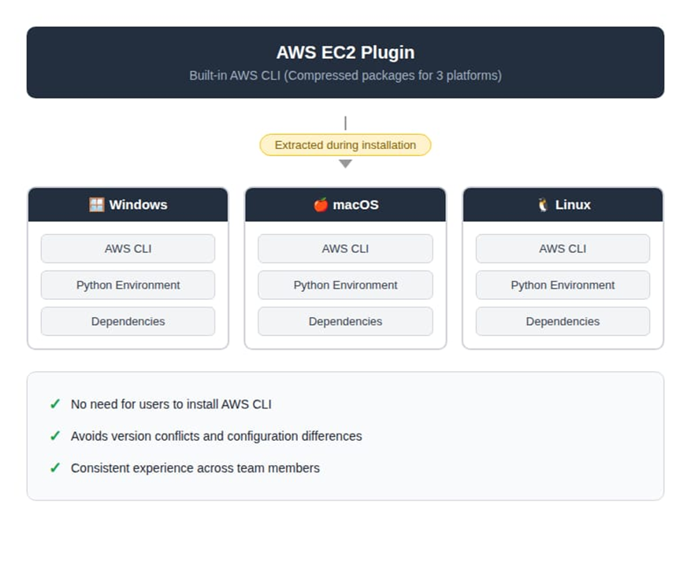
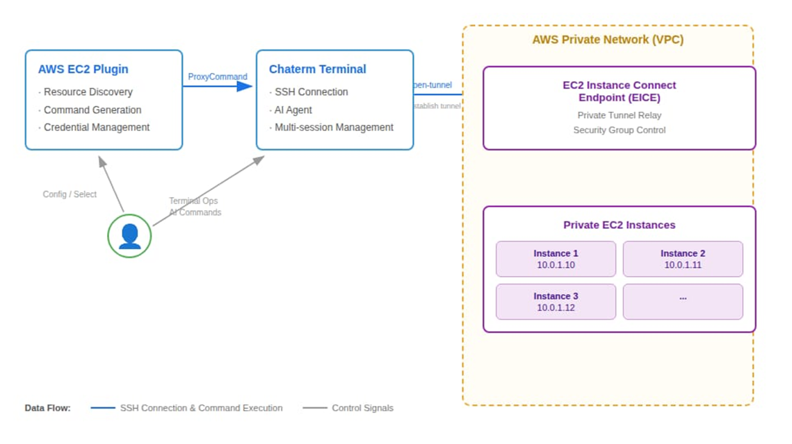

This article introduces the integration of Chaterm, with AWS EC2 Instance Connect Endpoint to address operational challenges in private subnets. Traditional approaches require VPNs or bastion hosts,whereas EICE leverages IAM-based authentication to establish secure connections without public IP addresses. Chaterm wraps the EICE capability with cross-platform auto-adaptation and a visual interface. 

---

## 1. Introduction
When building enterprise-grade AWS architectures, we typically follow the best practice of “layered security”: deploying databases, middleware, and core application servers in Private Subnets, without assigning public IPs.

However, this highly secure architectural design often creates a “last mile” challenge for day-to-day operations:

- **Complex Connectivity:** Operations personnel either need to configure complex VPNs or set up and maintain dedicated EC2 jump servers (Bastion Hosts).
- **Fragmented Environments:** Different local OS environments across team members (Windows/Mac/Linux) lead to chaotic SSH key management, inconsistent AWS CLI versions, and high onboarding costs for new team members.
- **Hindered Intelligence:** In the era of AIOps, many locally-running AI-assisted tools cannot penetrate complex network tunnels to directly perform intelligent diagnostics on instances within private subnets.

We will introduce an open-source intelligent terminal tool deeply integrated with AWS native capabilities — Chaterm, and demonstrate how it combines with AWS EC2 Instance Connect Endpoint (EICE) to achieve “one-click direct connection” and AI empowerment for private resources without exposing public ports.

## 2. What is Chaterm?
Chaterm is an open-source intelligent terminal tool developed by IntSig. Unlike traditional SSH clients, its core philosophy is “Chat with Terminal”. It is not just a connection tool — it has a powerful built-in AI Agent that can understand terminal context, help developers explain errors, generate commands, and even automatically write scripts.

In its latest version, Chaterm has launched an AWS EC2 plugin that fundamentally transforms the operations experience for private cloud resources through deep integration with AWS’s modern connectivity technologies.

## 3. AWS EC2 Instance Connect Endpoint — Technical Deep Dive

### 3.1 Why is this solution more advanced than traditional bastion hosts?
The EC2 Instance Connect Endpoint (EICE) feature, launched by AWS in 2023, elevates connection control from the “network layer” to the “identity layer”.

- **No Public IP Required:** EICE is a logical interface (Endpoint) deployed within the user’s VPC. It acts like an “invisible gateway”, allowing SSH traffic to reach target instances directly through AWS’s private network tunnel.
- **Identity as the Defense Line:** Traditional connectivity relies on IP whitelisting or SSH key distribution, whereas EICE relies on AWS IAM (Identity and Access Management) for authentication. This means all connection requests go through IAM permission verification and are audit-logged by CloudTrail.
- **Zero Trust Architecture:** EC2 instance security groups no longer need to open port 22 to the public internet (0.0.0.0/0) — they only need to allow traffic from the subnet where EICE is located.

## 4. The Solution: Dual Advantages of Chaterm + AWS EICE
Chaterm’s AWS plugin encapsulates EICE’s powerful capabilities behind a clean UI, primarily solving the following problems:

### 4.1 Simpler Connections with Adaptive Environment
Traditionally, using EICE requires memorizing lengthy AWS CLI commands (such as aws ec2-instance-connect open-tunnel). Chaterm’s plugin has a built-in cross-platform (Windows/macOS/Linux) AWS CLI environment that automatically completes dependency adaptation during plugin installation.

After configuring AWS credentials (Access Key / Secret Key), the plugin will automatically discover resources through the AWS API. Users simply click on an instance in the visual list, and the plugin will automatically generate the SSH ProxyCommand and establish an encrypted tunnel in the background



### 4.2 Unlocking the Full Potential of AI Operations
This is the biggest highlight of this solution. Previously, after connecting to a private network EC2 instance, local AI tools were often “out of reach”.

Since Chaterm establishes a transparent tunnel, its built-in AI Agent can operate private network EC2 instances as if operating a local machine. Once connected, Chaterm’s full AI capabilities take effect immediately:

- **Intelligent Inspection:** You can directly ask the AI: “Help me check the disk usage.” The AI will automatically execute df -h and present the output in a formatted manner.
- **Fault Diagnosis:** Describe the symptoms (e.g., “Web service response is slow”), and the AI will automatically execute a series of diagnostic commands like top, ps, netstat, and generate an analysis report. Compared to manually typing commands one by one, the efficiency improvement is significant.
- **Batch Operations:** Using Chaterm’s multi-session feature, you can simultaneously select 10 private network servers and have the AI assist with batch configuration update distribution.



## 5. Practical Guide: How to Configure
To ensure security, we will follow AWS’s Least Privilege Principle for configuration.

### 5.1 Step 1: AWS-Side Configuration (One-Time Setup)

#### 5.1.1 Create an EC2 Instance Connect Endpoint

Create an EICE in the VPC console or using CLI, ensuring you select the target private subnet:

```
aws ec2 create-instance-connect-endpoint \
--region cn-north-1 \
--subnet-id subnet-xxxxxx \
--security-group-ids sg-xxxxxx \
--preserve-client-ip
```

### 5.1.2 Configure Security Groups

Modify the target EC2’s security group to only allow SSH (port 22) traffic from the EICE security group ID.

### 5.1.3 Create a Dedicated IAM User and Policy

We strongly recommend not directly using administrator-privileged AK/SK. Please create a dedicated IAM user and grant only the following fine-grained permissions (restricting tunnel establishment to specific resources and ports):

```
{
    "Version": "2012-10-17",
    "Statement": [
        {
            "Effect": "Allow",
            "Action": [
                "ec2:DescribeInstances",
                "ec2:DescribeSubnets",
                "ec2:DescribeInstanceConnectEndpoints"
            ],
            "Resource": "*"
        },
        {
            "Effect": "Allow",
            "Action": "ec2-instance-connect:OpenTunnel",
            "Resource": "arn:aws:ec2:*:*:instance-connect-endpoint/*",
            "Condition": {
                "NumericEquals": {
                    "ec2-instance-connect:remotePort": "22"
                }
            }
        }
    ]
}
```

### 5.2 Step 2: Chaterm-Side Configuration (Only Takes 2 Minutes)

- Open Chaterm, search for and install the “AWS EC2” plugin in the plugin marketplace.
- Go to plugin settings, and enter the Access Key (AK), Secret Key (SK), and target Region (e.g., cn-north-1) of the IAM user created in the previous step.
- Return to the main interface — your private network instance list will load automatically. Select an instance and click “Connect”.


## 6. Summary
Through deep integration with AWS EC2 Instance Connect Endpoint, Chaterm provides developers with a connection solution that is both enterprise security-compliant (no public IP, IAM auditing) and delivers an excellent user experience (no bastion hosts, AI-empowered).

If you are looking for a more secure and intelligent way to manage your AWS private subnet resources, Chaterm is undoubtedly one of the best practices available today.


## Original

https://aws.amazon.com/cn/blogs/china/bastion-using-aws-eice-ec2-instance-connect-endpoint-chaterm-implement-subnet-security-intelligent-en/