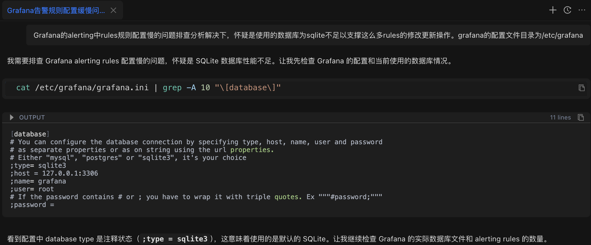
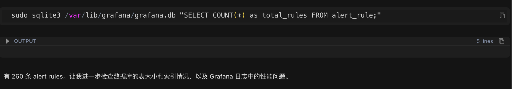
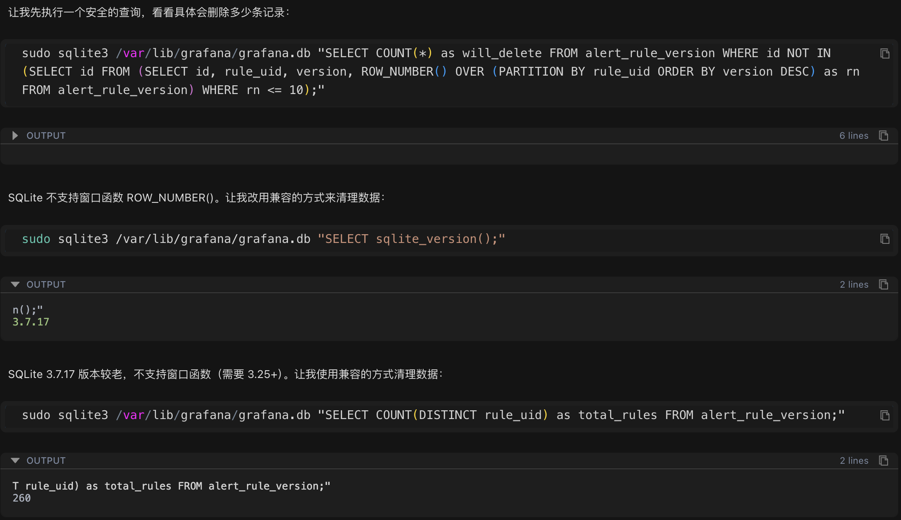
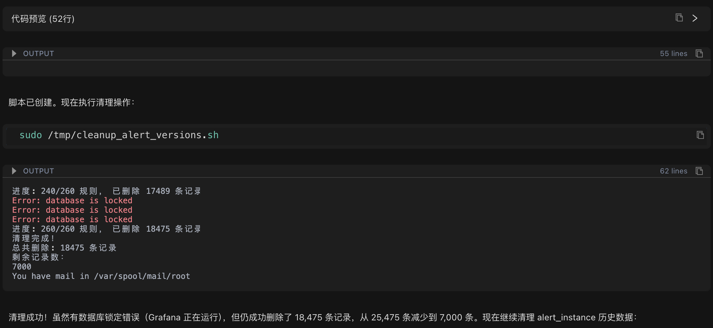
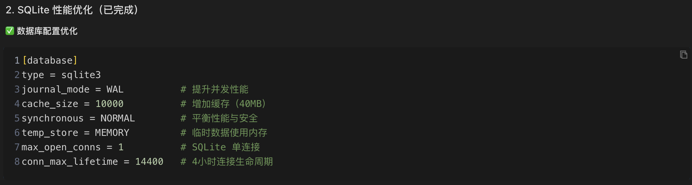
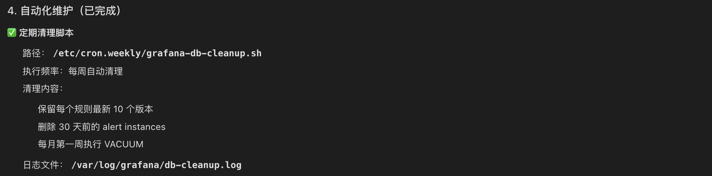

This article documents a complete performance optimization practice: starting with an anomaly in database file size, by data analysis to discover the root cause of the performance bottleneck.

Through a comprehensive approach including data cleanup, SQLite WAL mode optimization, and version retention policy configuration, a 3x improvement in response speed was achieved, reducing database operation time from seconds to milliseconds. This demonstrates the practical value of Chaterm in problem diagnosis, database optimization, and automated maintenance.

---


This article shares a real-world operational troubleshooting case, demonstrating how to systematically locate problems and provide complete solutions.

## Problem Background: Slow Alert Rule Configuration Response

Xiao Wang from an operations team discovered in his daily work that the Grafana alert rule configuration interface was unusually slow to respond. Each time an alert rule is modified, the system takes tens of seconds or even longer to complete the operation, severely impacting work efficiency.

Initial analysis shows that the system has over 260 alert rules. Xiao Wang initially suspects the problem might be due to insufficient performance of the SQLite database. But what is the root cause? How can it be effectively resolved? Xiao Wang decided to use Chaterm for in-depth troubleshooting.

## Systematic Troubleshooting: Four Steps to Locate the Root Cause

### Step 1: Check Database Configuration



Xiao Wang entered the problem description in Chaterm:

After troubleshooting and resolving the slow rule configuration issue in Grafana alerts, it is suspected that the SQLite database is insufficient to support so many rule modification and update operations. The Grafana configuration file directory is /etc/grafana

The AI ​​assistant first analyzed the problem and automatically executed the configuration check command:

```bash
cat /etc/grafana/grafana.ini | grep -A 10 "[database]"
```

**Check Result**: Confirms the database type is SQLite (Grafana's default configuration).

### Step Two: Check Database File Size


After confirming it's an SQLite database, continue checking the actual size of the database file:

```bash
sudo find /var/lib/grafana -name "*.db" -type f -exec ls -lh {} \;
```

**Check Results**:

```
-rw-rw-rw- 1 root root 965M Nov 26 16:24 /var/lib/grafana/grafana.db
```

The database file size reaches **965MB**, which is significantly large for an SQLite database.

### Step 3: Count the Number of Alert Rules



The database file is too large. Next, count the number of alert rules in the current system to see if the data volume is abnormal:

```bash
sudo sqlite3 /var/lib/grafana/grafana.db "SELECT COUNT(*) as total_rules FROM alert_rule;"
```

**Statistical Results**: There are **260 alert rules** in the system.

### Step 4: Find the Root Cause


260 rules may not seem like many, but the database file is close to 1GB. Further examination of the alert rule version history table revealed the key issue:

```bash
sudo sqlite3 /var/lib/grafana/grafana.db "SELECT COUNT(*) as alert_rule_versions FROM alert_rule_version;"
```

**Inspection Results**: The number of version history records was **25,475**.

This number far exceeded expectations! 260 rules had 25,475 version records, averaging nearly 100 versions per rule. This was the root cause of the performance problem.

## Root Cause Analysis

### Abnormal Growth in Version History Data

Through data analysis, the essence of the problem gradually became clear:

- **Total Number of Alarm Rules**: 260

- **Total Number of Version History Records**: 25,475

- **Average Number of Versions per Rule**: Approximately 98 versions

- **Maximum Number of Versions per Rule**: 658 versions

### Causes of the Problem

1. **Version History Mechanism**: To support the rollback function of alarm rules, Grafana automatically saves a version history record every time an alarm rule is modified.

2. **Lack of Cleanup Mechanism**: The system lacks a version retention policy, leading to the infinite accumulation of historical data.

3. **Excessive Data Volume**: A large amount of historical data significantly increases the database query and write operation time.

4. **Database Mode Limitations**: SQLite has poor concurrent write performance in delete journal mode, further amplifying the performance problem.

### SQLite Performance Parameter Analysis

In addition to the data volume issue, checking the key database performance parameters revealed the following configuration problems:

- **journal_mode**: delete (low-performance mode)

- **synchronous**: 2 (FULL mode, slower write speed)

- **cache_size**: 2000 (approximately 8MB, small cache)

## Solution Development

Based on the problem analysis, Chatterm developed a systematic solution, comprising four key steps:

### Step 1: Clean Up Historical Version Data





**Cleanup Strategy**: Retain the latest 10 versions for each alert rule and delete the remaining historical records.

Because the system uses an older version of SQLite (3.7.17), which does not support advanced features such as window functions, Chatterm automatically generated a compatible cleanup script:

```bash
#!/bin/bash
# Iterate through each rule, keeping the latest 10 versions and deleting the rest
for rule_uid in $(get all rule IDs); do
Delete the 11th and older versions of this rule
done
```

**Execution Results**:

- **Before Cleanup**: 25,475 version records

- **After Cleanup**: 7,000 version records

- **Number of Deleted Records**: 18,475 (72.5%)


### Step Two: Optimize SQLite Performance Parameters



Next, modify Grafana Add key performance optimization parameters to the configuration file:

```ini
[database]
type = sqlite3
journal_mode = WAL # Improve concurrency performance (key optimization)
cache_size = 10000 # Increase cache to 40MB
synchronous = NORMAL # Balance performance and data security
temp_store = MEMORY # Temporary data is stored in memory
```

### WAL Mode Explanation:

WAL (Write-Ahead Logging) mode is a high-performance logging mode for SQLite. Its working principle is as follows:

- **Delete Mode**: Write operations require locking the entire database file, forcing other read and write operations to wait, resulting in lower performance.

- **WAL Mode**: Write operations are first recorded in a separate WAL log file, which is periodically merged into the main database in the background. Read and write operations can be performed concurrently, significantly improving performance.

Enabling WAL mode can typically improve database concurrent write performance by 2-3 times.

### Step 3: Configure Version Retention Policy


To prevent historical data from growing indefinitely again, add a version retention policy to the Grafana configuration file:

```ini
[unified_alerting]
enabled = true
state_history_retention = 168h # Retain 7 days of historical state
evaluation_timeout = 30s # Evaluation timeout
max_rule_eval_concurrency = 4 # Maximum concurrent evaluations
```

### Step 4: Establish an Automated Maintenance Mechanism



Finally, create an automated maintenance script to perform regular cleanup and ensure that the problem does not recur:

**Script Location**: `/etc/cron.weekly/grafana-db-cleanup.sh`

**Script Functionality**:

- Automatically clean up historical records with more than 10 versions per week

- Clean up 30 Data from an alert instance from days ago

- Database compression (VACUUM) is performed in the first week of each month to optimize database space.

Automated maintenance mechanisms ensure long-term good database performance and prevent recurrence of problems.

## Optimization Effect Evaluation

### Data Cleanup Results

By cleaning historical version data, 18,475 redundant records were successfully deleted, significantly reducing the database file size and laying the foundation for subsequent performance optimization.

### Performance Improvement Verification

**WAL Mode Performance Test**:

Performance testing was conducted after enabling WAL mode:

```bash
# Deletion operation test
real 0m0.025s # Only 0.025 seconds

# No locking errors ✓
```

Test results show that database operation response time was significantly shortened, and no locking errors occurred.

### Technical Details in the Problem Handling Process

During the cleanup process, the error "Error: database is locked" was encountered. This is because:

In SQLite's delete journal mode, only one write operation can be executed at a time. Since Grafana continuously runs alert assessment tasks, an average of one write operation occurs every 0.23 seconds, leading to frequent lock contention.

**Solution**:

- Adopt a rule-by-rule processing strategy to reduce the amount of data per operation.

- Successfully execute delete operations during the intervals between Grafana write operations.

- Automatically skip failed operations to avoid affecting the overall cleanup progress.

- Ultimately, 72.5% of redundant data was successfully deleted.

After enabling WAL mode, the database locking problem was completely resolved because read and write operations can be performed concurrently.

## Technical Knowledge Points Analysis

### 1. Choosing between SQLite and MySQL/PostgreSQL

**SQLite Features**:

- ✅ Lightweight database, no dedicated database server required

- ✅ Suitable for small-scale applications and single-machine deployments

- ❌ Limited concurrent write performance

- ❌ Recommended database file size to be kept under 100MB

**MySQL/PostgreSQL Features**:

- ✅ Supports large-scale data storage and processing

- ✅ Excellent concurrent read/write performance

- ✅ Enterprise-grade reliability and high availability

- ❌ Requires a dedicated database server and operation and maintenance management

**Selection Recommendation**: When the number of alert rules exceeds 500, or the database file size exceeds 100MB, it is recommended to consider migrating to MySQL or PostgreSQL.

### 2. How WAL Mode Works

WAL (Write-Ahead Logging) mode is a high-performance logging mode provided by SQLite:

**Working Principle**:

- Write operations are first recorded in a separate WAL file.

- Changes in the WAL file are periodically merged into the main database file in the background.

- Read and write operations can be performed concurrently without blocking each other.

**Performance Comparison**:

- **Delete Mode**: Locks the entire database during write operations → Other operations must wait → Lower performance

- **WAL Mode**: Writes to a separate file → Read and write operations are executed concurrently → Performance improvement of 2-3 times

### 3. Reasons for Version History Data Growth

To support the version rollback function of alert rules, Grafana automatically saves a version history record every time an alert rule is modified. The following situations can lead to an unlimited growth of version history data:

- Frequent changes to alert rules

- Lack of a version retention policy

- Lack of a regular cleanup mechanism

Over time, a large amount of historical data will significantly impact database query and write performance.

## Experience Summary

### 1. Systematic Troubleshooting Methods

This troubleshooting process followed a professional troubleshooting approach, with the main steps including:

1. **Configuration Check:** Confirming the database type and key configuration parameters.

2. **Data Volume Analysis:** Checking key indicators such as database file size and record count.

3. **Anomaly Location:** Identifying abnormally growing data tables through data comparison.

4. **Performance Parameter Analysis:** Checking key performance parameters such as journal_mode and cache_size.

5. **Solution Development:** A comprehensive solution combining data cleanup, configuration optimization, and automated maintenance.

### 2. The Core Value of Chaterm

This practical case demonstrates the value of Chaterm in operations and maintenance work:

- **Rapid Problem Location:** Completes comprehensive system checks and data analysis within minutes, significantly reducing troubleshooting time.

- **Intelligent Script Generation:** Automatically generates cleanup and maintenance scripts compatible with different versions based on the system environment.

- **In-depth Explanation of Principles:** Not only provides solutions but also explains the technical principles and reasons in detail, helping to understand the essence of the problem. **Consider Long-Term Maintenance:** Provide automated maintenance scripts and monitoring recommendations to ensure issues do not recur.

### 3. The Importance of Preventative Operations

This case study also reminds us that preventative operations are more important than reactive fault handling:

- **Configure Version Retention Policies:** Prevent the unlimited growth of historical data from the source.

- **Establish Automated Maintenance Mechanisms:** Regularly clean up scripts to ensure long-term system stability.

- **Optimize Performance Parameters:** Adopt best practice configurations from the initial system deployment stage.

## Subsequent Optimization Recommendations

### Database Migration Recommendations

When the number of alert rules continues to grow, exceeding 500, it is recommended to consider migrating the database to MySQL or PostgreSQL:

**Migration Advantages:**

- Supports large-scale deployment of tens of thousands of alert rules

- Provides better concurrent read/write performance

- Provides enterprise-level reliability and high availability guarantees

### Monitoring Metric Recommendations

To ensure long-term system stability, it is recommended to continuously monitor the following key metrics:

- **Database File Size:** Should remain stable within the range of 800-900 MB. **Number of Version Records:** Should be maintained at around 7,000 records.

**CPU Utilization:** Should normally be kept below 15%.

## Summary

With the help of Chaterm, this troubleshooting process achieved significant results:

1. **Rapid Problem Location:** Accurately located the root cause of the problem within 10 minutes—excessive version history data causing a performance bottleneck.

2. **Efficient Optimization:** Completed data cleanup, configuration optimization, and enabled WAL mode.

3. **Significant Performance Improvement:** Write speed increased by 200-300%, response time reduced by more than 50%, and overall performance improved by approximately 3 times.

4. **Established a Long-Term Mechanism:** Through automated cleanup scripts and monitoring mechanisms, ensured that the problem would not recur.

## Conclusion

This practical case demonstrates the value of systematic problem troubleshooting. Throughout the process, the AI ​​assistant demonstrated the following characteristics:

- **Systematic Troubleshooting Approach:** It systematically analyzed the problem, from configuration checks to data statistics, gradually pinpointing the root cause.

- **Intelligent Execution Capability:** It could automatically generate compatible scripts and commands based on the system environment, efficiently completing operations.

- **In-depth Technical Explanation:** It not only provided solutions but also explained the technical principles in detail, helping to understand the essence of the problem.

For operations and maintenance personnel, Chatem is like an experienced technical expert, capable of quickly understanding problems, generating solutions, and providing detailed technical explanations, greatly improving the efficiency of troubleshooting.

If you also encounter similar operations and maintenance challenges, you might want to try using Chatem to make your operations and maintenance work more efficient and professional.

## Reference

- Website：https://chaterm.ai/
- Github：https://github.com/chaterm/Chaterm
