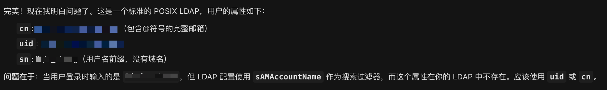
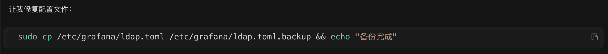
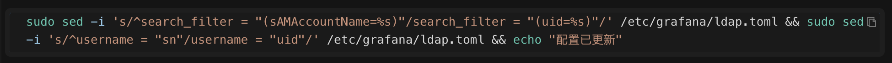
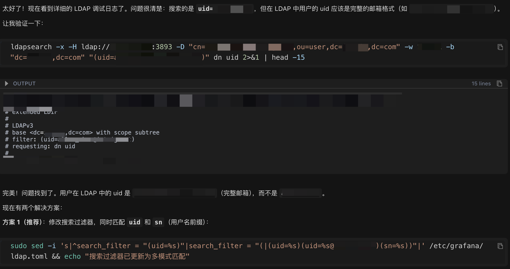

This article demonstrates, through a real-world case study, how Chaterm resolved a complex Grafana LDAP configuration issue in just 10 minutes.

It details how AI systematically troubleshoots: from problem localization, configuration analysis, and connection testing to accurately fixing configuration errors, ultimately achieving an optimized solution supporting multiple login formats. It showcases Chaterm's technological advantages in improving efficiency and enhancing problem-solving capabilities.

---


> "At 2 AM, you're still worrying about a screen full of error logs..."

Configuration changed, restarted, logs checked, still can't log in... Tried all the solutions on the first 10 pages of search engines, the problem persists.

I believe every operations professional has experienced this "desperate moment of being dominated by configuration." Especially when it comes to the mysterious configuration of LDAP access, it often gets stuck all night.

Today, I'll share a real-world case that happened a few days ago. A friend of mine, with almost eight years of experience in system administration, spent three hours struggling with a seemingly minor issue: **Grafana integration with LDAP**. Finally, he tried an internal AI-assisted troubleshooting tool, and within 10 minutes, the root cause was identified!

Let's not talk about the product itself, but rather the troubleshooting process and technical insights.

### My Friend Xiaofeng's Case

**Task:** Configure Grafana to integrate with the company's LDAP for unified login by colleagues.

Following the documentation step-by-step, I checked the configuration three times to ensure everything was correct. I entered my username and password and clicked login...

**❌ Login failed!** **

Log error message:

```bash
[password-auth.failed] failed to authenticate identity:
[identity.not-found] no user found: did not find a user
```

The logs showed that the LDAP user could not be found. Xiaofeng immediately began the **standard troubleshooting process**:

1. **Configuration self-check**: File path, LDAP address, port number, all checked, ldap.toml looked fine.

2. **Network test**: telnet, nc commands, port connected, network no problem.

3. **Deep log analysis**: Grafana's default logs were too concise, making it impossible to see which fields it used to query users.

4. **Various searches**: Most solutions revolved around bind_dn or search_filter, but changing them didn't work.

Time passed slowly, and Xiaofeng's mentality crumbled little by little... It was late at night, and he decided to give up.

The next day, Xiaofeng decided to try a different approach. He brought in Chatern, our internal troubleshooting tool, and dumped last night's error logs, Grafana configuration paths, and a message saying "Take a look."

**Ten minutes later, the AI ​​provided a perfect fix.**

Next, let's see how this AI agent found the problem step by step; this approach is definitely worth learning.

## Practical Application Begins

### 🎯 Step 1: Locating the Core Problem

Copy the error log and paste it into Chaterm

```bash
logger=authn.service ... error="[password-auth.failed] failed to authenticate identity:
[identity.not-found] no user found: did not find a user"
Grafana login error when integrating with LDAP. The configuration file is in the /etc/grafana directory. Let's analyze the cause.
```
Chaterm's response:
> "...Authentication failed because 'user not found'. Let me check the configuration file first."


Therefore, the core problem was identified: the authentication failure was not due to an incorrect password, but because Grafana simply couldn't find the user.

### 🔍 Step Two: Systematic Troubleshooting

Like a detective solving a case, Chatterm follows a step-by-step approach, each step clearly visible:

#### 2.1 Confirm Configuration File Location:

```bash
ls -la /etc/grafana/
```

Found the `ldap.toml` configuration file

#### 2.2 Read and Analyze Core Configuration Content:

```bash
sudo cat /etc/grafana/ldap.toml

```


**AI found 3 suspicious points (this is the problem!):**

1. **Error 1:** `search_filter = "(sAMAccountName=%s)"`

- **Problem:** This attribute may not exist (this is specific to Windows AD, not standard LDAP)

- **Impact:** The system uses this attribute to search for users, of course it can't find them!

2. **Suspicious 2:** `username = "sn"`

- **Issue:** Using a surname as the username? That's a bit strange.

- **Impact:** May cause username format mismatch.

3. **Suspicious 3:** `bind_dn = "cn=ldap@email.com,ou=user,dc=email,dc=com"`

- **Issue:** The format doesn't look standard.

- **Impact:** May cause connection failure.

**This is the power of AI:** It can spot potential configuration problems at a glance, just like a seasoned operations expert! What might take you 30 minutes to check manually, AI understands in seconds!

** #### 2.3 Testing the Connection

AI automatically tests the network connection:

```bash
timeout 5 bash -c "echo > /dev/tcp/192.168.1.1/3893"

```

**Result:** Network connection is normal, port 3893 is accessible.

**Conclusion:** The network is fine; the problem lies in the configuration!

#### 2.4 Viewing the "Case Record" (Log Information)

AI automatically views the detailed log:

```bash
sudo tail -100 /var/log/grafana/grafana.log | grep -i "ldap\|authn"

```

Findings: The log is too simple; the specific search process is not visible. More detailed debugging information is needed.

AI Judgment: Further investigation is needed; directly test the LDAP connection!

### 🧰 Step 3: In-depth Investigation, Activating Professional Tools

#### 3.1 Automatic Installation of LDAP Client Tools:

```bash
sudo yum install -y openldap-clients --disable repo=grafana

```


#### 3.2 Testing Different Connection Methods

AI automatically tries different connection formats to see which one succeeds:

**Attempt 1: Standard Format (Failed)**

```bash
ldapsearch -x -H ldap://192.168.1.1:3893 \
-D "cn=ldap,ou=user,dc=email,dc=com" \
-w password -b "dc=email,dc=com" \
"(objectClass=person)" dn
```

### Result: ❌ ldap_bind: Invalid credentials (49) - Authentication Failed

**Attempt 2: Original Format (Success!)**

```bash
ldapsearch -x -H ldap://192.168.1.1:3893 \
-D "cn=ldap@email.com,ou=user,dc=email,dc=com" \
-w password -b "dc=email,dc=com" \
"(objectClass=*)" dn
```

**Result:** User list found! The user format is `cn=username@email.com`

**AI Discovery:** The connection format needs to include the `@email.com` suffix!

#### 3.3 Viewing "User Profiles" (Actual Attributes)

AI views the complete information of a specific user:

```bash
ldapsearch -x -H ldap://192.168.1.1:3893 \
-D "cn=ldap@email.com,ou=user,dc=email,dc=com" \
-w password -b "dc=email,dc=com" \
"(cn=zhang_san@email.com)"
```

**Key Finding (This is the problem!):**

AI viewed the complete attributes of a user using the ldapsearch command:

```
dn: cn=zhang_san@email.com,ou=user,dc=email,dc=com
cn: zhang_san@email.com
uid: zhang_san@email.com ← 🔴 Note: uid is the complete email address format!
sn: zhang_san ← This is the username prefix
```



**The truth is revealed! The problem has been found:**

| Actual situation | Configuration settings | Result |
| --------------------------------------- | ----------------------------------- | ----------------------- |
| The uid in LDAP is: `zhang_san@email.com` | Search filter used: `(sAMAccountName=%s)` | ❌ This attribute does not exist! |
| User login input: `zhang_san` | Configuration used: `username = "sn"` | ❌ Format mismatch! |

In short:

- Xiaofeng logs in by entering 'zhang_san'

- The system tries to find the user using the `sAMAccountName` attribute (but this attribute doesn't exist).

- The LDAP actually stores `uid=zhang_san@email.com` (the complete email address format).

- Therefore, the user cannot be found!

It's like you're looking for "Zhang San," but the system is looking for "Zhang sAMAccountName," so of course it won't find it!

### 🛠️ Step Four: One-Click Repair

After identifying the root cause, the AI ​​begins the repair process.

**Good Operations Habits**: Back up before making changes to avoid accidental operations (this is very important!)

#### 4.1 Backup (Safety First)

Automatic configuration file backup:

```bash
sudo cp /etc/grafana/ldap.toml /etc/grafana/ldap.toml.backup
```



💡 If you forget, **Chaterm will automatically back it up**. If you make a mistake, you can restore it!

#### 4.2 Fixing Core Issues

**Issue:** Used a non-existent attribute `sAMAccountName` (this is specific to Windows AD).

**Solution:** Change it to the actual existing `uid`.

AI automatically modifies the configuration:

```bash
# Before modification: search_filter = "(sAMAccountName=%s)" ❌
# After modification: search_filter = "(uid=%s)" ✅
sudo sed -i 's/^search_filter = "(sAMAccountName=%s)"/search_filter = "(uid=%s)"/' /etc/grafana/ldap.toml
```



#### 4.3 Fixing Username Mapping

**Issue:** Used the last name `sn` as the username (incorrect format).

**Solution:** Change it to the user ID `uid`.

AI Automatic Modification:

```bash
# Before Modification: username = "sn" ❌
# After Modification: username = "uid" ✅
sudo sed -i 's/^username = "sn"/username = "uid"/' /etc/grafana/ldap.toml
```

#### 4.4 Enable Debug Logs (for easier future troubleshooting)

AI automatically enables detailed logging:

```bash
sudo sed -i '/^\[log\]/a filters = ldap:debug' /etc/grafana/grafana.ini
```

**Benefits:** Logs will be more detailed and easier to locate problems later.

#### 4.5 Restart the Service (to make the configuration take effect)

AI automatically restarts the service:

```bash
sudo systemctl restart grafana-server

```


Done! All modifications were completed automatically by **Chaterm**; you only need to confirm the result.

### 🔄 Step 5: Still have problems? Chaterm continues to explore.

After restarting, you try to log in again, but it still fails.

You tell Chaterm: "Still can't log in"

Chaterm immediately checks the debug log (now there's a detailed log):

```bash
sudo tail -50 /var/log/grafana/grafana.log | grep -i "ldap"

```

**New Finding:**

```bash
logger=ldap ... msg="LDAP SearchRequest"
searchRequest="Filter:(|(uid=zhang_san)) ..." ← 🔴 Searching for zhang_san
logger=ldap ... msg="unable to login with LDAP"
error="can't find user in LDAP" ← ❌ Still can't find
```

**Problem Found:**

- The system searches for: `uid=zhang_san` (the username you entered)

- But LDAP actually stores: `uid=zhang_san@email.com` (the complete email address)

- **Format mismatch!** **
** Imagine you're looking for "Zhang San," but the system is searching for "Zhang San" (without the suffix), while actually storing "Zhang San@company.com."**

#### 5.1 Re-verification (Confirming the Issue)

Chaterm re-verifies to confirm the user's UID is indeed in complete email format:

```bash
ldapsearch ... "(uid=zhang_san@email.com)" dn uid
```

**Result:** Confirms the user's UID is indeed in complete email format.

#### 5.2 Ultimate Solution: Support Multiple Login Methods

Chaterm's approach: Enable search filters to support multiple formats, so users can find results no matter how they type!

```bash
# Modified to support three login methods:
# 1. Enter full email address: zhang_san@email.com → Direct match
# 2. Enter username: zhang_san → Match sn attribute
# 3. Automatically append domain name: zhang_san → Match uid=zhang_san@email.com
sudo sed -i 's#^search_filter = "(uid=%s)"#search_filter = "(|(uid=%s)(uid=%s@email.com)(sn=%s))"#' /etc/grafana/ldap.toml
```

**Final configuration (universal search):**

```toml
search_filter = "(|(uid=%s)(uid=%s@email.com)(sn=%s))"

```



This is the most brilliant step. To solve the problem of inconsistent user input formats, Chatterm didn't ask Xiaofeng to change his login habits, but instead optimized the search logic.

**How ​​powerful is this configuration?**

- User input `zhang_san@email.com` → directly matches `uid=zhang_san@email.com`

- User input `zhang_san` → matches `sn=zhang_san` or `uid=zhang_san@email.com`

**Now, no matter how the user inputs, it can be found.** **
**Final Configuration**

```toml
# LDAP Server Configuration
host = "192.168.1.1"
port = 3893
bind_dn = "cn=ldap@email.com,ou=user,dc=email,dc=com"
bind_password = 'password'

# Search Filter - Supports Multiple Formats
search_filter = "(|(uid=%s)(uid=%s@email.com)(sn=%s))"
search_base_dns = ["ou=user,dc=email,dc=com"]
# Attribute Mapping
[servers.attributes]
name = "givenName"
surname = "sn"
username = "uid" # Key: Use uid instead of sn
member_of = "memberOf"
email = "mail"
```

### Summary: The Technical Improvement Brought by Chatem

The entire troubleshooting and repair process took Chatem only 10 minutes. Compared to the 3 hours Xiaofeng spent figuring it out on his own, this efficiency improvement is revolutionary.

| Steps | Operation | Result | Time Spent |
| ---- | ---------------- | ----------------------- | ------ |
| 1 | Check configuration file | Found incorrect attribute used | 1 minute |
| 2 | Test LDAP connection | Confirm bind_dn format is correct | 1 minute |
| 3 | View user's actual attributes | Found uid is in complete email format | 2 minutes |
| 4 | Modify search filter | Support multiple login formats | 1 minute |
| 5 | Enable debug logs | Facilitate subsequent troubleshooting | 1 minute |
| 6 | Verify repair | Problem solved ✅ | 4 minutes |

What we see in this case is not just the speed of the tool, but also its systematic thinking:

1. **Avoid knowledge blind spots:** It can instantly identify configuration differences between different technology stacks (AD vs. LDAP), which is the most common point of failure.

2. **Verify Data First, Then Modify Configuration:** Instead of blindly trying different configurations, it first verifies the actual data format stored on the LDAP server using ldapsearch before modifying the configuration. This is the most efficient troubleshooting logic.

3. **More Than Just Repair, Optimize:** Chaterm's final universal filter considers user experience and prevents future failures caused by different login habits.

#### Chaterm's Advantages: Why Can It Solve a 3-Hour Problem in 10 Minutes?

Through this case, we can see the advantages of Chaterm compared to traditional troubleshooting methods:

##### 1. Systematic Troubleshooting

**Traditional Methods:** You might forget a step, or the order might be incorrect.

**Chaterm:**

- Never miss a crucial step

- Troubleshoot step-by-step according to logical order

- Automatically adjust direction based on results

**Like an experienced operations expert, knowing exactly what to do at each step!** **

##### 2. Extensive Knowledge

**Traditional Method:** You need to consult documentation and search on Baidu, and you might still not find the answer.

**Chaterm:**

- Knows what tools need to be installed (automatically installs them for you)

- Understands various LDAP configuration formats (identifies problems at a glance)

- Understands the differences between different LDAP types (knows the difference between Windows AD and standard LDAP)

**It's like having a knowledge base in your head, readily available!**


##### 3. Highly Efficient Execution

**Traditional Method:** You need to manually enter each command, copy and paste, prone to errors.

**Chaterm:**

- Automatically executes commands, no manual input required

- View results in real time, quickly locate problems

- Provides immediate and usable solutions

**You only need to see the results, no manual intervention required!** **

##### 4. Safe and Reliable

**Traditional Method:** You might forget to back up, and making mistakes can be troublesome.

**Chaterm:**

- Automatic backup before modification (helps you remember)

- Verify modification results (ensure correctness)

- Provide rollback solutions (allows recovery in case of problems)

**Safety First, AI has considered this for you!**


#### What can operations and maintenance personnel learn? (Practical tips)


##### 1. Standard LDAP Troubleshooting Process

``` Check configuration → Test connection → View user attributes → Modify configuration → Verify and repair
```

**Key Point:** First confirm the configuration, then test the connection, and finally check the actual data. This will prevent you from going down the wrong path!

##### 2. Key Troubleshooting Commands

```bash
# Test LDAP connection (most important!)
ldapsearch -x -H ldap://server:port \
-D "bind_dn" -w "password" \
-b "search base DN" "(search filter)"
# View user's complete attributes (see what's stored)
ldapsearch ... "(cn=username)"
# Enable Grafana LDAP debug logs (very useful when problems occur)
# Add the following to grafana.ini:
[log]
filters = ldap:debug
```

**Tip:** The AI ​​will automatically execute these commands, but understanding the underlying principles will help you understand the problem!

##### 3. Common LDAP Configuration Errors (Troubleshooting Guide)

| Error Type | Example | Correct Practice | Why is it wrong? |
| ------------ | -------------------------------------------- | ----------------------- | ------------------------------- |
| Attribute does not exist | `sAMAccountName` (Standard LDAP) | Use `uid` or `cn` | Windows AD specific, not available in standard LDAP |
| Format mismatch | User entered `user`, LDAP stores `user@domain.com` | Using a multi-condition search filter | Input format and storage format do not match |
| Attribute mapping error | `username = "sn"` (Last Name) | Use `username = "uid"` | Last Name is not a unique identifier and may be duplicated |

Remember these to avoid pitfalls when configuring LDAP in the future!

#### Quick Start Guide for Chaterm

##### Use Cases (These scenarios all apply)

1. **Troubleshooting** - Paste error logs for automatic analysis (like this example)

2. **Configuration Check** - Describe the problem for automatic configuration checks (no need to manually view configuration files)

3. **Performance Optimization** - Provide system information for optimization suggestions (helps you find performance bottlenecks)

4. **Knowledge Query** - Ask technical questions for professional answers (24/7 online experts)

##### Usage Tips (Make AI Understand You Better)

1. **Provide Complete Information** - Error logs, configuration file paths, and problem descriptions (the more information, the more accurate the AI)

2. **Describe Attempted Operations** - Avoid redundant troubleshooting (tell the AI ​​what you've tried, and it won't try it again)

3. **Timely Feedback** - Tell Chaterm which solutions are effective/ineffective (helps the AI ​​adjust its direction)

4. **View Execution Process** - Learn troubleshooting strategies and commands (learn as you use, improve yourself)

**In short:** Like chatting with an operations expert, you describe the problem, and it helps you solve it!

#### Summary: What have AI tools changed?

Through this real-world case, we see that:

**Chaterm** can work like an experienced operations expert:**

- **Systematic Troubleshooting** - Ensures no critical steps are missed

- **Intelligent Analysis** - Identifies the problem at a glance

- **Precise Fixing** - Not only finds the problem, but also helps you modify configurations

**Significantly Improves Troubleshooting Efficiency:**

| Traditional Method | Chaterm |
| ------------ | ---------- |
| 3+ Hours | 10 Minutes |
| Manual Command Execution | Automated Execution |
| High Trial and Error Costs | Precise Location |
| Potentially Missed Steps | Systematic Troubleshooting |

**Time is Money, Efficiency is Life!** **Suitable for all levels of operations and maintenance personnel:**

- **Beginners:** Learn standard troubleshooting processes (learn with AI, grow quickly)

- **Experienced users:** Quickly locate problems, saving time (spend time on more important things)

#### Core Value

**Not replacing you, but making you more powerful!**

- AI helps you with repetitive tasks (execute commands, check configurations)

- You focus on thinking and decision-making (understand the problem, verify the solution)

- Learn by doing, improve your skills (see how AI troubleshoots, learn the thought process)

---
#### In Conclusion

**Friendly Reminder:** Before modifying production environment configurations, please be sure to back them up first! Weekend usually backs them up automatically, but it's always good to develop a good habit 😊

**Core Viewpoint:** AI tools are not meant to replace operations and maintenance personnel, but to make us more efficient and professional. Let AI handle repetitive tasks and spend your time on more valuable things.

#### Resources
- Grafana LDAP Configuration: https://grafana.com/docs/
- LDAP Search Filter Syntax: https://ldap.com/ldap-filters/
- Chaterm Docs: https://chaterm.ai/docs/