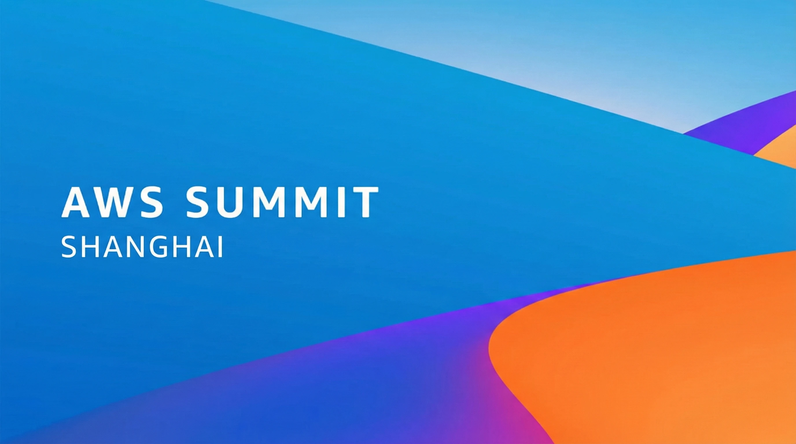
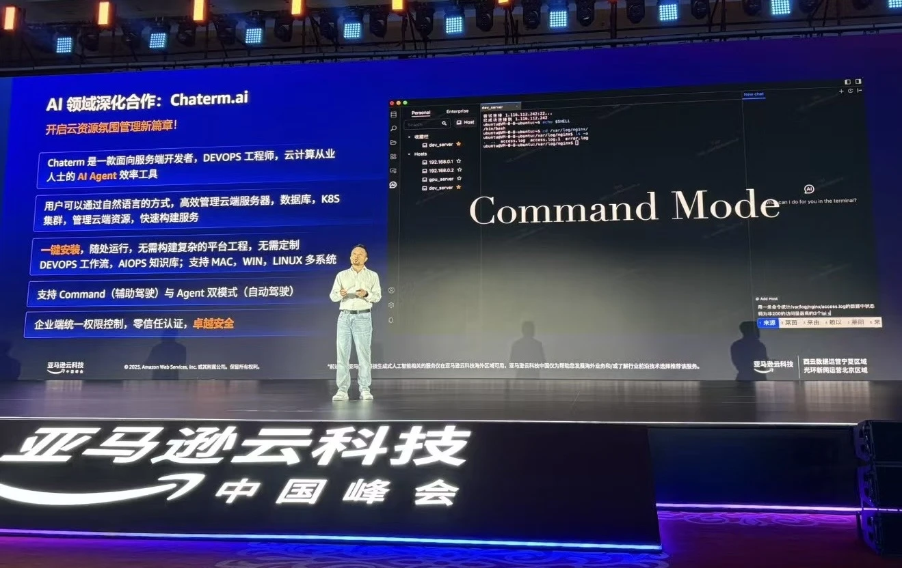
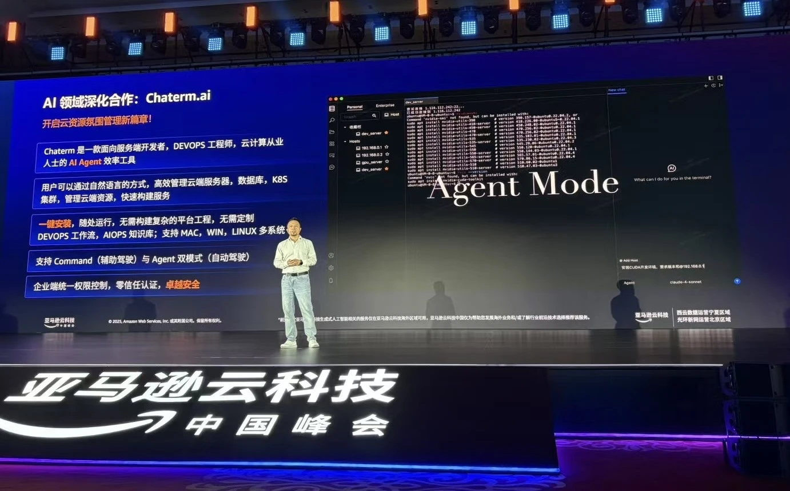

Chaterm, a representative of GenAI's outstanding and innovative projects, was open-sourced to developers worldwide at the AWS Summit Keynote.

Chaterm is an AI-powered smart terminal tool that combines AI functionality with traditional terminal functions. It supports natural language interaction, simplifies complex terminal operations, efficiently completes daily maintenance tasks, and completely revolutionizes the way developers interact with terminals.

---

## Chaterm: Ushering in the Era of Agentic AI for Terminals

In today's world where cloud-native and distributed systems are mainstream, the complexity of operations and cloud resource management is increasing exponentially.

With hundreds or thousands of servers, Kubernetes clusters spanning multiple environments, and logs and call chains scattered across different systems — **the terminal remains the core entry point, but its interaction methods are almost stuck in the style of 20 years ago.**

Chaterm was born in this context. It is an **AI Agent-driven intelligent terminal**, aiming to completely upgrade the terminal's interaction method from "command-driven" to "goal-driven."

## AI Agent-Driven Intelligent Terminal

Current DevOps practices in cloud management and operations require developers to manage hundreds or thousands of servers and containers. Due to the low level of intelligence, the complexity of operations increases dramatically, leading to a decrease in operational efficiency. This presents significant technical challenges to operations teams in areas such as batch operations and troubleshooting:

- **Cumbersome Batch Operations:** In large-scale distributed systems, operations engineers often need to perform the same operations on hundreds of servers. While the traditional Amazon Systems Manager Agent (SSM Agent) can perform batch processing on clustered machines, its lack of large-scale model support limits its intelligence to meet the demands of daily work.

- **High Knowledge Barrier:** The depth and breadth of the operations and maintenance (O&M) technology stack constitute a significant knowledge barrier. O&M personnel need to be proficient in multiple command-line tools, scripting languages, regular expressions, and system configuration. This full-stack knowledge requirement, from the operating system kernel to the application layer, means that novice engineers need at least six months of practical experience to handle routine problems.

- **Complex Troubleshooting:** In a microservice architecture, troubleshooting evolves into a complex distributed tracing challenge. When users report problems, O&M personnel need to retrieve hundreds of logs across the API gateway, order service, and payment service using the ELK Stack, and then correlate the call chain using Jaeger tracing IDs. This cross-service, cross-component log correlation analysis often requires senior engineers to spend several hours to pinpoint the specific problem.

To better address these issues and build smarter, more efficient solutions, Chatem was developed. Its core concept can be summarized in one sentence:

> **Users no longer need to care about "how to type commands," they only need to specify "what they want to accomplish."**

For example, in Chatem, you can directly describe your goal in natural language, such as: "Check all abnormal background services on this server," or "Analyze the anomaly logs from the last hour and provide remediation suggestions." The AI ​​Agent then **automatically completes the understanding, planning, execution, and result feedback.**

## The Key Leap from "Command Generation" to "Task Agent"

Unlike traditional tools that "AI generates commands for you," Chatem's design focuses on **Agentic AI**.

### 🔹 Goal-Driven, Not Command-Driven

In Chatem, AI doesn't just generate a command; it understands the user's ultimate goal, automatically breaks down complex tasks into multiple steps, executes them sequentially, and dynamically adjusts subsequent plans based on the execution results.

This means it can handle: multi-step maintenance tasks, cross-service and cross-host operations, and execution flows with conditional statements and rollback logic.

### 🔹 Two Working Modes, Adapting to Different Security and Habits

Chaterm provides two clear modes: **Command Mode** and **Agent Mode**.

| Mode | Location | Usage |
| -------------- | ---- | ----------------- |
| Command Mode | Assisted Driving | AI generates commands, which are executed after user confirmation |
| Agent Mode | Intelligent Driving | The user only provides the target, and the AI ​​automatically plans and executes the command |

**Command Mode:** Assisted generation; AI assists the user in generating commands, which the user can execute within the current terminal session.

 

**Agent Mode:** Intelligent generation: Users only need to provide the goal, and the AI ​​will automatically plan, analyze, and complete the task step by step. It will create a new backend connection and act as the user's operation agent.

## Agent Capabilities Truly Targeting Operations and Maintenance Scenarios

Chaterm elevates AI from a simple command generator to a true operations and maintenance assistant. It not only provides AI dialogue and terminal command execution capabilities but also possesses the automation capabilities of Agentic AI. Goals can be set via natural language, and the AI ​​will automatically plan and execute step by step to ultimately accomplish the required tasks or repair the necessary faults. Chaterm has achieved significant technological breakthroughs in areas such as system suggestion engineering optimization, task planning, and context understanding:

**System Suggestion Engineering Optimization:** Based on meticulously designed system suggestions, Chaterm is positioned as a "senior operations and maintenance expert with 20 years of experience," possessing expertise in network security, troubleshooting, performance optimization, and other areas, as well as strong problem-solving capabilities. This positioning allows it to think from the perspective of professional operations and maintenance personnel, providing solutions that better align with best practices.

**Task Planning and Execution Engine:** Detailed optimizations have been made to task planning, enabling the agent to automatically decompose complex tasks into a series of logical steps.

**Context Awareness and State Management:** Chaterm's context awareness and state management have been deeply optimized. During maintenance execution, context information ensures subsequent operations are based on previous results, and context windows provide alerts and appropriate overflow prevention mechanisms. In task management, Chatterm supports task recovery and continuation.

**Adaptive Execution and Error Recovery Mechanism:** Unlike simple script execution, the Agent is adaptive, dynamically adjusting subsequent plans based on the results of each step. When errors occur, the Agent attempts to understand the cause, provides solutions, and adjusts the execution path as necessary.

**Optimized Inference Speed:** Chatterm utilizes multiple technologies to optimize inference speed, improving not only the management efficiency of overseas cloud resources but also caching frequently used prompts to further reduce latency and costs. In operational scenarios, static content such as system prompts and tool definitions consumes a large number of tokens. Caching this content significantly reduces the Time-to-Fold (TTFT) generation time for each request, thereby optimizing and improving overall inference speed.

## Why does Challenge represent the next stage of the terminal?

For the past 20 years, the core capabilities of terminals have remained virtually unchanged: **humans adapt to machines, communicating with commands using strict syntax**. Challenge, however, represents a directional shift: **machines begin to understand human goals and perform complex operations on our behalf**.

The terminal is no longer just an input/output window, but rather: **a unified intelligent entry point for cloud resources** and **a bridge between AI and infrastructure**. Challenge is not about "adding AI to the terminal," but about **redefining how the terminal should work**.

> From "typing commands" to "speaking needs"
> This is not an upgrade in experience, but a paradigm shift.

- Website：https://chaterm.ai/
- Github：https://github.com/chaterm/Chaterm