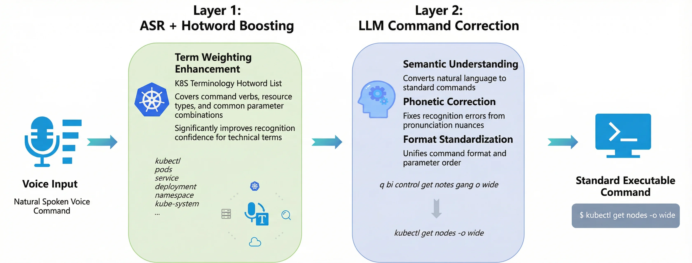
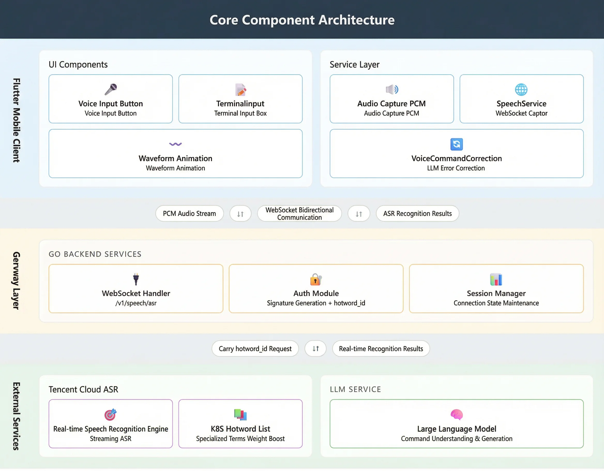
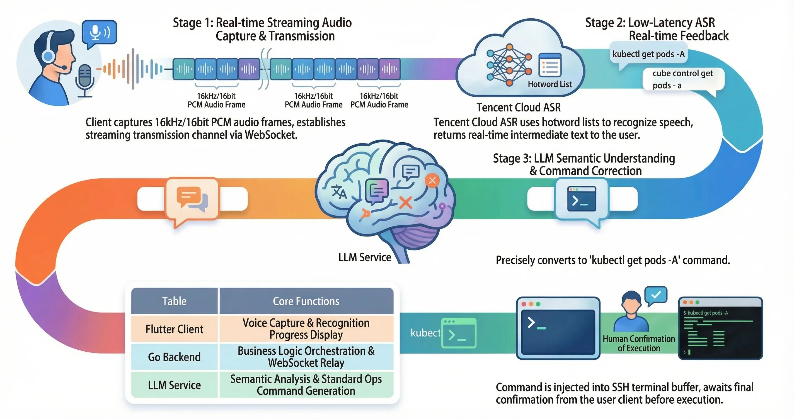
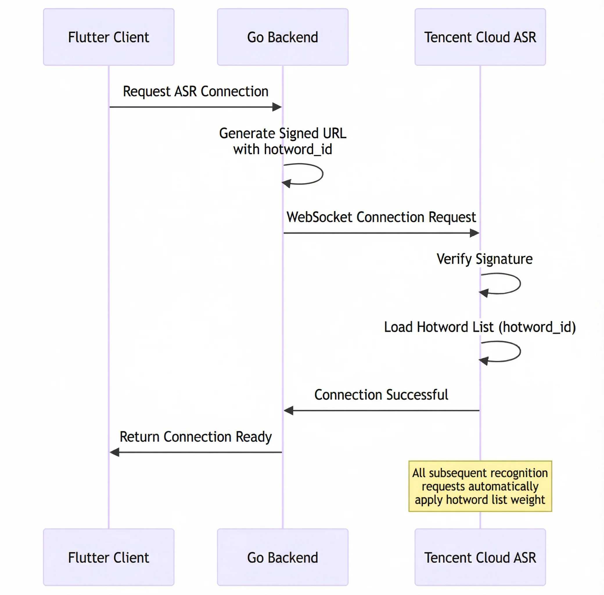
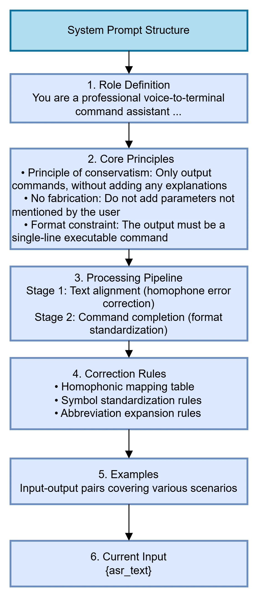
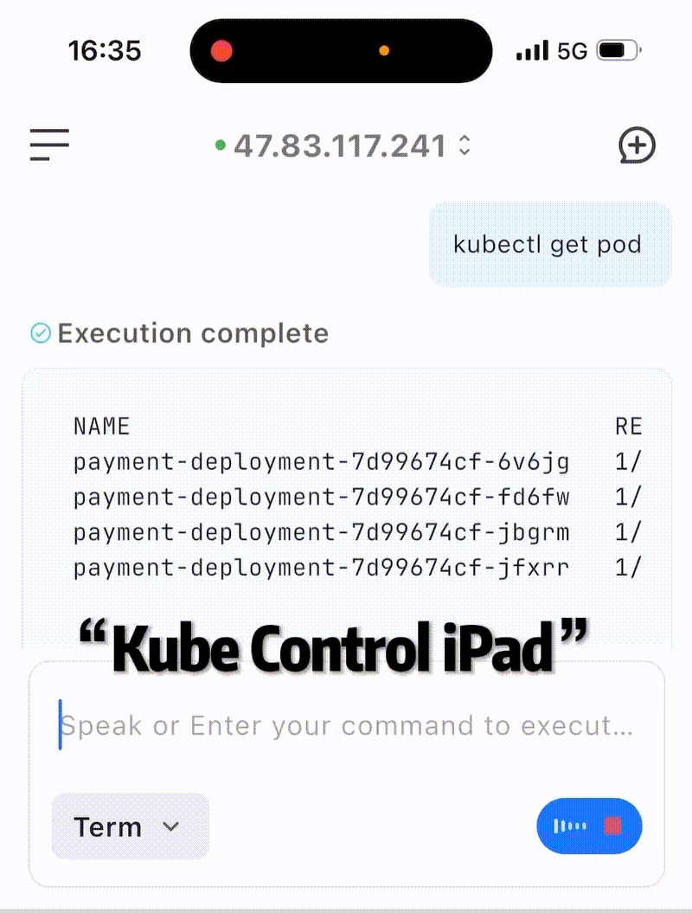
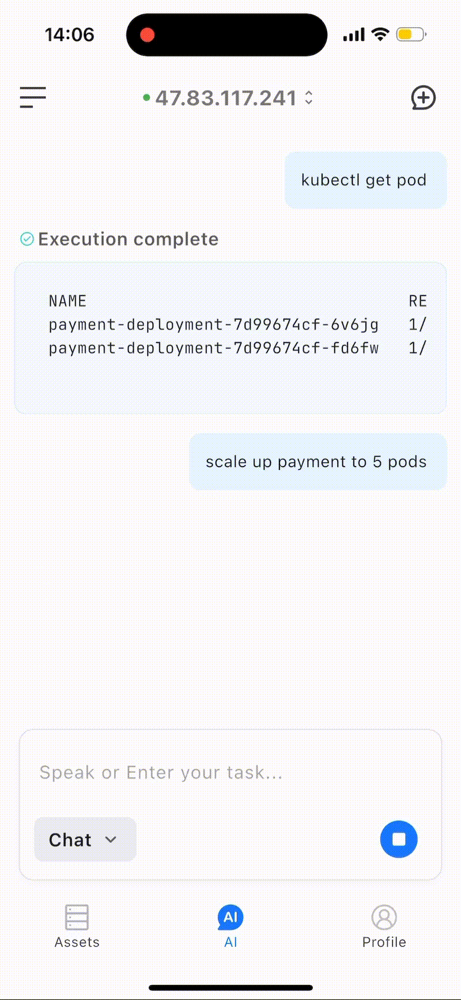

This article introduces how Chaterm achieves high-precision recognition of various terminal operations and Kubernetes commands on mobile devices through a two-layer architecture of ASR hotword list + LLM error correction.

It also introduces the design paradigm of Chaterm's prompt word engineering, including: clear role definition, clear task boundary constraints, structured processing flow, and few-shot examples, to improve the accuracy and consistency of model output.

---

<br>
As a programmer, after a year of hard work, even going home for the Spring Festival isn't always easy. There's the train journey home for family reunions, blind dates arranged by parents, giving money at classmates' weddings, and being bombarded with questions about salary from relatives. But the most terrifying thing is the sudden – "[P0 Level Alert] Core Transaction Service Timeout!"

As a programmer myself, I deeply empathize with these scenarios every time I witness them.


To ensure a good New Year, we created a firefighting tool capable of operating the production system with one hand even in extreme environments!

However, the first challenge we encountered was how to accurately convert traditional speech recognition into 100% accurate operating commands for various cloud platform APIs, or Kubernetes and Linux systems.


---

## Part 1: Technical Challenges of Kubernetes Command Speech Recognition

### 1.1 Background
The first issue to address is that engineers frequently need to execute various commands and parameters quickly via voice on mobile devices, such as `kubectl`. On mobile devices, this process faces a significant user experience problem: **typing complex Kubernetes commands on a mobile phone's virtual keyboard is extremely painful and inefficient.**

**Voice input** is a natural solution. However, traditional ASR (Automatic Speech Recognition) systems face serious challenges when processing Kubernetes commands:

| Challenge Type | Specific Manifestations | Example |
| --- | --- | --- |
| **Property Noun Recognition** | Command verbs are recognized as homophones | `kubectl` → "cool B control", "cube ctl" |
| **Complex Parameter Combinations** | Long command parameters are missing or misplaced | `kubectl get pods -n default -o wide` → "kubectl get pods default wide" |
| **Resource Type Confusion** | Ambiguity caused by mixing abbreviations and full names | `svc` vs `services`, `deploy` vs `deployments` |
| **Namespace Parameters** | Short parameters are easily ignored | `-n`, `--namespace` are swallowed or misrecognized |
| **Special Character Handling** | Symbols cannot be correctly recognized | Symbols such as `-`, `--`, `/` are missing |


### 1.2 Limitations of Traditional Solutions
Traditional speech recognition solutions mainly suffer from the following problems:

1. **Insufficient generalization ability of general models:** ASR models are trained on massive general corpora, resulting in limited coverage of specialized terminology in vertical domains.

2. **Out-of-Vocabulary (OOV) problem:** Words such as `kubectl`, `namespace`, and `deployment` are not in the regular vocabulary.

3. **Lack of contextual understanding:** Inability to understand command semantics, making intelligent completion and error correction difficult.

4. **Difficulty in recognizing mixed Chinese and English:** K8S commands involve a large amount of English terminology mixed with spoken Chinese.

### 1.3 Chaterm's Solution

**Chaterm achieves near 100% accuracy in recognizing K8S commands through a two-layer architecture design:**

****



---

## II. System Architecture Design

### 2.1 Core Component Architecture

At the implementation level of core components, the overall architecture follows the design pattern of "client → gateway → external service", with bidirectional data interaction between each layer via the WebSocket protocol.




<br>

**Flutter Mobile App:** The architecture is divided into two main modules: **User Interface (UI) components** and **Service Layer**. At the UI level, the VoiceInputButton component provides a voice input interface and uses WaveAnimation to provide real-time feedback on the user's operation status. At the service layer, AudioStreamService handles the acquisition of PCM format audio streams, while SpeechService encapsulates the data transmission logic based on the WebSocket protocol. Meanwhile, the VoiceCommandCorrection module encapsulates a carefully designed Prompt, enabling the use of a Large Language Model (LLM) to correct voice commands.

**Gateway Layer:** The backend services are built using Go. Its core components include a WebSocket handler and an authentication module. Specifically, during connection establishment, a parameter named `hotword_id` is appended, allowing the Automatic Speech Recognition (ASR) system to load a corresponding hotword list, achieving a "one-time handshake, end-to-end optimization" effect.

**External Service System:** This system primarily integrates two key capabilities: first, it utilizes Tencent Cloud's real-time speech recognition engine, which supports audio processing capabilities such as hotword lists, replacement words, and weight enhancement; second, it integrates LLM services to provide high-level semantic understanding and instruction generation capabilities. These two technologies work together to improve the overall performance of the system.

### 2.2 Full Process Analysis of Voice Execution



<br>

**Voice-Driven Execution of O&M Commands:** Taking `kubectl get pods -A` as an example

This process demonstrates how the system handles recognition errors and ultimately executes commands accurately when a user directly utters them:

**1. Phase One: Real-Time Voice Acquisition and Transmission**

- **Command Input:** The user presses a button in the Flutter client and utters the command: "kubectl get pods -A".

- **Audio Processing:** The client's AudioStreamService acquires 16kHz/16bit PCM audio frames in real time.

**2. Phase Two: Low-Latency ASR Real-Time Feedback**

- **Communication Link:** The Flutter client connects to the Go backend via a WebSocket interface (/v1/speech/asr). The backend synchronously establishes a connection with Tencent Cloud ASR, carrying `hotword_id` (hotword list) to enhance the recognition of technical terms.

- **Recognition Challenge:** Since words like "kubectl" are easily misrecognized in non-operations contexts, the system enhances accuracy by mounting an operations hotword list (hotword_id).

- **Real-time Preview:** ASR returns intermediate recognition results in real-time, pushed from the backend to the client. Users can see the real-time recognized text on the interface, such as: "q... q coins... cube control...".

**3. Phase Three: LLM Semantic Correction (Core Component)**

- **Original Text Acquisition:** After speech recognition ends, the final text returned by ASR may contain significant errors, such as: "cube control get pods Dash a" (mishearing "kubectl" as "cube control" and "-A" as "Dash a").

- **Calling LLM:** Calling the VoiceCommandCorrection interface.

- **Correction Output:** LLM, combined with the operations knowledge base, performs semantic analysis to accurately correct the above-mentioned confusing text to the standard: "kubectl get pods -A".

**4. Phase Four: Terminal Writing and Manual Confirmation**

- **Terminal Writing:** The corrected standard command is sent to the input box.

- **Final Check:** For security reasons, the command will not run immediately. Instead, it will wait for the user's secondary confirmation on the client before being officially triggered and executed in the terminal environment.


---

## III. First Layer: Accurate ASR Hotword List Recognition

### 3.1 Hotword List Technical Principles

**The Hotword List** is a domain adaptation mechanism provided by the ASR system. By increasing the prior probability of specific words during the decoding process, it significantly improves the recognition accuracy of target words.

#### 3.1.1 Why is a Hotword List Needed?
General ASR models are trained on massive amounts of everyday language corpora, resulting in insufficient coverage of specialized terminology and a **OOV (Out-of-Vocabulary) problem**. When a user says "kubectl," the model tends to output near-homophones seen during training (such as "CoolB Control") rather than low-frequency specialized terms.

#### 3.1.2 Working Principle
During ASR decoding, the output probability of each candidate word is calculated. **The Hotword List changes the decoding result by applying probability bonuses to specific words:**

```plain
No hot word list:                     With hot word list (kubectl weight 100):
─────────────────────                 ─────────────────────
"coolB control" P=0.35 ← Selected    "kubectl" P=0.15×5=0.75 ← Selected
"kubectl" P=0.15                     "CoolB control" P=0.35
```

Mathematical Expression: `P'(hot word) = P(hot word) × boost_factor`

The higher the weight, the larger the boost_factor, and the higher the probability of the hot word winning in homonym competition.

#### 3.1.3 Hot Word Weight Settings

Cloud ASR supports a weight range of 1-11,100:

| Weight Range | Applicable Scenarios | Description |
| --- | --- | --- |
| 1-10 | Regular Business Vocabulary | Slight Improvement, Avoiding Overfitting |
| 11 | Technical Terminology | Moderate Improvement, Balancing Accuracy and Generalization |
| 100 | Core Keywords | Forced Recognition, Applicable to OOV Vocabulary |


**In Kubernetes (K8S) command scenarios, a weight of 100 is used** to ensure that core terms such as `kubectl` and `namespace` are prioritized for recognition.

### 3.2 Kubernetes Hot Topic Table Design

We have built a Kubernetes-specific hot topic table covering the following categories:

#### 3.2.1 Core Command Verbs

```latex
kubectl|100
kubectl get|100
cube control|100
```

#### 3.2.2 Resource Type Vocabulary

```latex
pods|100
pod|100
services|100
```

#### 3.2.3 Commonly Used Parameter Combinations

```latex
-n|100
-n default|100
-- namespace|100
```

#### 3.2.4 Complete Command Template

```latex
kubectl get pods|100
kubectl get pods -A|100
kubectl get pods -n default|100
```

### 3.3 Hot Topic List Integration Process



## IV. Second Layer: LLM Intelligent Error Correction

### 4.1 The Necessity of LLM Error Correction

Although the hotword list significantly improves the recognition rate of technical terms, ASR output may still have the following problems:

1. **Residual Homophone Errors**: Some words are still recognized as near-homophones (e.g., "kube ctl").

2. **Natural Language Expressions**: Users may say "View all pods" instead of "kubectl get pods -A".

3. **Incorrect Parameter Order**: "-n default" may appear in the middle of the command.

4. **Incorrect Formatting**: Missing necessary spaces, hyphens, etc.

**The Role of the LLM Layer**: As a semantic understanding layer, it converts the raw output of ASR (natural language, homophones, incomplete commands) into **standard, executable Kubernetes commands**.

### 4.2 Prompt Engineering Design The industry-standard design paradigm for **Prompt Engineering** generally includes: clear role definition, clear task boundary constraints, structured processing flow, and high-quality **Few-shot examples**. A well-designed prompt can significantly improve the accuracy and consistency of model output.

In the voice command correction scenario of Chaterm, we followed the above principles and designed the following System Prompt structure:

+ **Role Definition**: Positioning the model as a "voice-to-terminal command assistant," clearly defining its responsibilities—only performing command conversion, without providing additional explanations or suggestions.

+ **Core Principle**: Emphasizing a conservative strategy, i.e., "no fabrication"—not adding parameters not mentioned by the user, avoiding erroneous commands caused by excessive model inference.

+ **Processing Flow**: Executed in two stages: first, correcting homophonic errors remaining from ASR (text correction), then performing K8s command format standardization (structural completion).

+ **Correction Rules**: Through continuous debugging, knowledge from areas such as homophonic mapping tables, symbol standardization rules, and abbreviation expansion rules is further integrated to provide the model with clear conversion criteria.

+ **Few-shot Examples**: Covering typical scenarios such as homophonic error correction, natural language conversion, and parameter normalization, examples guide the model to output in the expected format.



### 4.3 LLM Error Correction Effect

#### Typical Error Correction Examples

| Scenario | ASR Raw Output | LLM Error Correction Output |
| --- | --- | --- |
| Phonetic Error Correction | "cool B control get run" | kubectl get pods |
| Natural Language Conversion | "view all pods" | kubectl get pods -A |
| Parameter Normalization | "kubectl get pods bar n default" | kubectl get pods -n default |
| Hybrid Error Correction | "kube ctl describe of deployment nginx" | kubectl describe deployment nginx |
| Resource Operation | "delete nginx under default" | kubectl delete pod nginx -n default |

---

## V. Real-world Case Demonstration

### Case: Recovering the payment-deployment service using voice input





---

## VI. Summary

Through a two-layer architecture of **ASR and hotword enhancement + LLM error correction**, Chatem achieves near 100% accurate recognition of K8S commands:

1. **Hotword Table**: K8S command hotwords with weighted enhancement to ensure accurate recognition of proper nouns.

2. **LLM Error Correction**: Converts natural language, homophones, and incomplete commands into standard K8S commands.

3. **End-to-End Optimization**: Ensures accuracy across the entire process from voice input to command execution.

4. **Future Optimization Directions**: Supports skipping LLM calls for short commands and high-confidence scenarios to achieve rapid local rule correction; optimizes the hotword table based on user habits for command history learning; supports saving frequently used command templates, etc.


---

## Reference
- Website：https://chaterm.ai/
- Github：https://github.com/chaterm/Chaterm