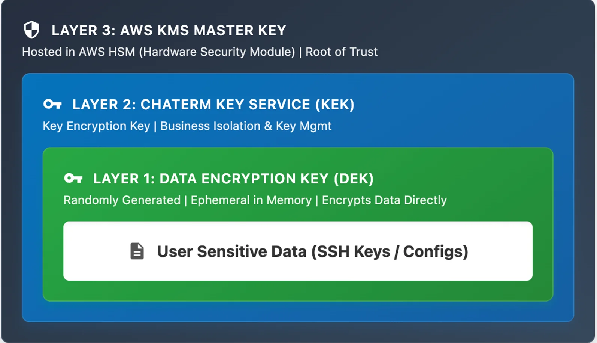
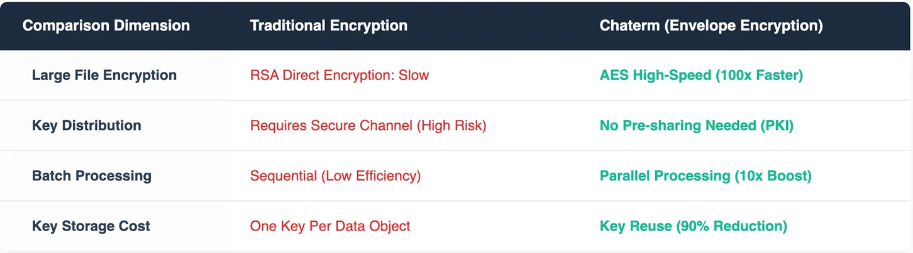
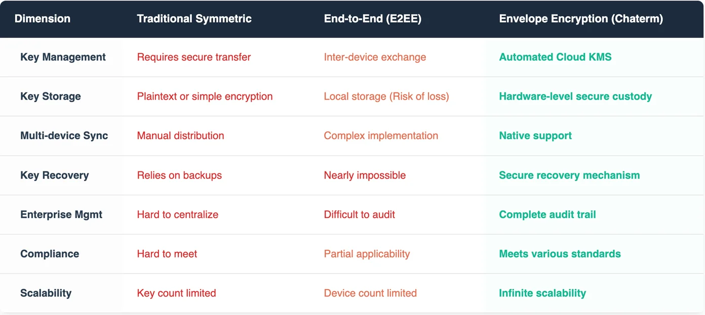
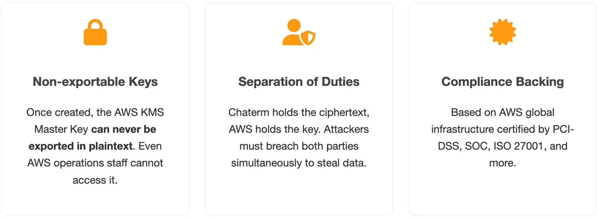
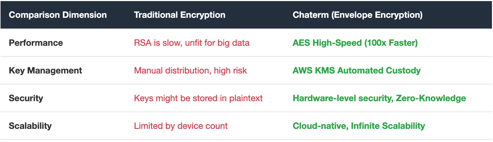
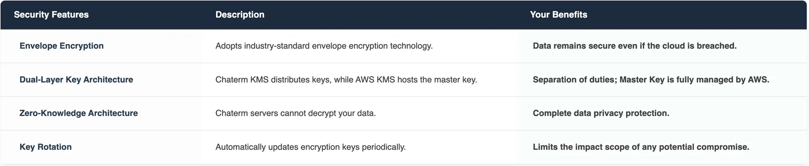

This document provides an in-depth look at how Chaterm utilizes AWS Key Management Service and Envelope Encryption, modern enterprise-grade data protection technologies, to explain their core principles and security advantages.

We will demonstrate how Chaterm uses these technologies to build a three-tiered key architecture, achieving end-to-end data security and providing bank-level protection for users' sensitive digital assets such as SSH keys and server configurations.

---

## 1. Why Data Security Matters
In modern IT operations and development, digital assets like SSH keys, server passwords, and database connection strings are extremely sensitive. Once leaked, the consequences are unimaginable:

- **Intrusion into core enterprise systems**
- **Theft or ransom of critical data**
- **Prolonged disruption of business services**
- **Irreversible damage to brand reputation**

Traditional terminal management tools often rely on simple password encryption or store data in plaintext on the cloud. These solutions harbor serious security risks. Even with encryption, if key management is improper, the system can still be breached. Therefore, we need more secure and reliable data protection technologies to meet these challenges.

To solve this problem, Chaterm did not choose a traditional self-built encryption scheme. Instead, we adopted AWS KMS combined with an Envelope Encryption architecture. This is not just a technical choice; it is a security commitment. Through this architectural design, we completely separate data “ownership” from “management rights,” ensuring that no single party (including Chaterm itself) can unilaterally access your sensitive information.

## 2. What is Envelope Encryption?

Envelope Encryption is an enterprise-grade encryption technology widely adopted by major cloud providers like AWS. The name is illustrative: just as you place an important letter inside an envelope and then lock that envelope inside a safe, your data undergoes double protection.

### Technical Background

Traditional encryption schemes face a dilemma:

- **Symmetric Encryption (e.g., AES):** Fast and suitable for large data, but key distribution is difficult.
- **Asymmetric Encryption (e.g., RSA):** Secure key management, but slow and unsuitable for large data volumes.

Envelope encryption cleverly combines the advantages of both while avoiding their respective downsides, becoming the standard encryption scheme for modern cloud services.

### Core Principles Explained

**The Three-Tier Key Protection System：** Envelope encryption relies on multi-layer key isolation, protecting data like a Russian nesting doll.

- **Data Encryption Key (DEK):** Directly encrypts your data. It is used once and then destroyed (from memory).
- **Key Encryption Key (KEK):** Protects the Data Encryption Key and is processed within backend services.
- **Master Key:** The root key, securely hosted within AWS KMS.

This layered design ensures that even if one layer is breached, the attacker cannot access your data. Each key layer has independent access controls, realizing true defense-in-depth.

### Envelope Encryption Workflow

**Key Security Points:**

- **Key Separation:** The Data Encryption Key (DEK) is separated from the Master Key. The DEK exists in memory only briefly during use.
- **Cloud Protection:** The Master Key is securely hosted by a cloud provider (AWS), offering enterprise-level security guarantees.
- **Zero Knowledge:** Cloud servers never possess the ability to decrypt the actual data content.

### In-Depth Security Analysis

**Multiple Security Guarantees**

Our security defense system is built on four core dimensions. At the cryptographic level, we use the AES-256 encryption algorithm—which would take billions of years to brute-force even with all the world’s computers—paired with GCM mode to provide both data confidentiality and integrity. We also utilize cryptographically secure random number generators to ensure key unpredictability.

Regarding physical security, the Master Key is fully hosted within the cloud provider’s secure infrastructure, enjoying hardware-level protection that passes multiple international security certifications, including professional defenses against side-channel attacks.

The access control mechanism uses Multi-Factor Authentication (MFA) to verify the authenticity of the requester, implements granular permission management, and maintains complete audit logs and real-time monitoring for all key operations.

Finally, Forward Secrecy design ensures that even if the Master Key is compromised in the future, historical data remains secure. This is achieved because every session uses an independent Data Encryption Key, combined with regular key rotation mechanisms to limit the potential blast radius of a leak.

### Technical Advantages

**Performance Advantages**

**Security Assurance**

In this process, your SSH private keys receive multiple layers of protection:

- **Chaterm cannot read it:** Our servers only see ciphertext.
- **Hackers cannot crack it:** Decryption is impossible without the Master Key.
- **Insiders cannot access it:** The Master Key is managed by the cloud provider; Chaterm staff cannot touch it.
- **You have total control:** Only your device can request decryption.

We don’t simply dump data into AWS for encryption; we designed a rigorous dual-verification mechanism:

**Envelope Encryption (Server-side Protection):** The ciphertext is stored in the Chaterm database. Even if hackers dump the database, they cannot decrypt it without the AWS KMS Master Key.

**User Key Derivation (Client-side Protection):** Even the Chaterm system itself can only assist you in retrieving the encrypted Data Encryption Key (DEK). The final step of decryption happens — and only happens — in your device’s memory. This means that without your master password participating in the verification, even if AWS KMS and Chaterm joined forces, your original data could not be restored. This is what we call “Zero Trust”—we do not trust any intermediaries, including ourselves.

### Comparison with Other Schemes

## 3. What is AWS KMS?

Before diving deeper, we must recognize the core component of Chaterm’s security architecture—AWS KMS. AWS Key Management Service (AWS KMS) is a fully managed service provided by AWS. If your data is a precious “letter,” AWS KMS is the “Central Vault” guarded 24/7 by armed convoys.

It is not just a place to store passwords; it is a highly rigorous encryption control center featuring:

- **Centralized Management:** Allows users to create and control encryption keys in one secure central location and unify key lifecycle management.

- **Fully Managed Infrastructure:** AWS KMS abstracts away complex underlying physical security details. Users enjoy international standard-compliant security infrastructure without building expensive physical encryption rooms.

- **Cloud-Native Integration:** As the core of the AWS security ecosystem, it integrates deeply with various AWS services, ensuring standardization and security of key operations.
It is based on this solid “Trust Anchor” that Chaterm builds its subsequent envelope encryption system.

## 4. Why Choose AWS KMS? 

Chaterm anchors its trust in AWS KMS because it offers a depth of security that self-built solutions cannot match:

**1. Non-exportable Keys (Logical Isolation)**

The design philosophy of AWS KMS is “Logical Isolation.” Once a Master Key is created in KMS, based on the underlying system design, it can never be exported in plaintext. This means that neither Chaterm’s highest-privilege administrators nor even AWS operations personnel can “extract” this root key via any API or physical means. Since the root key cannot be obtained, the encrypted data stored in Chaterm’s database remains meaningless gibberish to everyone.

**2. Separation of Duties**

By integrating AWS KMS, Chaterm achieves perfect separation of duties:

Chaterm: Responsible for holding the encrypted data (ciphertext).

AWS: Responsible for holding the decryption root key.

To steal your data, an attacker must simultaneously breach Chaterm’s server defenses and AWS’s global security infrastructure, while also bypassing strict identity authentication systems.

**3. Compliance Backing of AWS Global Infrastructure**

Data security is not just an algorithmic issue; it is a physical facility issue. AWS KMS runs within AWS’s high-security global data centers. These facilities possess the world’s most stringent compliance certifications, including PCI-DSS (Payment Card Industry Data Security Standard), SOC, and ISO 27001. Choosing Chaterm means your SSH key protection level directly inherits these financial-grade security standards.

### Visible Defense: CloudTrail Auditing & IAM Control

Beyond encryption, security means “visibility” and “controllability.” Chaterm combines AWS management tools to provide extra security barriers.

**Granular Permission Control (IAM):** Through AWS Identity and Access Management (IAM), we configure key usage permissions via the principle of least privilege. Only strictly authenticated Chaterm core service processes have the authority to initiate decryption requests. Unauthorized attempts are instantly rejected.

**Complete Audit Trails (CloudTrail):** Every API call to AWS KMS (encryption or decryption) is automatically recorded by AWS CloudTrail. We can trace who called the key, when, and from which IP. These immutable logs ensure any abnormal behavior leaves a permanent digital footprint.

## 5. How Chaterm Protects Your Data

**Core Security Features**

- **Envelope Encryption:** DEK encrypts data; Master Key encrypts DEK. Double protection.
- **Zero-Trust Architecture:** The server side never touches plaintext data.
- **Three-Layer Collaborative Key Architecture:** AWS KMS handles Master Key custody; Chaterm handles KEK rotation and DEK generation/distribution.
- **Key Isolation:** Physical separation of key management and data storage.

**Technical Innovations**

Chaterm has implemented several technical enhancements on top of standard envelope encryption. First, we integrated Zero-Knowledge Proof (ZKP) technology, allowing user identity verification without ever exposing password information. Second, we use a Distributed Key Generation (DKG) mechanism to avoid single points of failure.

Regarding frontier technology, we are pre-researching Homomorphic Encryption to allow calculation operations directly on ciphertext. Finally, for enterprise users, we provide comprehensive Key Custody Solutions for compliance and disaster recovery.

**Security Assurance Measures**

## 6. The Perfect Balance of User Experience and Security

When using Chaterm, all encryption operations are completed automatically in the background:

- **Imperceptible Encryption:** You use terminal functions normally; the system automatically encrypts all sensitive data.

- **Fast Synchronization:** AWS KMS is designed for high concurrency; decryption request response times are in milliseconds.

- **Offline Availability:** Local caching ensures work can continue even when disconnected.

- **Multi-Device Support:** Securely access your configurations on any device.

- **Local Optimization:** Calls to AWS KMS are only required during the session handshake phase; bulk data is processed locally with the DEK.

## 7. Applicable Scenarios

Chaterm’s envelope encryption technology is particularly suitable for:

**Individual Developers:**

-Syncing SSH configurations between home and office computers.

-Protecting access credentials for personal servers and cloud services.

-Preventing key leaks caused by lost laptops.

**DevOps Teams:**

- Securely sharing server access permissions among team members.

- Centralized management with decentralized control of key systems.

- Meeting security audit and compliance requirements.

## 8. Conclusion: Entrusting Trust to Professional Architecture

In today’s increasingly severe cybersecurity landscape, relying merely on “promises” is no longer enough to win trust. Chaterm utilizes AWS KMS Envelope Encryption technology to build data security upon mathematical algorithms, separation-of-duties architecture, and AWS’s verified infrastructure.

We firmly believe that the best security architecture is one where the platform “has no right to be evil.” Through AWS KMS, Chaterm achieves this: Your keys belong to you, your data belongs to you, and we are merely the trustworthy watchmen guarding the safe.

## 9. FAQ

**Q: If Chaterm’s servers are attacked, is my data safe?**

A: Yes. Due to envelope encryption, only encrypted data is stored on the server, and the server cannot access the decryption keys. Even if the server is completely controlled, the attacker cannot decrypt your data.

**Q: What if I forget my account Master Password?**

A: For security reasons, we cannot help you recover your password. We recommend using a password manager to keep it safe. Alternatively, you can perform a user password recovery operation via email or third-party login, though this may involve resetting your data keys depending on your recovery settings.

**Q: Does envelope encryption affect performance?**

A: There is almost no impact. Modern encryption algorithms are highly optimized, and encryption/decryption operations are completed in milliseconds.

**Q: Can Chaterm employees see my data?**

A: No. We adopt a Zero-Knowledge architecture. All data is encrypted on your device; we can only see meaningless ciphertext.

## 10. References

Want to learn more about Envelope Encryption? We recommend the following resources:

- https://en.wikipedia.org/wiki/Envelope_encryption

- https://docs.aws.amazon.com/kms/latest/developerguide/concepts.html

## Original

https://aws.amazon.com/cn/blogs/china/chaterm-aws-kms-envelope-encryption-for-zero-trust-security-en/