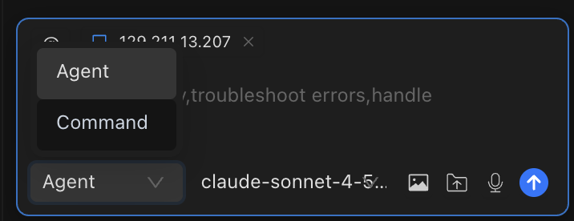

# AI Dialog

The AI Dialog panel is your central hub for interacting with AI — generate commands, plan complex tasks, and automate multi-host operations.



## Three Modes for Every Workflow

Chaterm offers two distinct dialog modes, each designed for a different level of AI involvement. Choose the one that fits your task.

### Command Mode

**AI generates commands for the active terminal — you approve before execution.**

In Command mode, the AI analyzes your request and produces one or more terminal commands. Each command is displayed for your review. You can approve, edit, or reject it before anything runs.

**Example conversation:**

> **You:** Find all log files larger than 100MB in /var/log and compress them.
>
> **AI:** Here is a command to find and compress those files:
>
> ```bash
> find /var/log -name "*.log" -size +100M -exec gzip {} \;
> ```
>
> **[Approve]** **[Reject]**

::: warning
In Command mode, commands run in your **currently active terminal**. Always verify you are connected to the correct host before approving.
:::

---

### Agent Mode

**AI autonomously executes multi-step tasks across one or more hosts.**

Agent mode gives the AI the ability to plan, execute, observe results, and adapt. It can operate across multiple hosts by using the `@` mention syntax. The AI continues working until the task is complete or it needs your input.

**Example conversation:**

> **You:** @web-server-01 @web-server-02 Check disk usage on both hosts. If any partition is above 80%, find and list the top 10 largest files.
>
> **AI:** Starting task on 2 hosts...
>
> _[Executes `df -h` on web-server-01]_ — All partitions below 80%. No action needed.
>
> _[Executes `df -h` on web-server-02]_ — `/data` is at 87%.
>
> _[Executes `du -ah /data | sort -rh | head -10` on web-server-02]_ — Here are the top 10 largest files...

::: tip
In Agent mode, type `@` in the input box to see a list of available hosts. You can select multiple hosts for cross-server operations.
:::

---

## Uploading Files and Images

You can attach files and images to any message to give the AI additional context.

| Type                | Supported Formats                                                                                                                                                   | Max Size | How to Attach                                                |
| ------------------- | ------------------------------------------------------------------------------------------------------------------------------------------------------------------- | -------- | ------------------------------------------------------------ |
| **Images**          | `.png`, `.jpg`, `.jpeg`, `.webp`                                                                                                                                    | 5 MB     | Drag and drop into the input box, or click the upload button |
| **Text/Code files** | `.txt`, `.md`, `.js`, `.ts`, `.py`, `.java`, `.cpp`, `.c`, `.html`, `.css`, `.json`, `.xml`, `.yaml`, `.yml`, `.sql`, `.sh`, `.bat`, `.ps1`, `.log`, `.csv`, `.tsv` | 1 MB     | Drag and drop into the input box, or click the upload button |

Code files are automatically wrapped in syntax-highlighted code blocks based on their extension.

---

## History Management

Every conversation is saved automatically. You can revisit, search, and organize past dialogs.

### Viewing and restoring history

1. Click the **menu button** in the top-left corner of the AI dialog panel.
2. Browse or **search** history by title using the search field.
3. Click any history entry to **restore** that conversation.

### Organizing history

- **Favorite** a conversation by clicking the star icon — favorites appear at the top of the list.
- **Rename** a conversation by clicking its title and typing a new name.
- **Delete** a conversation by clicking the delete icon on the history entry.

History supports **pagination**, so even large numbers of past conversations remain easy to navigate.

---

## Layout Switching

Chaterm offers two interface layouts so you can put the focus where you need it.

| Layout              | Description                                                           | Best for                                        |
| ------------------- | --------------------------------------------------------------------- | ----------------------------------------------- |
| **Terminal layout** | Terminal occupies the main area; AI sidebar is a secondary panel      | Terminal-centric workflows where AI assists     |
| **Agents layout**   | AI conversation occupies the main area; terminal is a secondary panel | AI-driven workflows where the terminal executes |

**Switch layouts instantly** with the keyboard shortcut:

- **macOS:** `Cmd + E`
- **Windows / Linux:** `Ctrl + E`

You can also change the layout in [General Settings](/docs/settings/general/). The change takes effect immediately — no restart required.

---

## Related Documentation

- [AI Settings](/docs/ai/settings/) — Configure providers, models, and create new dialogs
- [AI Preferences](/docs/ai/preferences/) — Fine-tune reasoning depth, auto-execution, and security policies
- [Model Configuration](/docs/ai/llms/) — Add and manage AI model providers
