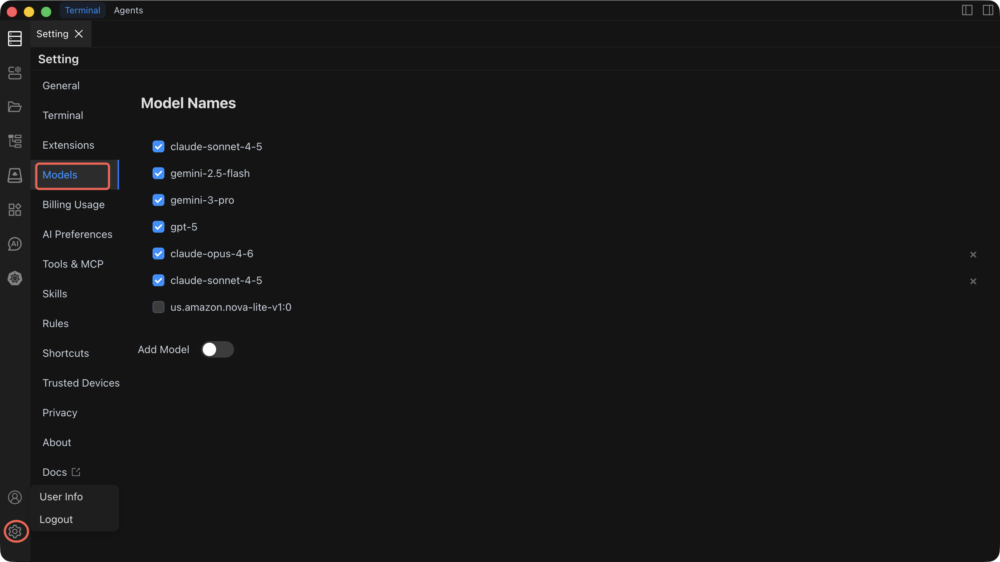

# Model List

Chaterm supports multiple AI model providers out of the box, and you can add your own for maximum flexibility.

## Built-in Models

Chaterm ships with several high-quality models pre-configured and ready to use — no setup required. Simply select one from the model dropdown in any AI dialog.

## Getting Started with Your First Custom Model

Follow these steps to add a custom model provider. The example below uses OpenAI, but the process is similar for all providers.

1. Open **Settings** by clicking the gear icon in the top-right corner.
2. Navigate to the **"Models"** tab in the left menu.
3. Click **"Add Model"**.
4. Select **OpenAI** (or your preferred provider) from the provider list.
5. Enter the **API endpoint URL** (e.g., `https://api.openai.com/v1`).
6. Paste your **API key**.
7. Type or select a **model name** (e.g., `gpt-5`).
8. Click **"Test Connection"** — a success message confirms everything is working.
9. Click **"Save"** — the model now appears in your model dropdown across all AI dialogs.

::: tip Recommended first setup
If you are new to Chaterm's AI features, start with **DeepSeek** or **OpenAI**. Both require only an API key, have straightforward setup, and provide strong general-purpose models suitable for command generation and agent tasks.
:::

---

## Provider Reference

### 1. LiteLLM

Connect to multiple model providers through a unified LiteLLM gateway.

| Configuration Item | Description                                           | Required |
| ------------------ | ----------------------------------------------------- | -------- |
| **URL Address**    | LiteLLM service endpoint                              | Yes      |
| **API Key**        | Access key for the LiteLLM gateway                    | Yes      |
| **Model Name**     | Model identifier (e.g., `gpt-5`, `claude-sonnet-4-6`) | Yes      |

**Best for:** Teams that already run a LiteLLM proxy to unify access to multiple providers behind a single endpoint.

---

### 2. OpenAI

Connect directly to OpenAI or any OpenAI-compatible API.

| Configuration Item     | Description                                                          | Required |
| ---------------------- | -------------------------------------------------------------------- | -------- |
| **OpenAI URL Address** | API endpoint (default: `https://api.openai.com/v1`)                  | Yes      |
| **OpenAI API Key**     | Your OpenAI API key                                                  | Yes      |
| **Model Name**         | Model to use (e.g., `gpt-5`, `claude-sonnet-4-6`, `claude-opus-4-5`) | Yes      |

**Best for:** Direct access to OpenAI models, or connecting to third-party services that expose an OpenAI-compatible API.

---

### 3. Amazon Bedrock

Use AWS Bedrock for enterprise-grade AI with AWS security and compliance.

| Configuration Item         | Description                                 | Required |
| -------------------------- | ------------------------------------------- | -------- |
| **AWS Access Key**         | IAM access key ID                           | Yes      |
| **AWS Secret Key**         | IAM secret access key                       | Yes      |
| **AWS Session Token**      | Temporary session token (for assumed roles) | No       |
| **AWS Region**             | Service region (e.g., `us-east-1`)          | Yes      |
| **Custom VPC Endpoint**    | Private endpoint for VPC-based access       | No       |
| **Cross-Region Inference** | Enable inference across multiple regions    | No       |
| **Model Name**             | Bedrock model identifier                    | Yes      |

**Best for:** Organizations already invested in AWS that need enterprise security, compliance controls, and private network access.

---

### 4. DeepSeek

Connect to the DeepSeek API for strong reasoning and coding capabilities.

| Configuration Item   | Description                                               | Required |
| -------------------- | --------------------------------------------------------- | -------- |
| **DeepSeek API Key** | Your DeepSeek API key                                     | Yes      |
| **Model Name**       | Model to use (e.g., `deepseek-chat`, `deepseek-reasoner`) | Yes      |

**Best for:** Cost-effective access to models with strong reasoning and code generation capabilities.

---

### 5. Ollama (Local Deployment)

Run models locally for maximum privacy and offline access.

| Configuration Item     | Description                                                      | Required |
| ---------------------- | ---------------------------------------------------------------- | -------- |
| **Ollama URL Address** | Local service address (default: `http://localhost:11434`)        | Yes      |
| **Model Name**         | Locally installed model (e.g., `llama3`, `codellama`, `mistral`) | Yes      |

**Best for:** Air-gapped environments, data-sensitive workloads, or experimentation without API costs.

::: tip
Make sure the Ollama service is running before testing the connection. You can start it with `ollama serve` and pull models with `ollama pull <model-name>`.
:::

---

## Configuration Tips

- **Test after every change** — Always click "Test Connection" after modifying any provider configuration.
- **Multiple models** — You can configure several providers and models simultaneously, then switch between them per dialog.
- **API key security** — Chaterm stores credentials locally. Rotate keys periodically with your provider.
- **Performance** — Monitor response times. Local models (Ollama) have no network latency but depend on your hardware. Cloud models are faster on powerful servers but add network round-trip time.

---

## Related Documentation

- [AI Settings](/docs/ai/settings/) — Create dialogs and configure providers step by step
- [AI Preferences](/docs/ai/preferences/) — Adjust reasoning depth, auto-execution, and security policies
