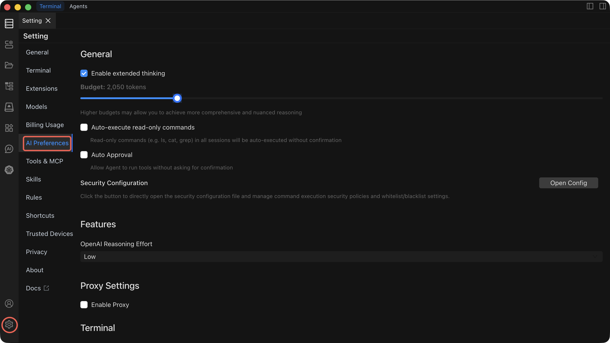

# AI Preferences

Fine-tune how the AI assistant behaves, from reasoning depth to command execution policies.

## Settings Reference

| Setting                                     | Default   | What it does                                                                                                                                    | When to change it                                                                                                                     |
| ------------------------------------------- | --------- | ----------------------------------------------------------------------------------------------------------------------------------------------- | ------------------------------------------------------------------------------------------------------------------------------------- |
| **Extended Thinking**                       | Enabled   | Allocates a token budget for the AI to reason step-by-step before responding. A higher budget produces more thorough, accurate answers.         | Increase the budget for complex multi-step tasks. Decrease it (or disable) when you need faster responses for simple questions.       |
| **Auto-execute read-only commands Execute** | Disabled  | Read-only commands (e.g. Is, cat, grep) in all sessions will be auto-executed without confirmation.                                             | Enable only after you are comfortable with the AI's behavior.                                                                         |
| **Auto Execute**                            | Disabled  | When enabled, Agent mode executes commands automatically without waiting for your approval.                                                     | Enable only after you are comfortable with the AI's behavior and have configured Security rules to block dangerous commands.          |
| **Security Configuration**                  | —         | Defines policies that prevent the AI from executing dangerous or destructive commands (e.g., `rm -rf /`, `DROP DATABASE`).                      | Configure before enabling Auto Execute. Review and update whenever your environment or risk tolerance changes.                        |
| **OpenAI Reasoning Level**                  | Low       | Controls reasoning intensity for OpenAI models: **Low** (fast, lower cost), **Medium** (balanced), **High** (deep reasoning, highest accuracy). | Raise to Medium or High for complex troubleshooting or planning tasks. Keep at Low for routine operations to save cost and latency.   |
| **Proxy Configuration**                     | Disabled  | Routes AI API traffic through an HTTP/SOCKS proxy. Configure protocol, hostname, port, and optional authentication.                             | Enable when your network requires a proxy to reach external API endpoints. Not needed for local models like Ollama.                   |
| **Shell Integration Timeout**               | 4 seconds | Maximum time the terminal waits for shell integration to initialize when executing a command.                                                   | Increase if you experience timeout errors on slow connections or heavily loaded hosts. Decrease to fail faster on unresponsive hosts. |

---

## Extended Thinking

Extended Thinking gives the AI a dedicated reasoning phase before it generates a response. You can control the token budget allocated to this phase.

- **Higher budget** = more comprehensive reasoning, better accuracy on complex tasks, but slower responses.
- **Lower budget** = faster responses, sufficient for straightforward questions.

Adjust the budget slider in the preferences panel to find the right balance for your workflow.

---

## Auto Execute

::: warning Security implications
When Auto Execute is enabled, the AI will run commands **without asking for your confirmation**. This is powerful for automation but carries risk. A misconfigured prompt or unexpected AI behavior could execute destructive commands.

**Before enabling Auto Execute:**

1. Configure **Security rules** to block dangerous commands.
2. Test the AI's behavior in manual mode with your typical prompts.
3. Start with a non-production environment.
   :::

When disabled (the default), every command generated by the AI requires explicit approval before execution.

---

## Security Configuration

Security Configuration lets you define a blocklist of commands or patterns that the AI is never allowed to execute, regardless of the Auto Execute setting.

- Add patterns for dangerous operations (e.g., `rm -rf`, `mkfs`, `shutdown`, `DROP TABLE`).
- Rules apply to both Command mode and Agent mode.
- Review your security rules regularly as your environment evolves.

---

## OpenAI Reasoning Level

This setting only affects OpenAI-compatible models. It controls how much reasoning effort the model applies:

| Level      | Response speed | Accuracy                     | Cost     |
| ---------- | -------------- | ---------------------------- | -------- |
| **Low**    | Fastest        | Good for routine tasks       | Lowest   |
| **Medium** | Moderate       | Better for nuanced questions | Moderate |
| **High**   | Slowest        | Best for complex reasoning   | Highest  |

---

## Proxy Configuration

If your network requires a proxy to reach external AI APIs, configure it here. The proxy is disabled by default.

- **Protocol** — HTTP, HTTPS, or SOCKS5
- **Hostname** — Proxy server address
- **Port** — Proxy server port
- **Username / Password** — Optional authentication credentials

::: tip
Proxy settings apply globally to all AI API traffic. If you use a local model via Ollama, traffic to `localhost` bypasses the proxy.
:::

---

## Shell Integration Timeout

The shell integration timeout controls how long Chaterm waits for the terminal shell to initialize its integration hooks when executing a command. If the timeout is exceeded, the command execution is aborted to prevent blocking.

The default of **4 seconds** works well for most connections. Increase it for high-latency or heavily loaded remote hosts.

---

## Related Documentation

- [AI Dialogs](/docs/ai/dialogs/) — Understand Chat, Command, and Agent modes
- [AI Settings](/docs/ai/settings/) — Configure providers, models, and create new dialogs
