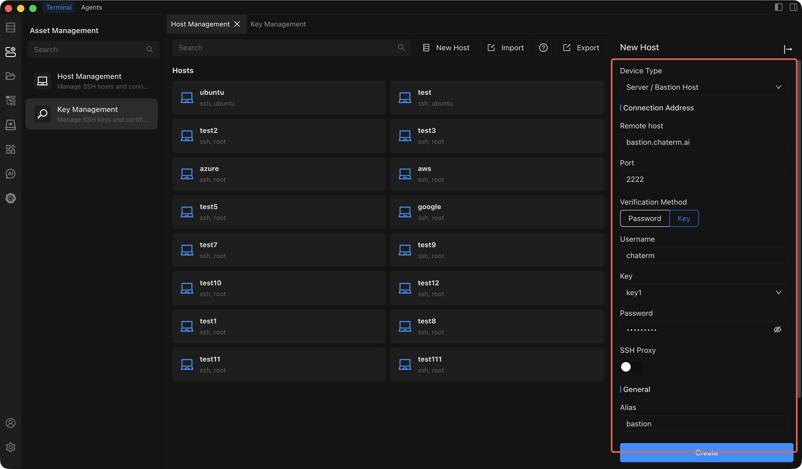

# Add a Bastion Host

Add a bastion host to Chaterm to access enterprise-level assets that are synchronized from a centralized bastion (jump server) system.

::: info What is a bastion host?
A bastion host (also called a jump server) is a hardened gateway server that sits between your local machine and the internal servers you need to manage. Instead of connecting to each server directly, you connect through the bastion host, which enforces access controls, auditing, and security policies. Organizations use bastion hosts to centrally manage who can access which servers and to maintain a full audit trail of all sessions.
:::

## Prerequisites

Before adding a bastion host, make sure you have:

- **Chaterm installed** and running. See [Downloads](/docs/start/downloads/) if you have not installed it yet.
- **Bastion host credentials** -- typically a combination of an SSH key and a password, as required by your organization's bastion system.
- **Connection address** -- the IP address or domain name of the bastion host, along with the SSH port.
- **Access permissions** granted by your organization's administrator to connect through the bastion.

## Steps

1. Open the **Host Management** page from the left sidebar.
2. Click **Add Host** in the top-right corner of the Host Management page.
3. In the **Add Host** sidebar that opens, set **Device type** to **Server / Bastion**.
4. Fill in the remaining configuration fields described in the table below.
5. Click **Create** to save the bastion host.

## Configuration Fields

| Field | Description | Required |
| --- | --- | --- |
| **Device Type** | Select **Server / Bastion** to indicate this is a bastion host resource. | Yes |
| **Connection IP/URL** | The IP address or domain name of the bastion host (e.g. `bastion.corp.example.com`). | Yes |
| **Port** | The SSH service port on the bastion host. Defaults to `22`. | Yes |
| **Username** | The SSH login username assigned to you on the bastion system. | Yes |
| **Key** | Select the SSH authentication key required by the bastion host. Keys can be managed in [Key Management](/docs/manage/keys/). | Yes |
| **Password** | The authentication password required by the bastion host. Some bastion systems require both a key and a password for two-factor authentication. | Yes |
| **SSH Proxy** | If the bastion host itself must be reached through an intermediate proxy server, configure the proxy details here. Leave empty for direct connections. | No |
| **Alias** | A friendly display name to identify this bastion host in the host list (e.g. `Production Bastion`). | Yes |
| **Group** | Assign the bastion host to a group for organization (e.g. `bastion`, `production`). You can select an existing group or type a new name. | No |

## Sync Bastion Assets

After adding a bastion host, Chaterm displays it on the bastion resource page along with a list of the internal assets available through it.

To update the asset list with the latest information from the bastion system:

1. Navigate to the **Bastion Resources** tab in the workspace.
2. Locate the bastion host entry you want to refresh.
3. Click the **Refresh** button next to the bastion host to manually sync the latest asset data.

Once synced, the internal assets appear in the list just like personal hosts. Click any asset to establish an SSH connection. You can also right-click an asset to add it to favorites, attach notes, or assign it to a custom group.

## Custom Group Management

You can create custom groups to organize bastion assets in a way that makes sense for your team:

1. In the workspace, select the **Bastion Resources** tab.
2. Click the **Custom Group** button in the upper-right corner.
3. Fill in the group details:
   - **Group Name** -- a short, descriptive name (e.g. `Web Servers`, `Database Tier`).
   - **Group Description** -- an optional note explaining what this group contains.
4. Click **Save** to create the group.

To edit or delete an existing custom group, right-click the group on the bastion resource page and choose the appropriate action from the context menu.

## Related Pages

- [Key Management](/docs/manage/keys/) -- import and manage SSH keys used for bastion authentication.
- [Connect to a Host](/docs/hosts/connect) -- learn about terminal features available when you connect to a bastion asset.
- [Edit, Clone & Delete](/docs/hosts/edit-clone-delete) -- modify or remove bastion host entries.
