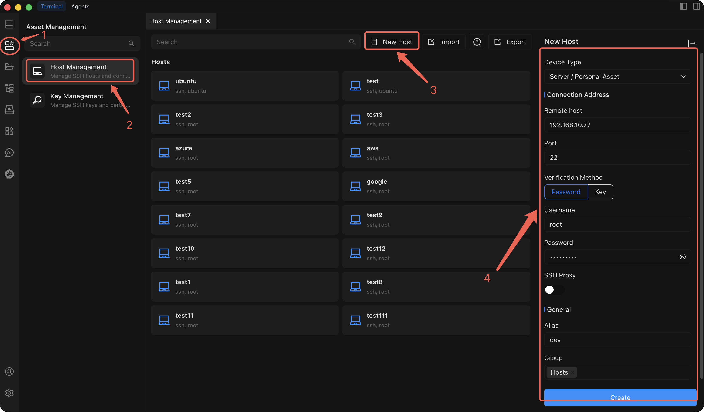

# Add a Personal Host

Add a personal server to Chaterm so you can connect to it via SSH directly from the workspace.

## Prerequisites

Before adding a personal host, make sure you have the following ready:

- **Chaterm installed** and running on your machine. See [Downloads](/docs/start/downloads/) if you have not installed it yet.
- **SSH credentials** for the target server -- either a password or an SSH private key.
- **Server IP address** (or hostname) and the SSH port number (default `22`).

## Steps

1. Open the **Host Management** page from the left sidebar.
2. Click **Add Host** in the top-right corner of the Host Management page.
3. In the **Add Host** sidebar that opens, set **Device type** to **Server / Personal**.
4. Fill in the remaining configuration fields described in the table below.
5. Click **Create** to save the host.

## Configuration Fields

| Field | Description | Required |
| --- | --- | --- |
| **Device type** | Select **Server / Personal** to indicate this is a personal server. | Yes |
| **Connection IP/Address** | The IP address or hostname of the target server (e.g. `192.168.1.100` or `dev.example.com`). | Yes |
| **Port** | The SSH service port on the target server. Defaults to `22`. Change this only if your server uses a non-standard port. | Yes |
| **Username** | The SSH login username (e.g. `root`, `ubuntu`, `deploy`). | Yes |
| **Authentication method** | Choose **Password** or **SSH Key**. See the tip below for guidance. | Yes |
| **SSH proxy** | If the server is behind a firewall or NAT, configure an SSH proxy to route the connection through an intermediate server. Leave empty for direct connections. | No |
| **Alias** | A friendly display name so you can quickly identify this host in the host list (e.g. `Dev API Server`). | Yes |
| **Group** | Assign the host to a group for easier organization (e.g. `development`, `production`). You can select an existing group or type a new group name. | No |

## Authentication Methods

::: tip Choosing an authentication method
- **Password authentication** is the simplest option. Enter the SSH password for the specified username.
- **Key authentication** is more secure and recommended for production servers. Select an SSH key that has already been imported in [Key Management](/docs/manage/keys/), or click the link to add a new key first and then return here to select it.
:::

## What Happens Next

After you click **Create**, the new host appears in your host list on the Host Management page. From here you can:

- **Connect immediately** -- click the host entry to open an SSH terminal session. See [Connect to a Host](/docs/hosts/connect) for details on the terminal features available during a session.
- **Edit or organize** -- right-click the host to rename, clone, move to a different group, or delete it. See [Edit, Clone & Delete](/docs/hosts/edit-clone-delete) for more information.
- **Manage SSH keys** -- if you need to rotate or add keys later, visit [Key Management](/docs/manage/keys/).
