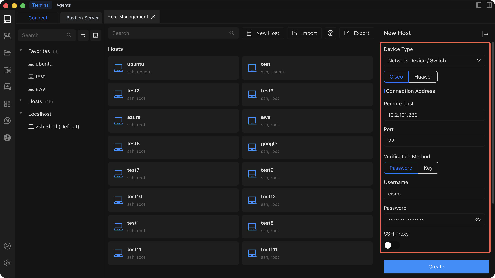

# Add a Router

Add a router or network device (such as a switch or firewall) to Chaterm so you can manage it via SSH alongside your servers.

## When to Use Router vs Personal Host

Use **Network device / Switch** for hardware that runs a network operating system (e.g. Cisco IOS, Juniper Junos, MikroTik RouterOS, or similar). These devices often have non-standard shell behaviors and limited command sets compared to a full Linux/Unix server.

Use **Server / Personal** for general-purpose servers, virtual machines, and cloud instances that run a standard operating system. See [Add a Personal Host](/docs/hosts/add-personal) for those instructions.

## Prerequisites

Before adding a router, make sure you have:

- **Chaterm installed** and running. See [Downloads](/docs/start/downloads/) if you have not installed it yet.
- **Device credentials** -- either a password or an SSH private key for the network device.
- **Device IP address** (or hostname) and the SSH port number (default `22`).
- **SSH enabled** on the network device. Many routers and switches ship with SSH disabled by default; consult your device documentation to enable it.

## Steps

1. Open the **Host Management** page from the left sidebar.
2. Click **Add Host** in the top-right corner of the Host Management page.
3. In the **Add Host** sidebar that opens, set **Device type** to **Network device / Switch**.
4. Fill in the remaining configuration fields described in the table below.
5. Click **Create** to save the device.

## Configuration Fields

| Field | Description | Required |
| --- | --- | --- |
| **Device type** | Select **Network device / Switch** to indicate this is a router, switch, or similar network appliance. | Yes |
| **Connection IP/Address** | The management IP address or hostname of the device (e.g. `10.0.0.1` or `core-switch.lan`). | Yes |
| **Port** | The SSH service port on the device. Defaults to `22`. | Yes |
| **Username** | The SSH login username configured on the device (e.g. `admin`, `cisco`). | Yes |
| **Authentication method** | Choose **Password** or **SSH Key**. See the tip below for guidance. | Yes |
| **SSH proxy** | If the network device is on an isolated management VLAN or behind a firewall, configure an SSH proxy to route the connection through an intermediate server. Leave empty for direct connections. | No |
| **Alias** | A friendly display name so you can quickly identify this device in the host list (e.g. `Core Switch - DC1`). | Yes |
| **Group** | Assign the device to a group for organization (e.g. `network`, `switches`, `firewalls`). You can select an existing group or type a new name. | No |

## Authentication Methods

::: tip Choosing an authentication method
- **Password authentication** -- enter the SSH password configured on the network device. This is the most common method for routers and switches.
- **Key authentication** -- select an SSH key that has already been imported in [Key Management](/docs/manage/keys/). Key-based authentication is supported on many modern network operating systems and is recommended when available.
:::

## Related Pages

- [Add a Personal Host](/docs/hosts/add-personal) -- for adding standard servers and VMs.
- [Add a Bastion Host](/docs/hosts/add-bastion) -- for adding enterprise bastion/jump servers.
- [Connect to a Host](/docs/hosts/connect) -- learn about the terminal features available during a session.
- [Key Management](/docs/manage/keys/) -- import and manage SSH keys.
