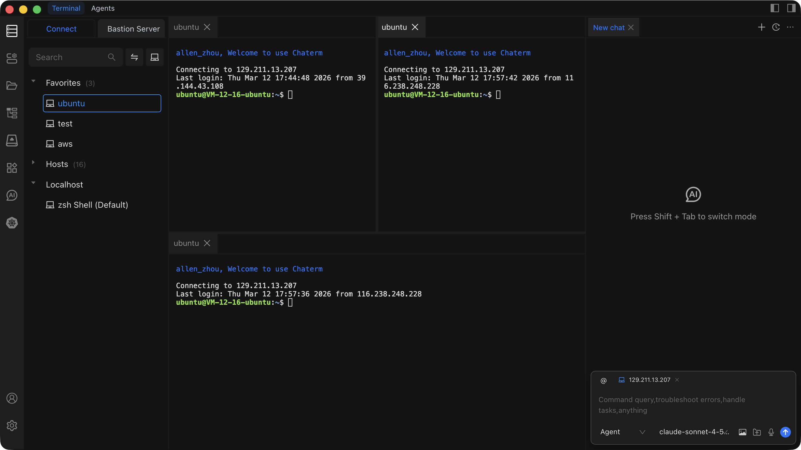

# Connect to a Host

Once a host has been added to Chaterm, you can open an SSH session to it with a single click.

## How to Connect

1. Open the **Host Management** page from the left sidebar, or locate the host in the workspace.
2. Click the target host entry in the host list.
3. Chaterm establishes an SSH connection and opens a terminal window for the session.

## Troubleshooting a Failed Connection

If the connection fails or drops unexpectedly, try the following steps:

1. **Verify network reachability** -- make sure your machine can reach the host. Try pinging the host IP address from your local terminal.
2. **Check credentials** -- confirm that the username, password, or SSH key is correct. You can update credentials by editing the host entry (see [Edit, Clone & Delete](/docs/hosts/edit-clone-delete)).
3. **Confirm the SSH service is running** -- ensure that the SSH daemon (e.g. `sshd`) is running on the target host and listening on the configured port.
4. **Check the port number** -- the default SSH port is `22`. If your server uses a different port, make sure the host entry in Chaterm matches.
5. **Review firewall rules** -- a firewall on the server or network may be blocking the SSH port. Verify that inbound traffic on the SSH port is allowed.
6. **Inspect the SSH proxy** -- if you configured an SSH proxy, ensure the proxy server itself is reachable and properly configured.
7. **Rotate or re-import keys** -- if you are using key authentication and the key was recently changed on the server, update or re-import the key in [Key Management](/docs/manage/keys/).

## Terminal Features

After connecting, the terminal window provides several productivity features:

### Multiple Tabs

Open connections to multiple hosts at the same time. Each connection opens in its own tab at the top of the terminal area. Click a tab to switch between sessions, or use keyboard shortcuts to cycle through them.

### Split Panes

Split the terminal area horizontally or vertically to view multiple sessions side by side. This is useful when you need to compare output from different servers or run commands on one host while monitoring another.

### Context Menu

Right-click a terminal tab to access quick actions:

- **Close** the current tab.
- **Rename** the tab for easier identification.
- **Clone** the session to open a duplicate connection in a new tab.
- Other actions depending on context.

### Terminal Search

Use the keyboard shortcut or the menu to open the search panel within the terminal. This lets you search through the terminal output history to find specific commands, log entries, or text.

## Related Pages

- [Terminal Operations](/docs/terminal/operations/) -- learn about advanced terminal features such as snippets, autocomplete, and AI-assisted commands.
- [Add a Personal Host](/docs/hosts/add-personal) -- add a new server to your host list.
- [Add a Bastion Host](/docs/hosts/add-bastion) -- add an enterprise bastion/jump server.
- [Add a Router](/docs/hosts/add-router) -- add a network device.
- [Key Management](/docs/manage/keys/) -- manage SSH keys used for authentication.
