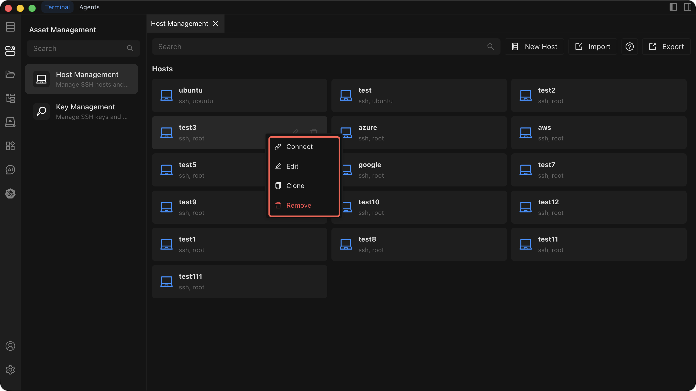

# Edit, Clone, or Delete a Host

Manage your existing hosts by editing their configuration, cloning them as templates, or removing them from the list.

## Edit a Host

1. Right-click the host in the list and select **Edit**.
2. Modify any of the following configuration fields:
   - Connection IP or address
   - Port
   - Username
   - Authentication method (password or SSH key)
   - SSH proxy settings (optional)
   - Alias
   - Group
3. Click **Save** to apply your changes.

## Clone a Host

1. Right-click the host in the list and select **Clone**.
2. A new host form opens, pre-filled with all configuration fields from the original host. The alias automatically receives a `_Clone` suffix (for example, `MyServer` becomes `MyServer_Clone`).
3. Adjust any fields as needed.
4. Click **Create** to add the cloned host.

Cloning preserves every configuration field of the original host, including connection address, port, username, authentication method, SSH proxy settings, alias, and group assignment.

## Delete a Host

::: warning
Deleting a host is irreversible. Once confirmed, all configuration data for that host is permanently removed and cannot be recovered.
:::

1. Right-click the host in the list and select **Delete**.
2. A confirmation dialog appears. Review the host name carefully.
3. Confirm the deletion to permanently remove the host.

---

See [Host Management](./index) for an overview of all host operations.
