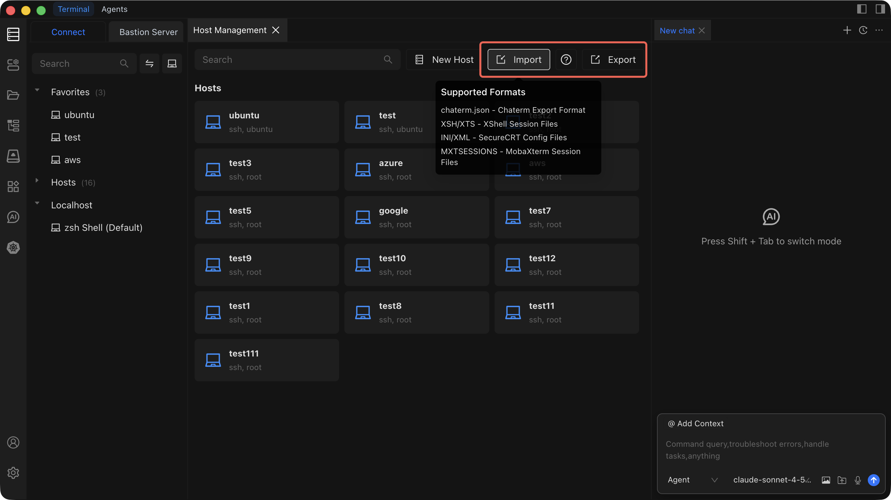

# Import and Export Hosts

Quickly migrate or back up your host assets by exporting them to a file or importing them from other tools.

## Export Hosts

1. Open the **Asset Management** view.
2. Click the **Export** button in the toolbar.
3. Choose a save location on your local machine.
4. The hosts are exported as a `.json` file containing all host configuration data.

## Import Hosts

::: tip
Back up your current host list by exporting it before performing an import. This ensures you can restore your original configuration if anything goes wrong.
:::

1. Open the **Asset Management** view.
2. Click the **Import** button in the toolbar.
3. Select the file you want to import from your local machine.
4. Chaterm reads the file and adds the imported hosts to your host list.

### Supported Formats

| Format | Source Tool | Notes |
| --- | --- | --- |
| JSON | Chaterm | Standard Chaterm export format |
| XSH / XTS | XShell | Session files |
| INI / XML | SecureCRT | Config files |
| MXTSESSIONS | MobaXterm | Session files |

---

See [Host Management](./index) for an overview of all host operations.
