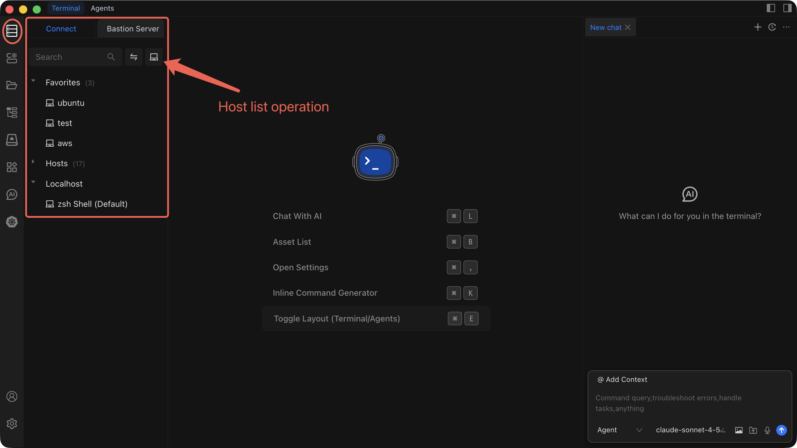

# Host List Operations

The host list is your central dashboard for browsing, searching, and managing every server you have added to Chaterm, so you can connect to any host in seconds.

## Open the Host List

Open the left sidebar and click **Hosts**. The host list displays two views:

- **Direct Connection** -- hosts you connect to over the network without an intermediary.
- **Bastion Resources** -- hosts that are reachable only through a bastion (jump server). Switch to this view by clicking the **Bastion Resources** tab.

## Search and Filter

1. Click the **search box** at the top of the host list.
2. Type an IP address, hostname, or alias.
3. Review the results that filter in real time as you type.

::: tip
Combine search with the Bastion Resources view to narrow results to a specific access path.
:::

## Favorites

1. Right-click a host to open its context menu.
2. Select **Add to Favorites** to pin the host to your Favorites list.
3. To unpin, right-click the host again and select **Remove from Favorites**.

Favorited hosts appear at the top of the list, giving you one-click access to the servers you use most.

## Context Menu Operations

Right-click any host to see the available actions:

| Action | Description |
| --- | --- |
| **Connect** | Open an SSH session to the host. |
| **Edit** | Modify the host's connection settings. |
| **Clone** | Duplicate the host entry with a new name. |
| **Delete** | Remove the host from Chaterm permanently. |
| **Add to Favorites** | Pin the host to the top of the list. |
| **Remove from Favorites** | Unpin the host from Favorites. |

## Best Practices

- **Group by purpose** -- Organize hosts into groups such as `Production`, `Staging`, `Development`, or `Database Servers` to keep the list manageable.
- **Use SSH keys** -- Prefer key-based authentication over passwords. See [Key Management](/docs/manage/keys/) for setup details.
- **Add clear notes** -- Record important details (environment, owner, special ports) so any team member can understand a host at a glance.
- **Clean up regularly** -- Review the list periodically and delete hosts that are decommissioned or no longer in use.

## Related Pages

- [Add a Personal Host](./add-personal) -- Add a host that connects directly over the network.
- [Add a Bastion Host](./add-bastion) -- Add a host accessible through a bastion server.
- [Add a Router](./add-router) -- Configure a router or jump host entry.
- [Connect to a Host](./connect) -- Establish an SSH session and use the terminal.
- [Edit, Clone, or Delete a Host](./edit-clone-delete) -- Modify or remove existing host entries.
- [Import and Export Hosts](./import-export) -- Bulk-import or export your host list.
