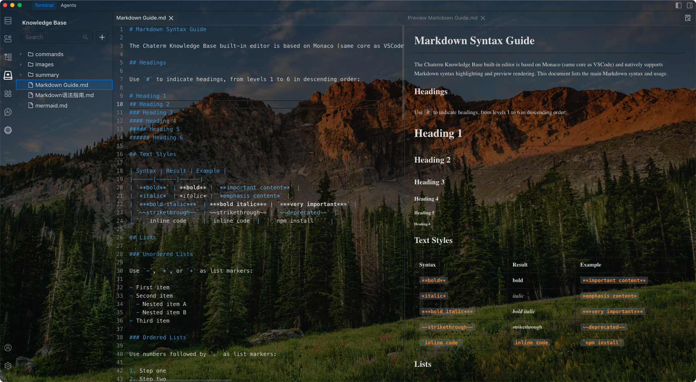
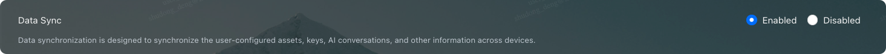

# Knowledge Base User Guide

Notes are an indispensable way for every engineer to work and learn. In the past, we might store notes locally, in note-taking software, or in a company wiki system, and review or look them up when needed. But have you ever encountered this: because you switched note apps or devices, or simply because too much time has passed, you can no longer find those notes? In the era of AI-native applications, do we have a better way to write, manage, and use notes?

In AI-native application scenarios, a more ideal form of notes should satisfy two points: be tightly bound to the business application, and be usable for both humans and AI. Based on this, the Chaterm Knowledge Base provides a management approach where the "application itself is the carrier of knowledge": knowledge flows and accumulates along with the application, making it easier to maintain and reuse over the long term; at the same time, knowledge is organized in a structured form that models can directly consume, enabling AI to more stably understand user preferences, project constraints, and best practices, thereby improving collaboration efficiency and output consistency.

Practice has shown that in-context learning is one of the important ways to improve model consistency and reduce hallucinations. Persisting key information into the knowledge base in the form of files can serve as a high-quality context carrier. When executing tasks, the Agent can retrieve and read relevant content on demand, forming traceable and iterative context inputs.

## Edit/Manage Files in Chaterm

Click the <KbDocIcon /> icon in the left sidebar to enter the knowledge base management interface. You can get a file management experience in Chaterm that is fully similar to VS Code. It supports creating new files/folders, renaming, moving, copying, pasting, deleting, and importing files/folders into the knowledge base.

Chaterm uses VS Code's Monaco Editor as the built-in editor, with native support for Markdown/HTML/LaTeX/Mermaid and more, which better fits engineers' writing habits.

## Use the Knowledge Base as Conversation Context

You can attach documents in the knowledge base to AI messages, and the Agent will read them as context before making a request. Chaterm uses dynamic context technology and does not directly stuff the file contents into the conversation, thereby saving token usage.

### How to add to a conversation

There are multiple ways to add a file to the context:

1. In the Knowledge Center, right-click and use `Add to chat` on the file
2. In the AI input box, type **`@`** to select a document.
3. Drag the opened file directly into the AI input box,

<video controls width="100%" src="../image/add-to-chat.mp4"></video>

## /command (Custom Commands)

`/command` is used to turn knowledge base files into reusable "prompt snippets" and quickly insert them into conversations.

Custom commands are stored as files under the knowledge base `commands/` directory.

### How to use:

- Type **`/`** in the AI input box to open the command selection popup.
- After selecting, a **command chip** (command reference) will be inserted into the message.
- Click this chip to open and edit the corresponding command file.

### Naming recommendations:

- The command name is generated from the file name (without the extension) and automatically prefixed with `/`.
- It is recommended to use **kebab-case** (for example, `deploy-guide.md` → `/deploy-guide`) to avoid input ambiguity caused by spaces.

## Summarize to the Knowledge Base

Chaterm provides a built-in command `/summary-to-doc`, which is used to write conversation summaries into the knowledge base.

### How to use:

1. In the UI of each task completion message, there is a `Summarize to Knowledge Base` button. After clicking it, the model will call the `summarize_to_knowledge` tool and write the summary into the `summary` folder of the knowledge base in Markdown format.

<video controls width="100%" src="../image/summary-to-doc3.mp4" title="Title"></video>

2. With a custom command, type `/` in the input box and select the default `/summary-to-doc` command. If you have requirements for the summary format, you can modify the content of that command.

<video controls src="../image/summary-to-doc4.mp4" title="Title"></video>

## Knowledge Base Sync

Chaterm can encrypt and sync your knowledge base to the cloud, and automatically keep it consistent across multiple devices under the same account. This includes regular documents, custom commands in `commands/`, summary notes in `summary/`, and imported assets such as images.

### How to use:

1. Go to `Settings` --> `Privacy` --> `Data Sync`, turn on `Data Sync`, and make sure the device is signed in.

2. After you edit, import, or delete knowledge base content on any device, Chaterm syncs it automatically in the background, without manual upload or download.
3. Other signed-in devices with sync enabled will automatically pull the latest content, so you can continue using the same knowledge base across devices.

Knowledge base sync is especially useful when switching to a new computer, moving between work and personal devices, or avoiding knowledge loss caused by local file issues.

## TODO

We will soon support the following features:

- When starting each task, automatically retrieve the knowledge base to improve the accuracy of model responses, making your Chaterm better the more you use it.

- Share the knowledge base within a team, so that all members use the same knowledge base.
