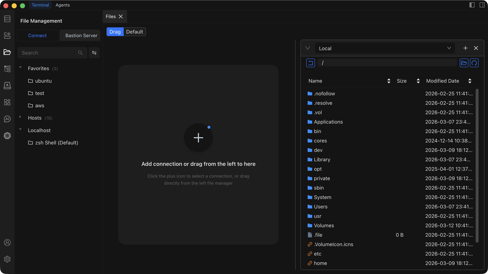

# File Management

Browse, edit, and transfer files on remote servers through Chaterm's built-in SFTP-based file manager.

## Prerequisites

Before using File Management, make sure:

- You have an **active SSH connection** to the target host. If you are not connected yet, see [Connect to a Host](/docs/hosts/connect).
- The remote server has **SFTP enabled**. Most OpenSSH installations enable SFTP by default, but some hardened servers disable it.

::: warning SFTP Required
File Management relies entirely on the server's SFTP subsystem. If SFTP is not enabled on the remote server, browsing, editing, and transferring files will not work. Ask your server administrator to enable the SFTP subsystem if you see connection errors in File Management.
:::

## Browsing Files

1. Click **File Management** in the left sidebar.
2. Chaterm displays the remote file tree for the currently connected host.
3. Click a **folder** to expand or collapse its contents.
4. **Right-click** a directory and select **Refresh** to reload its file list.
5. Use the **search bar** at the top of the file tree to find a file or directory by name.

## Editing Files

1. **Double-click** a file in the file tree to open it in the built-in editor.
2. Edit the file content. The editor provides syntax highlighting that is detected automatically from the file type.
3. Click the **Save** button (or use the keyboard shortcut) to write your changes back to the remote server.

The editor offers a modern, IDE-like experience with multi-language syntax highlighting.

## Uploading Files

1. In the file tree, navigate to the **target directory** where you want to place the file.
2. Click the **Upload** button, or drag one or more local files directly into the file tree area.
3. Select the files or folders you want to upload (if you used the button).
4. A progress indicator shows the transfer speed and percentage. Wait for the upload to finish.

## Downloading Files

1. In the file tree, locate the file or folder you want to download.
2. **Right-click** the item and select **Download**, or select the item and click the **Download** button.
3. Choose a local save location when prompted.
4. Wait for the download to complete. The progress indicator shows transfer status.

## File Operations

You can perform the following operations by right-clicking a file or folder in the file tree:

| Operation | Description |
| --- | --- |
| **Rename** | Change the name of a file or folder. |
| **Permissions** | Modify file permissions (`chmod`). Enter the new mode (e.g., `755`) in the dialog. |
| **Copy** | Copy a file or folder to another location on the server. |
| **Move** | Move a file or folder to a different directory on the server. |
| **Delete** | Permanently remove a file or folder. This action is irreversible -- use with caution. |

## Tips

- **Large files** may take a significant amount of time to transfer. Keep the connection open and avoid navigating away until the transfer completes.
- **System files** may require elevated permissions. If you cannot edit or delete a file, check that your user account has the necessary access.
- **Back up important files** before making edits, especially on production servers.
