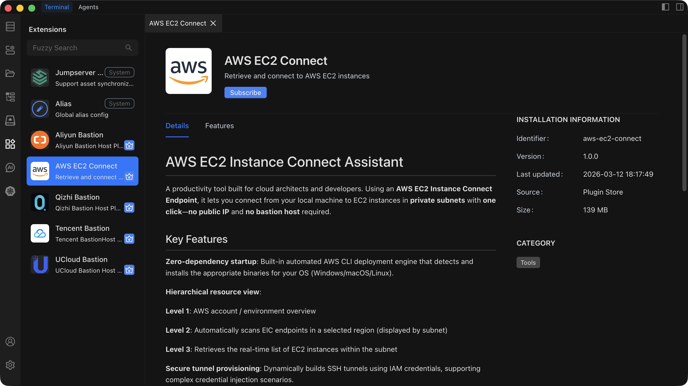

# Extension Management

Install and manage extensions to customize and expand Chaterm's capabilities.

## Browsing Extensions

1. Click **Extensions** in the left sidebar to open the Extension Management page.
2. Select the **Extension Marketplace** tab to see all available extensions, or switch to the **Installed Extensions** tab to see extensions already on your system.
3. Use the **search bar** to filter extensions by keyword.
4. Click an extension card to view its details, including a full description, feature list, and version information.

## Installing an Extension

**From the Extension Marketplace**

1. On the Extension Management page, browse or search for the extension you need.
2. Click the extension card to review its details.
3. Click the **Install** button.
4. Wait for the installation to complete.

**From a Local File**

1. Click the **Install from File** button.
2. Select an extension package file (`.chaterm` format) from your local machine.
3. Chaterm verifies and installs the extension automatically.

::: tip Auto-enabled After Install
Extensions are **automatically enabled** as soon as installation finishes. You can start using the new functionality right away, and you can manage the extension from the **Installed Extensions** tab.
:::

## Enabling and Disabling an Extension

1. Go to the **Installed Extensions** tab.
2. Locate the extension you want to toggle.
3. Click the **Enable** button to activate a disabled extension, or click the **Disable** button to deactivate an active extension.
4. The change takes effect immediately -- no restart required.

::: warning Core Extensions
Disabling certain core extensions may break essential Chaterm functionality (for example, terminal rendering or connection handling). Only disable an extension if you are sure it is not required for your workflow.
:::

## Configuring an Extension

Some extensions expose settings that let you customize their behavior:

1. In the **Installed Extensions** tab, find the extension you want to configure.
2. Click the **Configure** button. A settings dialog opens.
3. Adjust the available options. Common configuration items include:
   - Feature switches (on / off toggles)
   - Display options (themes, layout)
   - Behavior parameters (timeouts, defaults)
   - Integration settings (API keys, endpoints)
4. Click **Save**. The new configuration takes effect immediately.

For global extension preferences, see [Extension Settings](/docs/settings/extensions/).

## Updating an Extension

When a newer version of an installed extension is available:

1. An **update badge** appears next to the extension in the list.
2. Click the **Update** button to upgrade to the latest version.
3. Your existing configuration is preserved after the update.

## Uninstalling an Extension

1. In the **Installed Extensions** tab, locate the extension you want to remove.
2. Click the **Uninstall** button.
3. Confirm the action in the dialog. The extension and its data are removed from Chaterm.
