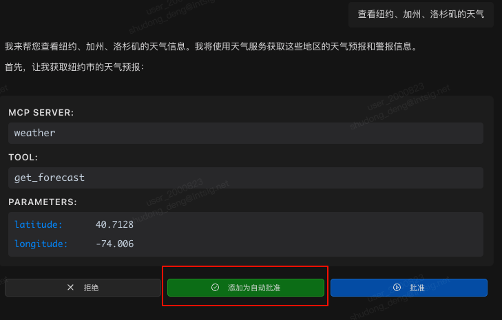
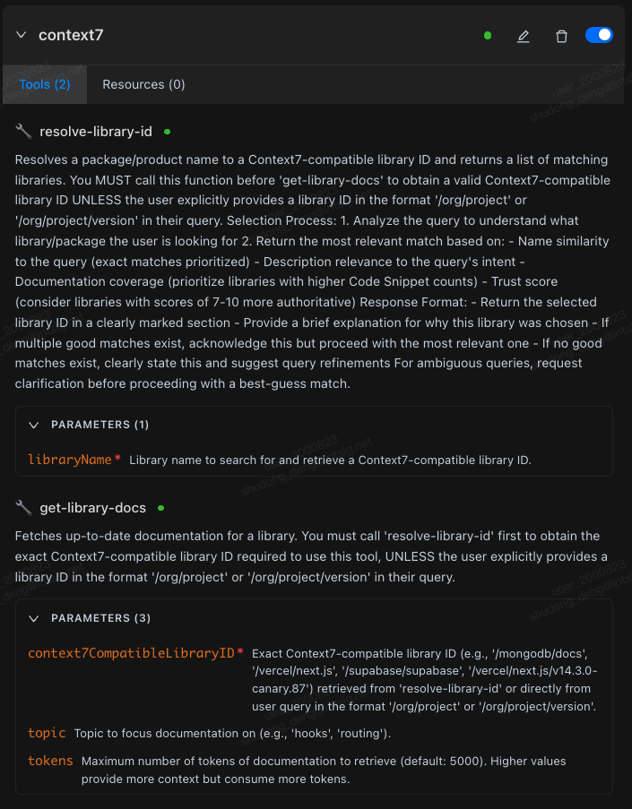

# MCP Usage Guide

MCP (Model Context Protocol) lets you extend Chaterm's AI with external tools, knowledge bases, and APIs by connecting to MCP servers.


## Your First MCP Server

Get up and running in under five minutes.

1. Open **Settings** in Chaterm.
2. Go to the **Tools & MCP** tab and click **Add Server** — this opens the `mcp_setting.json` file.
3. Paste one of the JSON examples below into the editor.
4. Save the file. Chaterm will automatically connect to the server.

After saving, the server's status badge changes from *connecting* to *connected* (or displays an error message), and its Tools and Resources are loaded automatically.


::: tip
Not sure which server to try first? The **filesystem** server (shown below) is a great starting point — it gives the AI read/write access to directories you choose.
:::

---

## Configuration

### STDIO server (local command-line)

Use this type when the MCP server runs as a local process on your machine.

```json
// MCP server using stdio transport
{
  "mcpServers": {
    "filesystem": {
      "command": "npx",
      "args": [
        "-y",
        "@modelcontextprotocol/server-filesystem",
        "/Users/username/Desktop",
        "/path/to/other/allowed/dir"
      ]
    }
  }
}
```

#### STDIO configuration fields

| Field         | Required | Description                                                                                                                                                             | Example                                             |
| ------------- | -------- | ----------------------------------------------------------------------------------------------------------------------------------------------------------------------- | --------------------------------------------------- |
| `type`        | No       | Connection type, inferred as `stdio` when `command` is provided if omitted                                                                                              | `"stdio"`                                           |
| `command`     | Yes      | Executable command to start. Can be written as a complete line (with parameters) or just executable name                                                                | `"npx"`, `"node"`, `"python"`                       |
| `args`        | No       | Array of arguments passed to the command; when `command` contains spaces and `args` is not provided, the system will automatically parse (supports quotes and escaping) | `["-y", "@modelcontextprotocol/server-filesystem"]` |
| `cwd`         | No       | Process working directory                                                                                                                                               | `"/Users/you"`                                      |
| `env`         | No       | Process environment variables (key-value pairs)                                                                                                                         | `{"API_KEY": "xxx"}`                                |
| `disabled`    | No       | Whether to disable this server                                                                                                                                          | `true`/`false`                                      |
| `timeout`     | No       | Call timeout (seconds)                                                                                                                                                  | `120`, `180`                                        |
| `autoApprove` | No       | Auto-approve tool whitelist (by tool name)                                                                                                                              | `["read_file"]`                                     |

Notes:

- `envFile` field is not supported; if you need to load variables from a file, handle it in the startup environment before writing to `env`.
- Compatible fields: For backward compatibility, `url?`, `headers?` are also allowed in stdio configuration, but not recommended (will not switch connection type to http).

### HTTP server (remote service)

Use this type when the MCP server is hosted remotely and exposes a Streamable HTTP endpoint.

```json
{
  "mcpServers": {
    "context7": {
      "url": "https://mcp.context7.com/mcp",
      "headers": {
        "CONTEXT7_API_KEY": "your-api-key"
      },
      "disabled": false
    }
  }
}
```

#### HTTP configuration fields

| Field         | Required | Description                                                           | Example                                |
| ------------- | -------- | --------------------------------------------------------------------- | -------------------------------------- |
| `type`        | No       | Connection type, inferred as `http` when `url` is provided if omitted | `"http"`                               |
| `url`         | Yes      | Server address (supports streaming HTTP client)                       | `"https://your-mcp-host.example.com/"` |
| `headers`     | No       | Request headers (e.g., authentication, proxy related)                 | `{"Authorization": "Bearer <TOKEN>"}`  |
| `disabled`    | No       | Whether to disable this server                                        | `true`/`false`                         |
| `timeout`     | No       | Call timeout (seconds)                                                | `120`, `180`                           |
| `autoApprove` | No       | Auto-approve tool whitelist (by tool name)                            | `["search"]`                           |

Notes:

- `url` must be a valid URL (strictly validated by schema).
- Compatible fields: For backward compatibility, `command?`, `args?`, `env?` are also allowed in http configuration, only for old configuration migration scenarios; not recommended for long-term use.

### Common fields

> Reference `schemas.ts` in the project:
>
> - Common fields (supported by both types): `disabled?`, `timeout?` (seconds, default value see application), `autoApprove?` (string array).
> - `type` is optional: Can be omitted when `command` (inferred as stdio) or `url` (inferred as http) is provided; recommended to explicitly fill for better readability.
> - Compatible fields: Legacy `transportType` is supported, the application will automatically convert it to `type`; not recommended to continue using in new configurations.

---

## Using MCP in Conversations

### Toggling tools on and off

Click a tool name in the **Tools** list to enable or disable it. Disabled tools are removed from the model context entirely, so the Agent cannot use them. Turning off unused tools is a simple way to save tokens.


### Auto-approval

After adding tool names to `autoApprove` in the configuration, matching tools skip the confirmation step and execute immediately. You can also add tools to the auto-approve list dynamically during a conversation.



::: warning
Only add tools you fully trust to `autoApprove`. Auto-approved tools bypass the confirmation dialog and execute without user review.
:::

### Viewing parameters and resources

Expand a tool's **PARAMETERS** panel to see parameter names, whether they are required, and their descriptions.

In the **Resources** tab you can view resource names, descriptions, and URIs; supported entry points can read resources directly.



---

## Development Tips

### File-change auto-restart

If you run a local MCP server from build artifacts (e.g., `build/index.js`), Chaterm detects changes to that file and automatically restarts the corresponding stdio server. This speeds up your development cycle significantly.

If auto-restart does not trigger, you can manually reconnect by toggling the server **Disable then Enable**.

---

## Where to Find MCP Servers

- **GitHub repositories**:
  - [modelcontextprotocol/servers](https://github.com/modelcontextprotocol/servers)
  - [punkpeye/awesome-mcp-servers](https://github.com/punkpeye/awesome-mcp-servers)
- **Online MCP directories**:
  - [mcpservers.org](https://mcpservers.org/)
  - [mcp.so](https://mcp.so/)
  - [glama.ai/mcp/servers](https://glama.ai/mcp/servers)
- **PulseMCP**: [www.pulsemcp.com](https://www.pulsemcp.com/)

---

## Security and Performance Recommendations

::: tip Security checklist
- Only add trusted tools to `autoApprove`.
- Be cautious when injecting credentials in `env` or `headers` — avoid sharing config files that contain secrets.
- Follow the principle of least privilege: only expose the directories, networks, and APIs that are actually needed.
:::

- **Performance**: For typical networks, set `timeout` to 120 - 180 seconds. For remote services, prefer nearby endpoints and make sure your proxy does not interrupt streaming connections.
- **Maintainability**: Use a consistent naming scheme and group related servers together. Back up your `mcp_setting.json` regularly.

---

## What to Read Next

- Running into connection or call issues? See [MCP Troubleshooting & Best Practices](../troubleshooting/).
