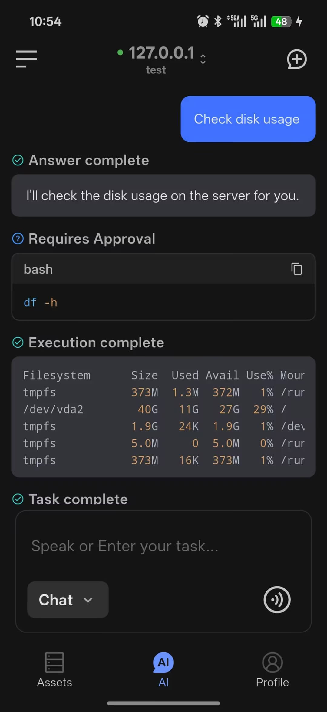
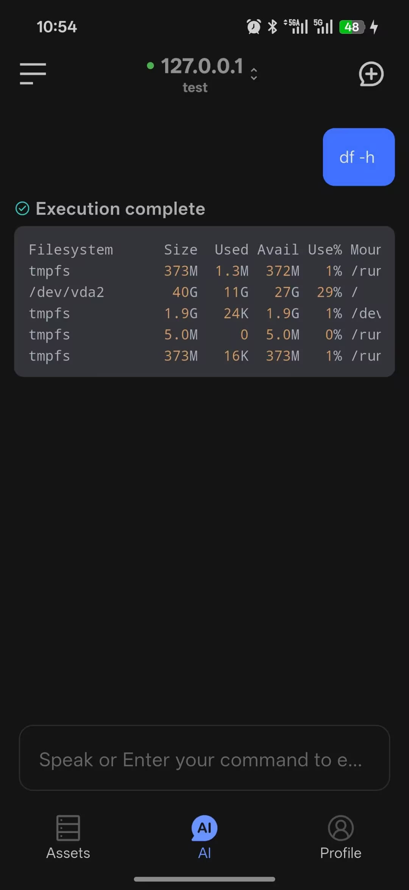

# AI Dialog

AI Dialog on mobile helps you execute commands, troubleshoot issues, and ask day-to-day operations questions from your phone.

The mobile experience currently focuses on two modes: `Chat` and `Term`. You can switch between them from the mode selector below the input box.

  

## Chat Mode

`Chat` mode is designed for working with AI on analysis, explanations, and command suggestions.

Usage notes:

- Sign in before using it
- Select an available model in Profile first
- Supports text input
- Supports voice input
- AI can understand natural language and generate executable commands
- AI can continue troubleshooting based on the current context

Best for:

- Learning Linux commands
- Getting troubleshooting suggestions
- Asking for script-writing help
- Understanding configuration files
- Reviewing operations best practices

  

## Term Mode

`Term` mode directly executes commands without sending them through AI.

Usage notes:

- Connect to a server first
- If no server is connected, the page shows an entry to connect a host
- Supports text input
- Supports voice input
- Returns the command output directly

Best for:

- Running a quick one-off command
- Checking host status fast

  

## Typical Workflow

1. Open the AI dialog page
2. Connect to the target host
3. Choose `Chat` or `Term`
4. Enter a question or command, or start a request with voice input
5. Review the result and continue if needed

## Recommendations

- Use `Chat` mode first when you need explanation, planning, or troubleshooting
- After signing in, confirm your model settings in Profile before entering `Chat` mode
