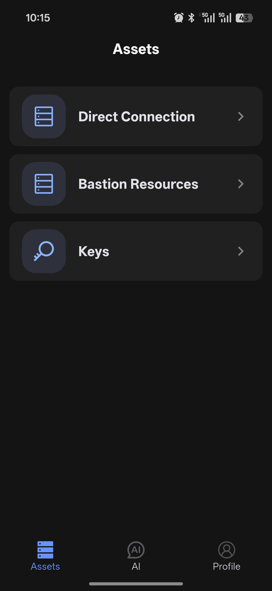

# Asset Management

The Assets module is the mobile entry point for managing SSH resources. It includes Direct Connection, Bastion Resources, and Key Management.

  

## Direct Connections

Direct Connections are used for servers you add yourself.

### Add a New Asset

1. Tap the floating `+` button in the lower-right corner
2. Choose `New`
3. Fill in the server information:
   - Label
   - IP address or domain
   - Username
   - Port
4. Choose an authentication method:
   - Password
   - Private key
5. Tap `Save`

### Manage Assets

- Connect: tap a host card to open an SSH session
- Edit: long-press a card and choose `Edit`
- Favorite: long-press a card and choose `Favorite` to pin it near the top
- Delete: long-press a card and choose `Delete`

### Search and Filter

You can search or filter by:

- Host name
- IP address
- Username
- Group

## Bastion Resources

Bastion Resources are used to manage server assets maintained behind a jump server.

### Add a Bastion Resource

1. Tap `+`
2. Choose `New`
3. Fill in the bastion host name, address, port, and username
4. Choose key-based authentication
5. Tap `Save and Sync`

After saving, the synced server assets appear in the bastion host drop-down list.

### Manage Bastion Resources

- Sync assets: tap the sync button next to the group title
- Edit: long-press the group name and choose `Edit`
- Delete: long-press the group name and choose `Delete`

### Manage Synced Server Assets

Synced assets under a bastion host support these actions:

- Tap a card to connect
- Long-press a card to edit notes
- Long-press a card to add it to favorites

## Key Management

Key Management is used to maintain the SSH keys required for login.

- Tap the lower-right `+` button to add a new key
- Import key files from local storage
- Use the edit and delete actions shown on each key card

::: tip Tip
If you manage many hosts, keep favorites, groups, and notes organized first. It makes searching much faster.
:::
