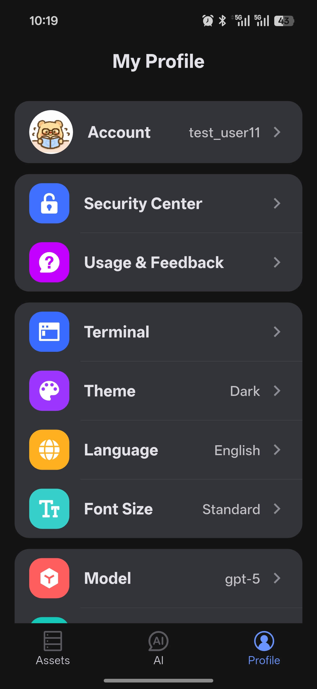

# Profile

Profile is where you manage account information, app settings, and AI-related preferences on mobile.

  

## Account

You can complete these actions here:

- View the current signed-in account
- Edit profile information
- Sign out
- Reset password
- Delete the account

## Security Center

Security Center provides signed-in device management.

- View all signed-in devices
- Remove untrusted devices

## App Settings

### Terminal

- KeepAlive heartbeat interval
- Terminal execution timeout

### Appearance and Language

- Theme: Light / Dark / Follow System
- Language: Simplified Chinese / English
- Font size: Small / Standard / Large

## AI Settings

### Model Selection

After signing in, you can choose from the models currently available in the app.

### AI Preferences

- Auto-execute toggle
- Vibration feedback
- Task completion notifications

### Custom Rules

Set tone, style, and other personalized instructions for AI.

### Data Management

- Data sync toggle
- Delete all local conversation history
