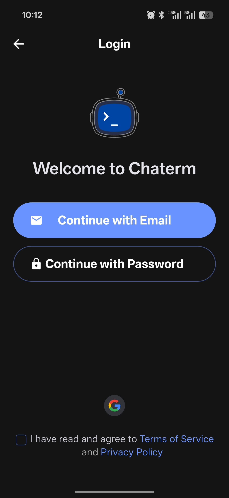
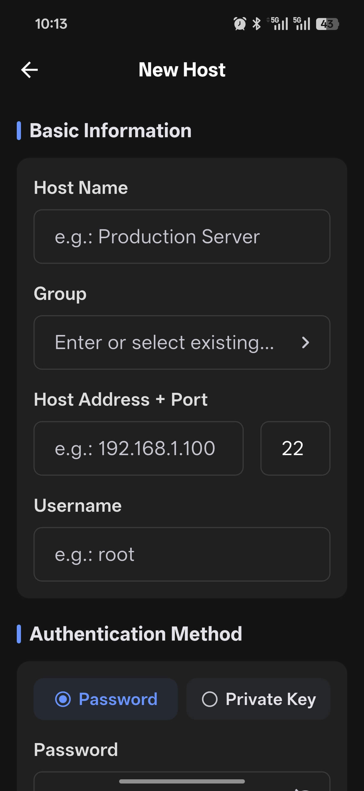
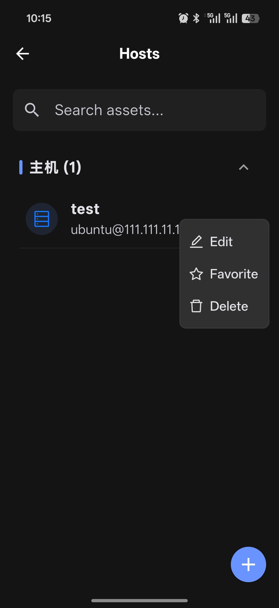
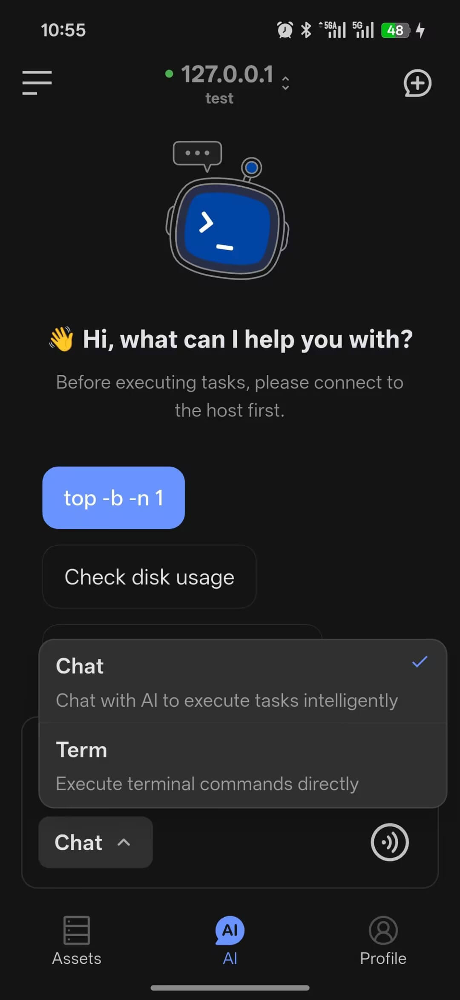

# Mobile Quick Start

Get up and running with Chaterm on iOS or Android in five steps.

## Step 1: Install the App

### iOS

1. Open the [App Store](https://apps.apple.com/app/6754307456).
2. Search for **Chaterm** and install it.
3. Complete the permission prompts when you launch it for the first time.

### Android

1. Open [Google Play](https://play.google.com/store/apps/details?id=com.intsig.chaterm.global).
2. Search for **Chaterm** and install it.
3. Complete the permission prompts when you launch it for the first time.

::: tip Sign In Early
If you want data sync and full AI features, sign in before you start using the app.
:::

## Step 2: Sign In

Chaterm mobile supports signing in now or browsing first and finishing sign-in later. Available methods:

- **Email** -- receive a verification code to sign in
- **Username and password** -- use your existing credentials
- **Third-party** -- sign in with Google, or Apple, depending on availability in the app

  

## Step 3: Add Your First Host

1. Open the **Assets** page.
2. Enter **Direct Connections** and tap the **+** button in the lower-right corner.
3. Choose **New**.
4. Fill in the host label, IP address, port, username, and other details.
5. Select **password authentication** or **key authentication**.
6. Tap **Save**.

::: tip Desktop Sync
If you have enabled data sync on desktop, your asset data is encrypted and synced to mobile automatically. See [Asset Management](/docs/mobile/assets/) for more details.
:::

  

## Step 4: Open an SSH Connection

1. Tap the target host card in the asset list.
2. Chaterm automatically creates the SSH connection.
3. After the connection succeeds, you enter the terminal screen.

Common actions:

- **Tap** a host card to connect directly.
- **Long-press** a card to edit, favorite, or delete it.
- **Search** to quickly filter by host name, IP, username, or group.

  

## Step 5: Start Using AI

Mobile provides two main interaction modes:

| Mode | Purpose |
|------|---------|
| **Term** | Directly runs the command you enter |
| **Chat** | AI understands your request and suggests commands or actions |

Basic flow:

1. Open the AI dialog page.
2. Connect to a target host or select a model.
3. Switch modes from the selector at the bottom of the input box.
4. Enter a question or command, or use voice input.
5. Review the execution result or the AI response.

For more details, see [AI Dialog](/docs/mobile/ai-agent/).

  

## Recommended First Run

1. Add a test host.
2. Start one SSH session.
3. Run `pwd` or `uname -a` in **Term** mode.
4. Switch to **Chat** mode and ask a Linux command question.
5. Open **Profile** and configure theme, language, and AI preferences.
