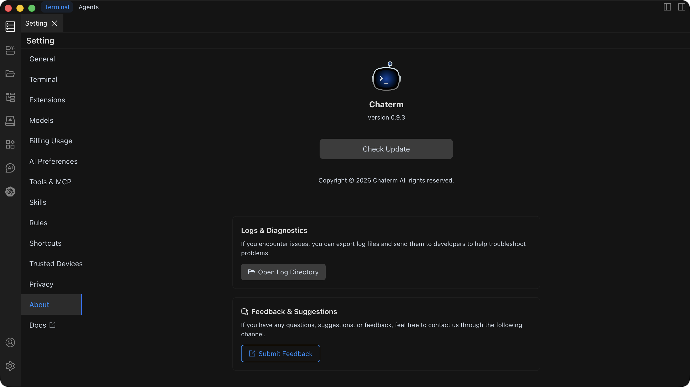

# About

The About page displays Chaterm version information and provides version update checking functionality.

## View Version Information

On the About page, you can view the currently installed Chaterm version number. The version number is typically displayed at the top of the page in the format `vX.X.X` (e.g., v1.0.0).

### Version Information Details

- **Current Version**: Displays the Chaterm version number you are currently using
- **Update Status**: Shows whether updates are available

## Check for Updates

Chaterm provides both automatic and manual ways to check for updates.

### Automatic Update Check

Chaterm automatically checks for updates in the following situations:

- When the application starts

### Manual Update Check

1. Open **Settings** → **About**
2. Click the **Check for Updates** button
3. The system will connect to the update server to check for new versions

### Update Process

When a new version is detected:

1. **Notification**: The system will display an update notification informing you that a new version is available
2. **View Changelog**: You can view the update content and improvements of the new version
3. **Download Update**: Click the download button to start downloading the new version installer
4. **Install Update**: After downloading, follow the prompts to complete the installation
