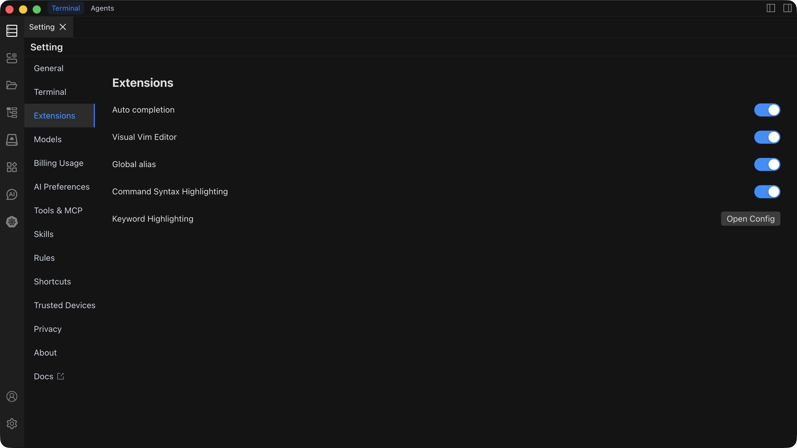

# Extension Settings

Extension settings are used to configure Chaterm's enhanced features, allowing you to customize your terminal experience and work efficiency. These extension features can significantly improve command input, text editing, and terminal output experience.



## Auto Completion

Intelligent command completion feature that supports automatic completion of Shell commands and provides smart suggestions based on context.

**Key Features**:

- Supports Shell command auto-completion
- Context-based intelligent suggestions
- Real-time syntax checking
- Quick command snippet insertion

**Use Cases**:

- Smart prompts when writing commands, reducing input errors
- Improve command input efficiency, quickly complete common operations
- Get hints and help when learning new commands

**Configuration**:

- **Enable**: Activate intelligent command completion
- **Disable**: Disable auto-completion, use traditional input method

::: tip Recommendation
Enabling auto-completion can significantly improve command input efficiency, especially for users who frequently use complex commands. It's recommended to enable this feature after familiarizing yourself with basic operations.
:::

## Visual Vim Editor

Integrated Vim editor with a visual interface, providing powerful text editing capabilities. Offers a modern IDE-like file editing experience within the terminal, supporting multi-language syntax highlighting.

**Key Features**:

- Faster than traditional Vim command operations
- Visual Vim text editing operations without memorizing complex commands
- Supports multi-language syntax highlighting
- Similar editing experience to Sublime Text
- Supports mouse operations and intuitive text editing

**Use Cases**:

- Quick text editing and modification
- Complex editing operations (batch replacement, multi-cursor editing, etc.)
- Remote file editing without additional editors
- Code editing requiring syntax highlighting

**Configuration**:

- **Enable**: Activate visual Vim editor functionality
- **Disable**: Use traditional terminal editing method

::: tip Recommendation
The visual Vim editor is particularly suitable for scenarios where you need to quickly edit files in the terminal. Even without familiarity with Vim commands, you can enjoy powerful editing features through the visual interface.
:::

## Global Alias

Create and manage global command aliases to simplify input of commonly used commands. Achieve unified global command aliases across multiple terminal sessions, hosts, and shells.

**Key Features**:

- Supports complex command combinations and parameters
- Alias inheritance and override mechanisms
- Dynamic alias management
- Unified alias configuration across hosts and shells
- Configure once, effective globally

**Use Cases**:

- Simplify long commands, improve input efficiency
- Create personal command sets, unify workflows
- Use the same alias configuration across hosts
- Set simple aliases for complex batch scripts

**Configuration Example**:

```bash
# Common alias configuration
alias ll="ls -la"
alias gs="git status"
alias gp="git push"
alias gl="git log --oneline"
alias ..="cd .."
alias ...="cd ../.."
```

**Configuration**:

- **Enable**: Activate global Alias functionality
- **Disable**: Disable global aliases, use only system default aliases

::: tip Recommendation
Proper use of global Alias can significantly improve work efficiency. It's recommended to set aliases for the most commonly used commands and avoid creating too many aliases that could cause memory burden.
:::

## Global Highlighting

Provides syntax highlighting and color identification for terminal output, improving readability. Provides globally consistent syntax highlighting across hosts and shells.

**Key Features**:

- Intelligent syntax recognition, automatically identifies different content types
- Real-time highlight updates, instant syntax highlighting display
- Unified highlight configuration across hosts and shells
- Supports multiple content types (logs, JSON, code, etc.)
- Set once, follows on any host

**Use Cases**:

- Error message identification, quickly locate issues
- Data formatting display, improve readability
- Log analysis, quickly find key information
- Code output viewing, clearly display code structure

**Configuration**:

- **Enable**: Activate global syntax highlighting functionality
- **Disable**: Disable syntax highlighting, use plain text display

::: tip Recommendation
Global highlighting is particularly suitable for scenarios that frequently require viewing logs, JSON data, or code output. Enabling it can significantly improve information identification efficiency.
:::

## Keyword Highlighting

Customize terminal output highlighting rules to highlight key information in session windows. By configuring keyword highlighting, you can quickly identify important content in log files or stream output, improving information search and issue localization efficiency.

**Key Features**:

- Supports highlighting of single words, phrases, or substrings
- Supports regular expression matching for flexible highlight rule definition
- Customizable display attributes (bold, reverse, color, etc.)
- Multiple display attributes can be combined for eye-catching visual effects
- One-click open configuration file for quick highlight rule editing
- Takes effect immediately without restarting the terminal

**Use Cases**:

- Quickly locate error messages during log analysis (such as ERROR, WARN keywords)
- Identify strings of specific formats (such as IP addresses, emails, URLs, etc.)
- Highlight key prompt information in command output
- Quickly find target content in large amounts of output
- Monitor real-time stream output, promptly discover issues

**Configuration Example**:

```yaml
# Keyword highlighting configuration example
- pattern: "ERROR|FATAL"
  color: "#ff0000"
  bold: true

- pattern: "\\d{1,3}\\.\\d{1,3}\\.\\d{1,3}\\.\\d{1,3}"
  color: "#00ff00"
  description: "IP address highlighting"

- pattern: "WARN|WARNING"
  color: "#ffaa00"
  bold: true
```

**Configuration**:

- **Enable**: Activate keyword highlighting functionality, terminal output will be highlighted according to configured rules
- **Disable**: Disable keyword highlighting, terminal output displays in default style
- **Configure**: Click the configure button to open the configuration file and add or modify highlight rules

::: tip Recommendation
Keyword highlighting is particularly suitable for scenarios that frequently require viewing logs or monitoring output. It's recommended to set highlight rules for common error keywords, IP addresses, timestamps, etc., which can significantly improve issue localization efficiency. Using regular expressions can match more complex patterns, such as email addresses, URLs, etc.
:::

## Best Practices

### Feature Combination

- **Auto Completion + Global Alias**: Combined use can maximize command input efficiency
- **Visual Vim + Global Highlighting**: Get the best experience when editing files
- **Global Alias + Global Highlighting**: Unified work environment configuration

### Performance Optimization

::: warning Note
Some extension features may affect terminal performance. Please enable them reasonably according to actual needs:

- If terminal response becomes slow, try disabling some extension features
- Global highlighting may consume more resources when processing large amounts of output
- Auto completion may require more computing resources in complex command scenarios
  :::

### First-Time Use Recommendations

::: tip Recommendation
For first-time use, it's recommended to:

1. First understand the specific effects of each feature
2. Gradually enable corresponding features according to actual needs
3. Regularly clean up unused aliases and configurations
4. Adjust feature switches based on usage experience
   :::

### Multi-Host Scenarios

- Global Alias and global highlighting configurations take effect once on all hosts
- Unified work environment configuration improves cross-host operation efficiency
- Reduce duplicate configurations, improve user experience
