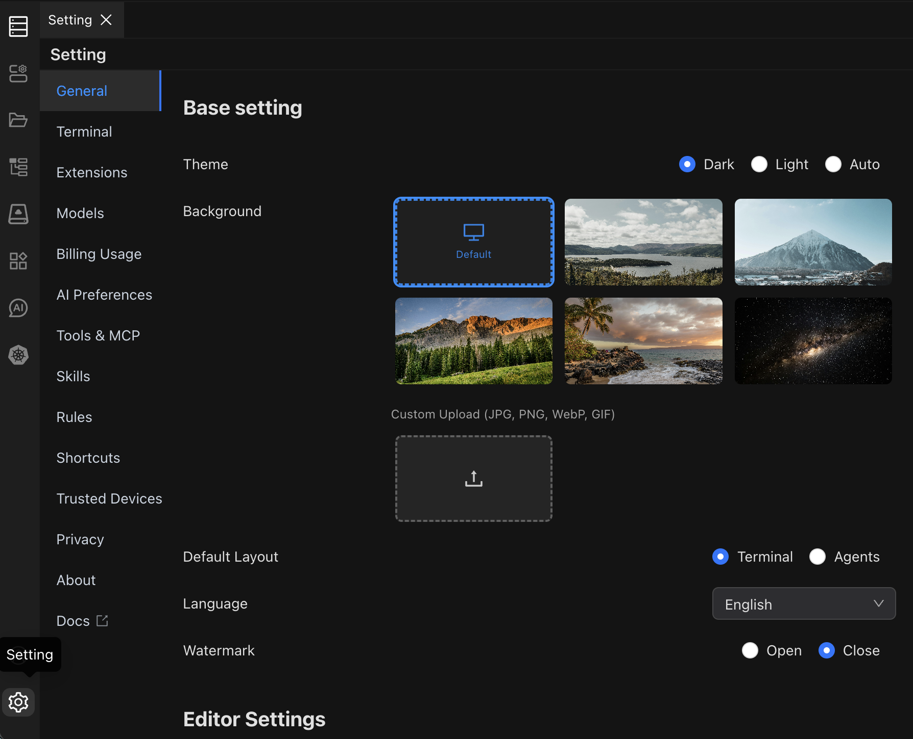

# General Settings

Customize Chaterm's appearance, language, layout, and editor behavior from General Settings.

## General Settings

| Setting | Options | Default | Description |
| --- | --- | --- | --- |
| **Theme** | Dark, Light, Follow System | Follow System | Controls the interface color scheme. Dark reduces eye strain in low light; Light is best in bright environments. |
| **Background** | Enable / Disable | Disable | When enabled, you can upload a custom background image or select a system-provided one. |
| **Layout** | Terminal Layout, Agents Layout | Terminal Layout | Terminal Layout uses a traditional terminal-first view. Agents Layout prioritizes the AI panel. |
| **Language** | English, Simplified Chinese, Traditional Chinese, Deutsch, Francais, Italiano, Portugues, Russian, Japanese, Korean, Arabic | English | Sets the interface language. Changes take effect immediately without restarting. |
| **Watermark** | Enable / Disable | Disable | Displays a watermark overlay on the interface when enabled. |

## Editor Settings

These settings control the built-in code and text editor.

| Setting | Options | Default | Description |
| --- | --- | --- | --- |
| **Font Size** | 8 -- 32 px | 14 | Font size used in the editor. |
| **Line Height** | 0 -- 48 | 0 (auto) | Spacing between lines. Set to 0 to let the editor calculate automatically. |
| **Font** | Preset monospace fonts | Cascadia Mono | Monospace font used in the editor. |
| **Tab Size** | 1 -- 8 spaces | 4 | Number of spaces inserted when pressing Tab. |
| **Word Wrap** | Enable / Disable | Disable | When enabled, long lines wrap to fit the editor width instead of scrolling horizontally. |
| **Minimap** | Enable / Disable | Enable | Shows a small overview of the file on the right side of the editor. |
| **Mouse Wheel Zoom** | Enable / Disable | Disable | When enabled, use `Ctrl` + mouse wheel (or `Cmd` + mouse wheel on macOS) to zoom the editor font. |

## See Also

- [Terminal Settings](/docs/settings/terminal/) -- configure terminal emulation, fonts, and cursor style
- [Shortcut Settings](/docs/settings/shortcuts/) -- view and customize keyboard shortcuts
