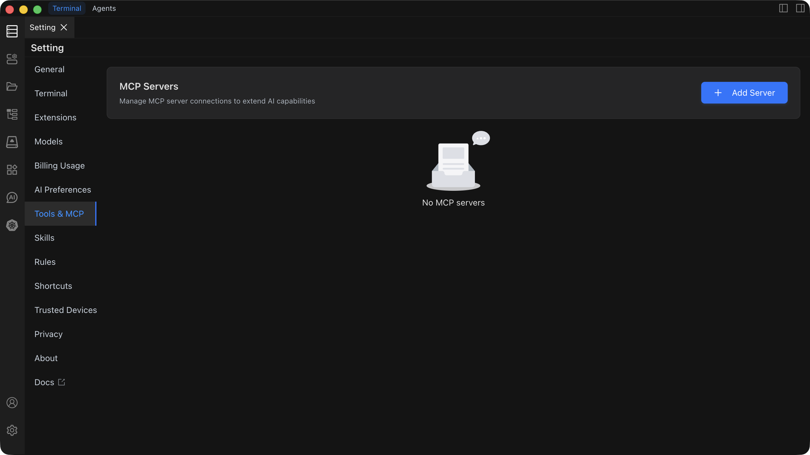

# MCP Settings

MCP (Model Context Protocol) settings are used to configure and manage MCP servers, enabling AI to access external data sources and tools, expanding AI's capability boundaries.

## Feature Overview

The MCP Settings page provides the following core features:

- **Add MCP Server**: Connect to enterprise knowledge bases (such as Notion, GitHub, etc.) or third-party services
- **Server Configuration**: Configure MCP server connection information, authentication parameters, etc.
- **Enable/Disable Control**: Flexibly control the enabled state of MCP servers
- **Tool and Resource Management**: View and manage tools and resources provided by MCP servers
- **Auto-approval Settings**: Configure tool auto-execution whitelist to improve efficiency

## Quick Start

### Adding an MCP Server

1. Find the `Tools & MCP` tab on the left side of the Settings page
2. Click `Add Server`, and the system will automatically open the `mcp_setting.json` file
3. Add a new server configuration in the editor (JSON format)
4. After saving, Chaterm will automatically read and attempt to connect to the server

### Server Types

MCP supports two types of servers:

- **STDIO Server**: Local command-line server that communicates through standard input/output
- **HTTP Server**: Remote service that connects through HTTP/HTTPS protocol

## Main Features

### Server Management

- **Connection Status Monitoring**: Real-time view of server connection status (connecting/connected/error)
- **Configuration Editing**: Edit server configuration directly in JSON files
- **Quick Enable/Disable**: Quickly control server state through switches

### Tool Management

- **Tool List**: View all tools provided by the server
- **Tool Toggle**: Enable/disable specific tools as needed to save token consumption
- **Parameter View**: View tool parameter descriptions and usage methods
- **Auto-approval**: Configure auto-approval for trusted tools to skip confirmation steps

### Resource Management

- **Resource Browsing**: View the resource list provided by the server
- **Resource Description**: Understand the purpose and URI of each resource
- **Direct Access**: Directly read resources in supported entry points

## Configuration Details

### Basic Configuration Items

- **type**: Connection type (stdio/http), can be omitted (system will automatically infer)
- **disabled**: Whether to disable this server
- **timeout**: Call timeout time (seconds)
- **autoApprove**: Auto-approval tool whitelist (by tool name)

### STDIO Server Configuration

Requires configuration of `command` and optional parameters such as `args`, `cwd`, `env`, etc.

### HTTP Server Configuration

Requires configuration of `url` and optional parameters such as `headers` (for authentication), etc.

## Usage Recommendations

- **Security**: Only add trusted tools to `autoApprove`, handle configurations containing credentials with caution
- **Performance Optimization**: Set appropriate `timeout` values based on network conditions (recommended 120-180 seconds)
- **Resource Management**: Reasonably close unused tools to reduce token consumption
- **Configuration Backup**: Regularly backup the `mcp_setting.json` configuration file

## Related Documentation

For detailed configuration instructions, troubleshooting, and best practices, please refer to the [MCP Usage Guide](/docs/mcp/usage/) documentation.
