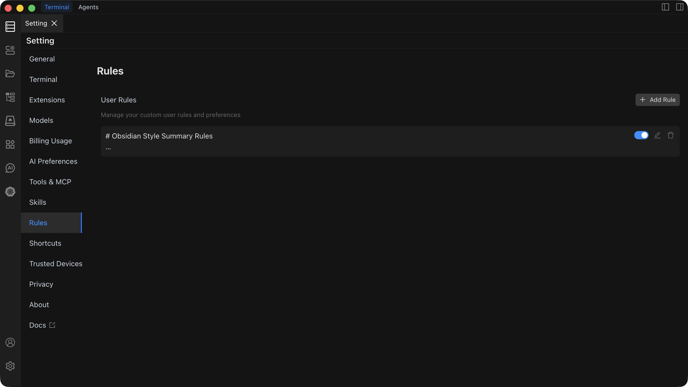

# Rules

The Rules feature manages your custom user rules and preferences, enhancing Chaterm's intelligence and work efficiency. By configuring personalized rules, you can customize the AI assistant's behavior patterns to better match your work habits and needs.



## Feature Overview

The Rules system is one of Chaterm's core features, allowing you to:

- **Customize AI Behavior**: Set the AI assistant's response style and work mode
- **Improve Work Efficiency**: Optimize AI assistant output quality through rule configuration
- **Personalized Experience**: Customize AI interaction methods according to personal preferences
- **Scenario Adaptation**: Configure dedicated rule sets for different work scenarios

## Rule Configuration

### Basic Settings

#### Response Language Settings

Configure the AI assistant's default response language:

| Option          | Description                         | Use Case                   |
| --------------- | ----------------------------------- | -------------------------- |
| **Chinese**     | Chinese response                    | Chinese work environment   |
| **English**     | English response                    | International projects     |
| **Auto Detect** | Automatically select based on input | Multi-language environment |

#### Tone Style Configuration

Set the AI assistant's communication style:

- **Professional**: Formal, rigorous business tone
- **Friendly**: Relaxed, warm communication style
- **Technical**: Professional, precise technical expression
- **Concise**: Direct, efficient information delivery

#### Output Format Requirements

Customize AI response format specifications:

- **Code Style**: Specify code indentation, naming conventions, etc.
- **Document Format**: Set Markdown, HTML, and other format preferences
- **Structured Output**: Configure structured displays such as lists, tables, etc.

### Security Rule Settings

Configure security-related behavior restrictions:

- **Command Execution Restrictions**: Prohibit execution of dangerous commands
- **File Access Control**: Restrict access to sensitive files
- **Network Operation Standards**: Control network request behavior

## Rule Management

### Create New Rules

1. **Enter Rules Settings Page**
   - Click the "Rules" option in the sidebar
   - Select the "Add Rule" button

2. **Configure Rule Content**
   - Enter rule content
   - Set rule enable/disable state
   - Save and test rule effects

3. **Rule Operations**
   - **Edit**: Modify existing rule content
   - **Delete**: Remove unnecessary rules
   - **Enable/Disable**: Control rule activation state

## Usage Examples

### Project Management Rules

```markdown
# Project Management Rules

- Task Decomposition: Break down complex tasks into manageable small tasks
- Progress Tracking: Regularly update project progress status
- Risk Assessment: Identify and assess project risks
```

### Development Team Rules

```markdown
# Development Team Rules

- Code Review: All code must be reviewed
- Commit Standards: Use unified commit message format
- Documentation Requirements: Important features must provide documentation
```

## Best Practices

### Rule Writing Recommendations

1. **Clear and Specific**: Rule descriptions should be clear and unambiguous
2. **Moderate Configuration**: Don't set too many conflicting rules
3. **Regular Optimization**: Adjust rule configuration based on usage effects
4. **Test and Verify**: Fully test new rule configurations

## Troubleshooting

### Common Issues

<details>
<summary><strong>Q: Rules not taking effect after configuration?</strong></summary>

A: Check rule priority settings, ensure rules are enabled, and test again after restarting the application.

</details>

<details>
<summary><strong>Q: How to delete unnecessary rules?</strong></summary>

A: Select the rule to delete on the Rules Management page, click the delete button and confirm the operation.

</details>

<details>
<summary><strong>Q: How to handle rule conflicts?</strong></summary>

A: The system will execute rules in priority order, with high-priority rules overriding low-priority rules.

</details>

---

> **Tip**: The Rules feature is an advanced feature of Chaterm. It's recommended to familiarize yourself with basic features first, then gradually configure personalized rules.
