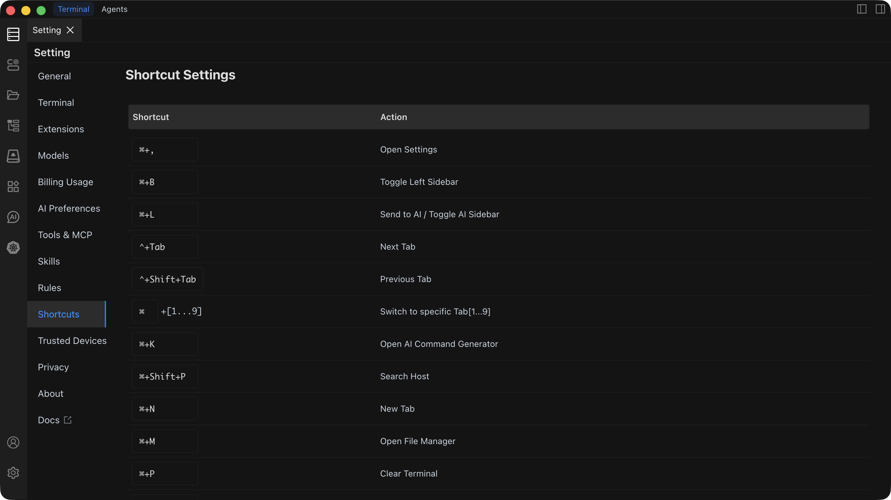

# Shortcut Settings

View, customize, and reset keyboard shortcuts to speed up your workflow.

## Default Shortcuts

### Interface Control

| Function | macOS | Windows / Linux |
| --- | --- | --- |
| Open Settings | `Command + ,` | `Ctrl + ,` |
| Toggle Left Sidebar | `Command + B` | `Ctrl + B` |
| Toggle Right Sidebar | `Command + Option + B` | `Ctrl + Alt + B` |
| Send to AI / Toggle AI Sidebar | `Command + L` | `Ctrl + L` |
| Toggle Layout (Terminal / Agents) | `Command + E` | `Ctrl + E` |
| Toggle Agents Layout Left Sidebar | `Command + Shift + S` | `Ctrl + Shift + S` |
| Toggle AI Mode | `Shift + Tab` | `Shift + Tab` |

### Terminal Operations

| Function | macOS | Windows / Linux |
| --- | --- | --- |
| Open AI Command Dialog | `Command + K` | `Ctrl + K` |
| Open File Management | `Command + M` | `Ctrl + M` |
| Clear Screen | `Command + P` | `Ctrl + P` |
| Terminal Search | `Command + F` | `Ctrl + F` |
| Copy | `Command + C` | `Ctrl + C` |
| Paste | `Command + V` | `Ctrl + V` |

### Tab Management

| Function | macOS | Windows / Linux |
| --- | --- | --- |
| Switch to Next Tab | `Control + Tab` | `Ctrl + Tab` |
| Switch to Previous Tab | `Control + Shift + Tab` | `Ctrl + Shift + Tab` |
| Switch to Tab [1-9] | `Command + [1-9]` | `Ctrl + [1-9]` |
| New Tab | `Command + N` | `Ctrl + N` |

### Font Control

| Function | macOS | Windows / Linux |
| --- | --- | --- |
| Zoom In | `Command + =` | `Ctrl + =` |
| Zoom Out | `Command + -` | `Ctrl + -` |

## Customizing a Shortcut

1. Open **Settings** and navigate to **Shortcut Settings**.
2. Find the function you want to rebind.
3. Click the shortcut input box next to it.
4. Press the new key combination you want to assign.
5. If the combination conflicts with another function, Chaterm displays a conflict warning -- choose a different combination or reassign the conflicting shortcut first.
6. The new shortcut is saved automatically.

::: tip
Choose uncommon key combinations to avoid conflicts with operating-system shortcuts. Custom shortcuts override the defaults listed above.
:::

## Resetting Shortcuts

1. Open **Settings** and navigate to **Shortcut Settings**.
2. Click **Reset All Shortcuts**.
3. Confirm the reset in the dialog.

All shortcuts return to their default values.

::: warning
Resetting shortcuts is irreversible. All custom shortcut assignments will be lost.
:::

## See Also

- [General Settings](/docs/settings/general/) -- theme, language, layout, and editor options
- [Terminal Operations](/docs/terminal/operations/) -- detailed guide to terminal features
