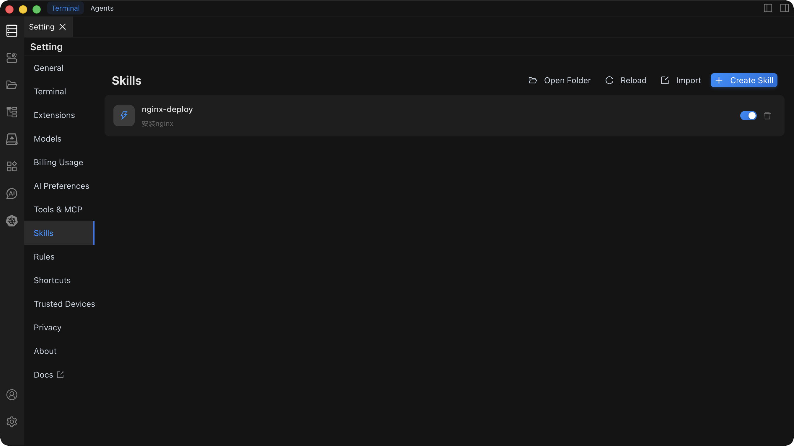
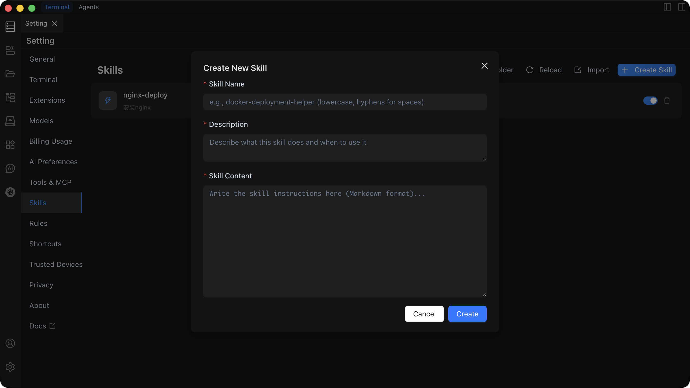

# Skills Settings

Skills settings let you configure and manage custom Skills so that the AI can follow your predefined workflows and instructions — turning it from a “general assistant” into your “domain expert”.



## Overview

The Skills settings page provides the following core capabilities:

- **Create Skill**: Define custom workflows and instruction sets.
- **Import Skill**: Import Skills from an existing `.zip` package.
- **Manage Skills**: Enable/disable, edit, and delete Skills.

## Get Started

### Create a New Skill



1. In the Settings page, open the `Skills` tab.
2. Click the **Create Skill** button.
3. Fill in the Skill information:
   - **Name**: Display name of the Skill.
   - **Description**: What the Skill does and when to use it.
   - **Skill Content**: Detailed workflow and instructions.
   - **Resource files** (optional): Related scripts, templates, or other files.
4. Click **Save**. The Skill is enabled automatically and injected into the AI context.

### Import a Skill

#### Option 1: Import from ZIP

1. In the `Skills` tab, click **Import**.
2. Select a `.zip` file that contains a `SKILL.md` file.
3. Confirm the import. The Skill is added to the list and enabled automatically.

#### Option 2: Import from Folder

1. In the `Skills` tab, click **Open Folder**.
2. Move a folder that contains a `SKILL.md` file into the opened `skills` directory.
3. Back in the `Skills` tab, click **Reload**. The Skill is added to the list and enabled automatically.

## SKILL.md Format

### Basic Structure

A standard `SKILL.md` should include the following structure:

```markdown
# Skill Name

## Description

Briefly explain what the Skill does and when to use it.

## Steps

1. First step
2. Second step
3. ...
```

## Related Documentation

For detailed usage, troubleshooting, and best practices, see:

- [Skills Usage Guide](/docs/skills/usage/) – Full usage instructions and examples.
- [Skills Troubleshooting](/docs/skills/troubleshooting/) – Common issues and solutions.
