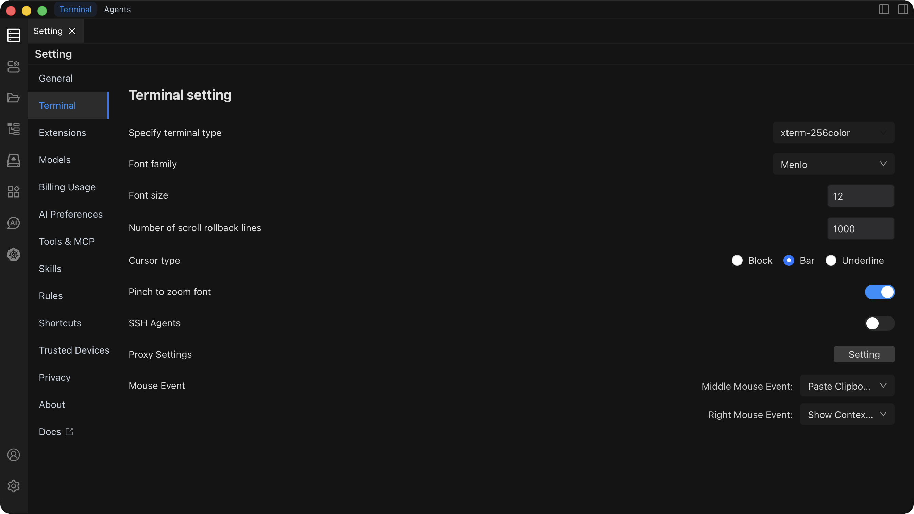

# Terminal Settings

Configure terminal emulation, fonts, cursor style, scrollback, and input behavior.

## Settings Overview

| Setting | Default | Description |
| --- | --- | --- |
| **Terminal Type** | xterm | Terminal emulator type. Options include xterm, vt100, and others. |
| **Font** | Monaco / Menlo | Monospace font used in the terminal. |
| **Font Size** | 14 px | Font size for terminal text. |
| **Scrollback** | 1000 lines | Number of lines kept in terminal history. |
| **Cursor Style** | Block | Cursor shape: Block, Underline, or Bar. |
| **Trackpad Zoom** | Disabled | Enable pinch-to-zoom gestures to resize terminal font. |
| **SSH Agents** | -- | SSH key agent and forwarding configuration. |
| **Proxy** | -- | Network proxy for terminal connections. |
| **Mouse Middle Button** | Paste | Action triggered by middle-click in the terminal. |
| **Mouse Right Button** | Context Menu | Action triggered by right-click in the terminal. |

::: tip Font Recommendation
Use a monospace font (e.g., Monaco, Menlo, Consolas, JetBrains Mono) to keep code and command output aligned. A font size of 12--14 px works well on most displays.
:::

::: warning Scrollback Memory Usage
High scrollback values consume more memory. For most workflows, 1000--5000 lines is sufficient. If you regularly inspect large log output, consider piping to a file or using terminal search (`Cmd + F` / `Ctrl + F`) instead.
:::

## SSH Agents

SSH Agent settings let you manage keys and enable agent forwarding for jump-host scenarios.

- **SSH Agent Forwarding** -- forwards your local SSH agent through remote connections, so you can authenticate to a second host without copying keys.
- **Key Management** -- add, remove, or reorder SSH keys used for connections.
- **Auto Authentication** -- after configuration, Chaterm uses the appropriate key automatically when connecting.

## Proxy Configuration

Route terminal connections through a network proxy.

| Field | Description |
| --- | --- |
| **Protocol** | HTTP, HTTPS, or SOCKS5. |
| **Address** | Hostname or IP of the proxy server. |
| **Port** | Port number of the proxy server. |
| **Username / Password** | Credentials, if the proxy requires authentication. |

::: warning
Proxy settings apply to all terminal connections. Incorrect configuration may prevent connections from succeeding. Verify the proxy address and port before saving.
:::

## See Also

- [General Settings](/docs/settings/general/) -- theme, language, layout, and editor options
- [Shortcut Settings](/docs/settings/shortcuts/) -- keyboard shortcuts for terminal operations and more
