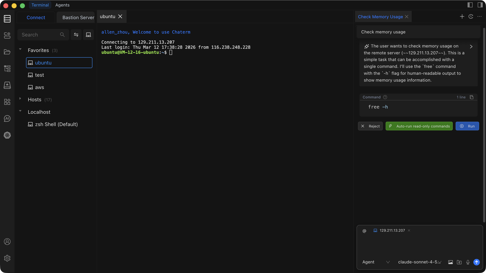

# Quick Start

::: info What you'll learn

- How to install Chaterm and sign in to your account
- How to add and connect to a remote host via SSH
- How to use AI-powered Command, and Agent modes
- How to run real-world tasks like system monitoring and log analysis
  :::

## Step 1: Install and Sign In

### Install Chaterm

Download the installer for your operating system. The button below auto-detects your platform.

<div id="smart-download-section" class="smart-download-container">
  <a id="smart-download-btn" href="/download/" class="smart-download-btn" style="display: none;">
    <span class="download-icon">⤓</span>
    <span id="download-btn-text">Download Chaterm</span>
  </a>
</div>

<script>
(function() {
  const URLS = {
    win: 'https://static-download.chaterm.net/chaterm-latest-setup-x64.exe',
    mac_arm: 'https://static-download.chaterm.net/chaterm-latest-macos-arm64.dmg',
    mac_x64: 'https://static-download.chaterm.net/chaterm-latest-macos-x64.dmg',
    linux_deb: 'https://static-download.chaterm.net/chaterm-latest-linux-amd64.deb',
    linux_universal: 'https://static-download.chaterm.net/chaterm-latest-linux-x86_64.AppImage',
  }

  function detectOS() {
    if (typeof window === 'undefined') return null

    const uaData = navigator.userAgentData
    const ua = (navigator.userAgent || '').toLowerCase()
    const platform = (navigator.platform || '').toLowerCase()

    if (uaData?.platform) {
      const p = uaData.platform.toLowerCase()
      if (p.includes('android')) return 'Android'
      if (p.includes('ios')) return 'iOS'
    }
    if (/android/i.test(ua)) return 'Android'

    const isIPad =
      platform === 'macintel' && typeof navigator.maxTouchPoints === 'number' && navigator.maxTouchPoints > 1
    if (/iphone|ipod|ipad/i.test(ua) || isIPad) return 'iOS'

    if (/windows|win32|win64|wow64/i.test(ua)) return 'Windows'

    if (!isIPad && (/mac|macintosh|darwin/i.test(ua) || platform.includes('mac'))) return 'macOS'

    if (/linux|x11/i.test(ua) && !/android/i.test(ua)) return 'Linux'

    return null
  }

  async function detectMacArch() {
    if (typeof window === 'undefined') return 'arm64'

    if (navigator.userAgentData?.getHighEntropyValues) {
      try {
        const { architecture } = await navigator.userAgentData.getHighEntropyValues(['architecture'])
        if (architecture === 'arm') return 'arm64'
        if (architecture) return 'x64'
      } catch {}
    }

    const ua = navigator.userAgent.toLowerCase()
    if (ua.includes('arm') || ua.includes('aarch64')) return 'arm64'
    if (ua.includes('x86_64') || ua.includes('amd64') || ua.includes('intel')) return 'x64'

    return 'arm64'
  }

  async function updateSmartDownload() {
    if (typeof window === 'undefined') return

    const os = detectOS()
    const downloadBtn = document.getElementById('smart-download-btn')
    const downloadBtnText = document.getElementById('download-btn-text')

    if (!os) {
      if (downloadBtn) downloadBtn.style.display = 'none'
      return
    }

    let label = os
    let url = null

    if (os === 'Windows') {
      label = 'Windows'
      url = URLS.win
    } else if (os === 'macOS') {
      const arch = await detectMacArch()
      if (arch === 'x64') {
        label = 'macOS (Intel)'
        url = URLS.mac_x64
      } else {
        label = 'macOS (Apple Silicon)'
        url = URLS.mac_arm
      }
    } else if (os === 'Linux') {
      label = 'Linux'
      url = URLS.linux_deb
    } else {
      // Android/iOS - redirect to download page
      label = os
      url = '/download/'
    }

    if (downloadBtn && url) {
      downloadBtn.href = url
      downloadBtn.target = '_blank'
      downloadBtn.style.display = 'inline-flex'
    }
    if (downloadBtnText) {
      downloadBtnText.textContent = 'Download ' + label + ' version'
    }
  }

  // Initialize when DOM is ready
  if (typeof window !== 'undefined' && typeof document !== 'undefined') {
    if (document.readyState === 'loading') {
      document.addEventListener('DOMContentLoaded', function() {
        setTimeout(updateSmartDownload, 100)
      })
    } else {
      setTimeout(updateSmartDownload, 100)
    }
  }
})()
</script>

<style>
.smart-download-container {
  text-align: left;
  margin: 1rem 0;
}

.smart-download-btn {
  display: inline-flex;
  align-items: center;
  justify-content: center;
  gap: 0.5rem;
  padding: 0.5rem 1.25rem;
  background: #374151;
  color: #ffffff !important;
  border-radius: 6px;
  text-decoration: none !important;
  font-weight: 500;
  font-size: 0.9rem;
  transition: all 0.2s ease;
  border: none;
  cursor: pointer;
}

.smart-download-btn:hover {
  background: #1f2937;
  color: #ffffff !important;
  transform: translateY(-1px);
}

.smart-download-btn span {
  color: #ffffff !important;
}

.download-icon {
  font-size: 1rem;
  line-height: 1;
  color: #ffffff !important;
}

@media (max-width: 768px) {
  .smart-download-btn {
    padding: 0.5rem 1rem;
    font-size: 0.85rem;
  }
}
</style>

Don't see your platform? Visit the [Downloads](/docs/start/downloads/) page for all available packages.

Open the downloaded installer and follow the on-screen prompts to complete installation. Launch Chaterm once it is ready.

### Sign In

Select one of the following sign-in methods:

- **Email verification code** -- Enter your email address, then enter the one-time code sent to your inbox.
- **Username and password** -- Enter your existing account credentials.
- **Third-party login** -- Click the Google, GitHub, or Apple ID button to authenticate.

::: tip First-time users
When you sign in with an email for the first time, Chaterm automatically creates a new account for you. No separate registration step is needed.
:::

::: warning Skipping sign-in
You can click **Skip** to use Chaterm without an account, but the uilt-in AI model requires you to log in before you can use it.
:::

## Step 2: Add a Host

Open the host management panel and add your first remote server. Below is a summary of the key fields.

| Field           | Description                   | Example         |
| --------------- | ----------------------------- | --------------- |
| **Label**       | A friendly name for this host | `my-web-server` |
| **Host**        | IP address or hostname        | `192.168.1.100` |
| **Port**        | SSH port number               | `22`            |
| **Username**    | SSH login user                | `root`          |
| **Auth Method** | Password or private key       | Password        |

For a full walkthrough with screenshots, see [Add a Personal Host](/docs/hosts/add-personal).

### Connect to a Host

Click any host in the host list to establish an SSH connection. A new terminal tab opens automatically once the connection succeeds.

## Step 3: Try AI Features



### Open the AI Conversation Panel

Use either of these methods:

1. **Click the AI icon** in the left sidebar.
2. **Press a keyboard shortcut** in the terminal:
   - macOS: `Cmd + L`
   - Windows/Linux: `Ctrl + L`

### Choose an Interaction Mode

Click **New Conversation**, then select the mode that fits your task:

| Mode        | When to use                             | Runs commands?         |
| ----------- | --------------------------------------- | ---------------------- |
| **Command** | Execute commands in the active terminal | Yes (current terminal) |
| **Agent**   | Operate across one or more hosts        | Yes (any host via `@`) |

Select a model from the model dropdown, then type your prompt and press Enter.

### Use In-Terminal AI Shortcuts

While working inside a terminal session, you have two fast paths to AI:

- **`Ctrl+K` / `Cmd+K`** -- Opens an inline prompt dialog. Type what you need and the AI generates a command.
- **`Ctrl+L` / `Cmd+L`** -- Opens the AI conversation panel with your current terminal context already attached.

::: tip Example with Ctrl+K
Press `Cmd+K`, type `show disk usage sorted by size`, and the AI returns:

```bash
du -sh /* 2>/dev/null | sort -rh | head -20
```

Press Enter to execute it directly in your terminal.
:::

## Try It Now

Copy and paste these prompts into the AI conversation panel to see Chaterm in action.

### Monitor system resources across hosts

```
@my-web-server Check CPU and memory usage. Flag anything above 80%.
```

**Expected output:** The AI runs `top`, `free -h`, and similar commands, then summarizes resource usage with a clear warning for any metric that exceeds 80%.

### Analyze recent error logs

```
@my-web-server Find ERROR lines in /var/log/syslog from the last 2 hours and group them by source.
```

**Expected output:** The AI runs `journalctl` or `grep` with appropriate time filters, then presents a grouped summary of errors with counts and timestamps.

### Clean up old temporary files

```
@my-web-server List all files in /tmp older than 7 days, show their total size, then delete them after confirmation.
```

**Expected output:** The AI first runs `find /tmp -mtime +7` to list matching files, shows you the list and total disk usage, then asks for your confirmation before executing the removal.

::: warning Always review before executing
In Command and Agent modes the AI can run real commands on your servers. Review each proposed command before confirming execution, especially for destructive operations like `rm`, `drop`, or `truncate`.
:::

## Next Steps

Now that you have Chaterm up and running, explore these areas to go deeper:

- **[AI Conversations](/docs/ai/dialogs/)** -- Learn about conversation history, context management, and multi-turn workflows.
- **[AI Model Settings](/docs/ai/llms/)** -- Configure which models to use and bring your own API keys.
- **[Host Management](/docs/hosts/)** -- Organize hosts, set up bastion/jump servers, and import/export configurations.
- **[Terminal Operations](/docs/terminal/operations/)** -- Master split panes, tabs, snippets, and other terminal features.
- **[MCP Integration](/docs/mcp/usage/)** -- Extend Chaterm with Model Context Protocol tools and servers.
- **[Keyboard Shortcuts](/docs/settings/shortcuts/)** -- Customize keybindings for faster navigation.
- **[Billing and Plans](/docs/settings/billing/)** -- Understand usage limits, upgrade options, and team plans.
