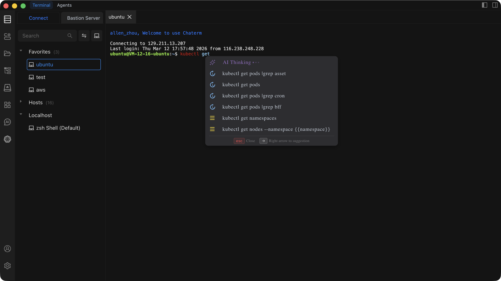

# Command Autocomplete

Chaterm suggests commands as you type in the terminal, helping you work faster and reducing typos by drawing from your history, a built-in command library, and optional AI suggestions.

## How It Works

Autocomplete combines three sources to generate suggestions:

- **Command History** -- prioritizes commands you have used on the current server, then supplements with frequently used commands from your other servers (cross-host recommendations).
- **Built-in Command Library** -- common Linux and shell commands are always available as suggestions.
- **AI Smart Suggestions (Optional)** -- generates context-aware command completions based on your current input.

Cross-host recommendations match the current server's usage patterns first, then fill in with related commands you frequently use on other servers.

## Usage

1. Start typing a command in the terminal. The autocomplete panel appears automatically.
2. Press `→` (right arrow) to enter selection mode.
3. Press `↑` / `↓` to navigate between suggestions.
4. Press `Enter` to confirm and insert the selected command.
5. Press `Esc` or `←` (left arrow) to exit selection mode or close the panel.

| Key       | Action                                    |
| --------- | ----------------------------------------- |
| `→`       | Enter selection mode                      |
| `↑` / `↓` | Navigate between suggestions             |
| `Enter`   | Confirm and insert the selected command   |
| `Esc`     | Close the autocomplete panel              |
| `←`       | Exit selection mode                       |

## Configuration

You can enable or disable autocomplete in **Settings > Extension Settings**:

- **Enabled** (recommended) -- shows autocomplete suggestions while you type.
- **Disabled** -- hides the autocomplete panel entirely; you type commands manually.

For details on locating this toggle, see [Extension Settings](/docs/settings/extensions/).

## FAQ

### The autocomplete panel is not showing up

- Confirm that **Autocomplete** is enabled in **Settings > Extension Settings**.
- Type at least one character and wait briefly for suggestions to appear.
- If the panel still does not appear, try restarting the terminal session.

### AI suggestions are not appearing

- AI suggestions require a network connection. Local autocomplete (history and built-in commands) continues to work offline.
- Check that AI features are enabled in your settings.

### Suggestions seem irrelevant

- Autocomplete improves over time as it learns from your command history.
- Cross-host suggestions may surface commands from other servers. If a suggestion does not apply, simply ignore it and keep typing.
