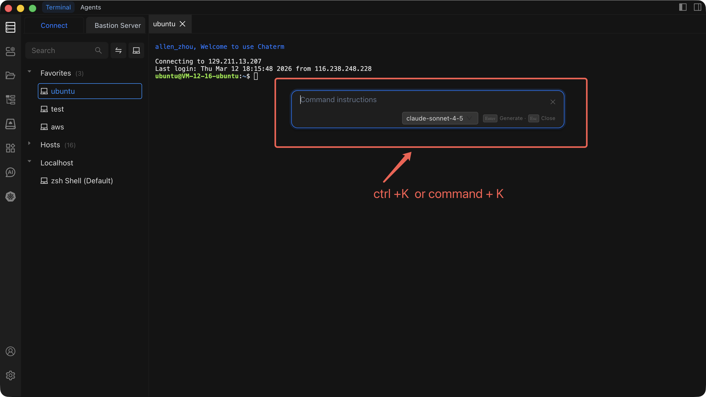
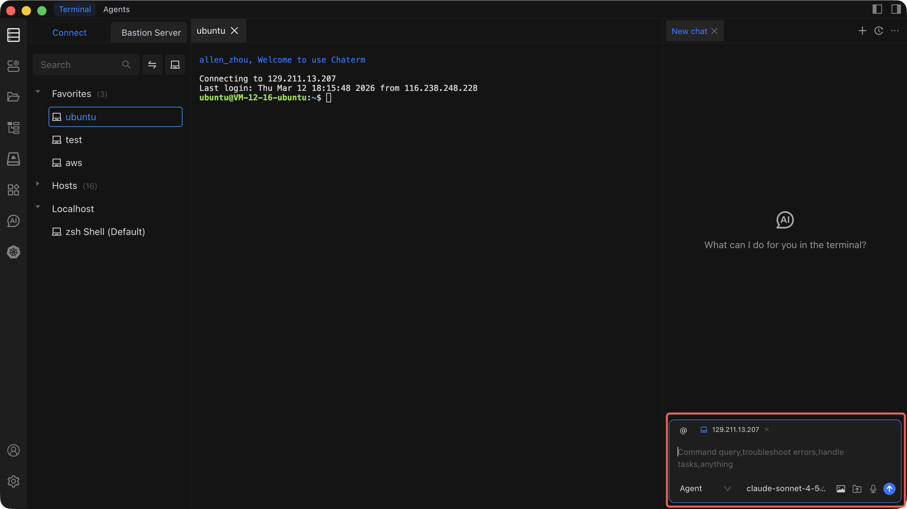

# Chat to AI

Chat to AI lets you interact with AI directly from the terminal to generate commands, troubleshoot issues, and plan complex tasks.

Chaterm provides two distinct AI interaction modes. Choose the one that fits your task:

| Mode                  | Shortcut                    | Best For                                      |
| --------------------- | --------------------------- | --------------------------------------------- |
| AI Command Dialog     | `Cmd + K` / `Ctrl + K`     | Quick, single-command generation               |
| AI Sidebar            | `Cmd + L` / `Ctrl + L`     | Complex tasks requiring context and conversation |

## Mode 1: AI Command Dialog (`Cmd + K` / `Ctrl + K`)

A lightweight popup that turns a plain-language request into a ready-to-run command. Use it when you know *what* you want to do but not the exact syntax.

### Steps

1. Press `Cmd + K` (macOS) or `Ctrl + K` (Windows/Linux) while in the terminal.
2. Type what you want to accomplish in plain language.
3. AI generates the corresponding command.
4. Review the command, then press Enter to insert it into the terminal.

### When to Use

- You need a command but cannot remember the flags or syntax.
- You want to perform a single, straightforward operation.
- You are looking up how to use a specific tool.

### Examples

| You Type                              | AI Generates                                      |
| ------------------------------------- | ------------------------------------------------- |
| "Find all `.log` files larger than 100MB" | `find / -name "*.log" -size +100M`               |
| "Show disk usage sorted by size"      | `du -sh /* \| sort -rh`                           |
| "Restart the nginx service"           | `sudo systemctl restart nginx`                    |
| "Compress the `/var/log` directory"   | `tar -czf /tmp/var-log-backup.tar.gz /var/log`    |

## Mode 2: AI Sidebar (`Cmd + L` / `Ctrl + L`)

A persistent sidebar that reads your terminal's context -- output history, working directory, and environment -- and lets you have a multi-turn conversation with AI. Use it when you need to plan, troubleshoot, or iterate.

### Steps

1. Press `Cmd + L` (macOS) or `Ctrl + L` (Windows/Linux) while in the terminal.
2. The sidebar opens and automatically captures the current terminal context.
3. Describe your task or ask a question.
4. AI analyzes the context and responds with suggestions or commands.
5. Continue the conversation to refine the plan, then execute commands step by step.

### What Context AI Reads

- Current terminal output and scrollback history.
- Current working directory.
- Terminal session environment information.

### When to Use

- A task requires multiple steps (e.g., deploying an application).
- You need to troubleshoot an error visible in the terminal output.
- You want to discuss trade-offs before executing commands.
- You need AI to understand what just happened in the session.

### Example: Troubleshooting a Failed Service

**Before (manual):**
You see `nginx.service: Failed` in the terminal. You manually run `journalctl`, read logs, edit config files, and restart -- guessing along the way.

**After (with AI Sidebar):**
1. Press `Cmd + L` to open the sidebar. AI sees the error output automatically.
2. Type: "Why did nginx fail to start?"
3. AI reads the terminal output, identifies the config syntax error, and suggests the fix.
4. You apply the fix and ask AI to verify: "Check if nginx config is valid now."
5. AI generates `nginx -t`, you run it, and AI confirms success.

## Shortcuts

| Function                          | macOS         | Windows/Linux |
| --------------------------------- | ------------- | ------------- |
| Open AI Command Dialog            | `Cmd + K`     | `Ctrl + K`    |
| Open / Toggle AI Sidebar          | `Cmd + L`     | `Ctrl + L`    |

## Tips

- **Be specific.** Instead of "fix this", say "the nginx config on line 42 has a syntax error -- suggest a fix."
- **Use the sidebar for multi-step work.** Let AI plan the steps, then execute them one at a time.
- **Save useful commands.** After AI generates a command you will reuse, save it as a [Command Snippet](/docs/terminal/snippets/) for one-click execution later.
- **Review before executing.** Always read AI-generated commands before running them, especially on production servers.

::: warning Security Notice

- Do not execute AI-generated commands that could cause data loss without reviewing them first.
- For sensitive operations, always confirm manually.
- Verify destructive commands in a test environment before running them in production.

:::

## Related

- [AI Dialogs](/docs/ai/dialogs/) -- more details on AI dialog configuration and capabilities.
- [Command Snippets](/docs/terminal/snippets/) -- save and reuse commands generated by AI.
