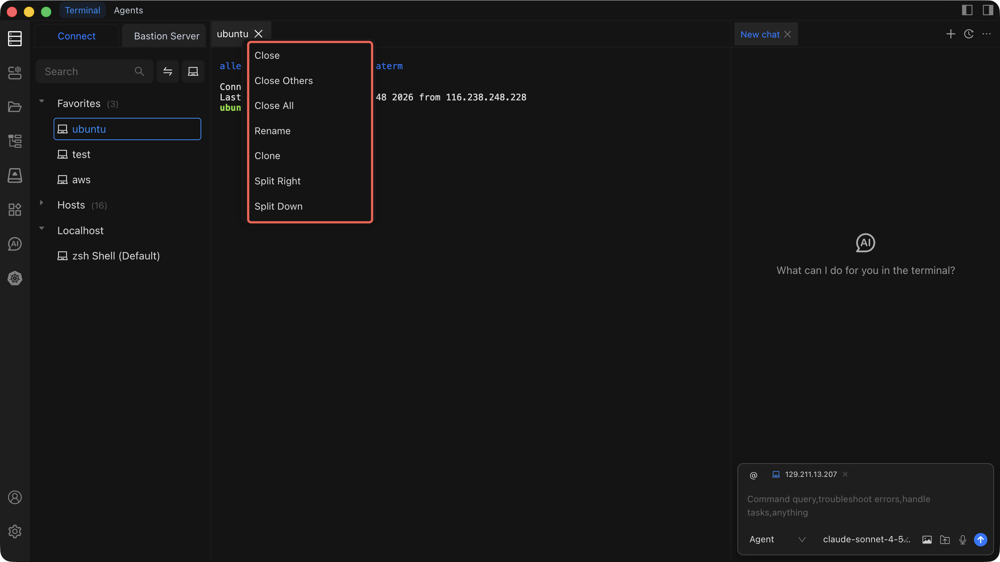

# Terminal Management

Manage multiple terminal sessions, organize your workspace with tabs and splits, and keep your workflow efficient.

## Tab Menu Bar Actions

Right-click a tab or use the tab menu bar to access the following actions:

| Action           | What It Does                                         | When to Use It                                                    |
| ---------------- | ---------------------------------------------------- | ----------------------------------------------------------------- |
| **Close**        | Closes the current terminal session                  | When you are done with a task and no longer need the session      |
| **Close Others** | Closes every session except the one currently focused | When your workspace is cluttered and you want to keep one session |
| **Close All**    | Closes all open terminal sessions                    | When you are switching contexts or ending your work               |
| **Clone**        | Duplicates the current session into a new tab        | When you need a second session on the same host                   |
| **Split Right**  | Creates a horizontal split pane to the right          | When you want side-by-side terminals (e.g., logs + commands)      |
| **Split Down**   | Creates a vertical split pane below                   | When you want stacked terminals (e.g., monitoring + operations)   |

## Right-Click Menu Functions

Right-click anywhere inside the terminal to access a context menu with the following options:

### Basic Operations

| Function         | Description                                              |
| ---------------- | -------------------------------------------------------- |
| **Copy**         | Copy the selected text to the clipboard                  |
| **Paste**        | Paste clipboard content into the terminal                |
| **Search**       | Open the search bar to find text in the terminal output  |
| **Clear**        | Clear all visible output in the current terminal         |
| **File Manager** | Open a file manager rooted at the terminal's working directory |
| **Font Size**    | Scale the terminal font size up or down                  |

### Connection Management

| Function          | Description                                        |
| ----------------- | -------------------------------------------------- |
| **Disconnect**    | Disconnect the current terminal's SSH connection   |
| **New Terminal**  | Open a brand-new terminal session                  |
| **Close Terminal**| Close the current terminal session                 |

### Split Operations

| Function        | Description                         |
| --------------- | ----------------------------------- |
| **Split Right** | Create a horizontal split pane      |
| **Split Down**  | Create a vertical split pane        |

## Tips for Managing Terminals

1. **Use splits for related tasks** -- keep logs on one side and commands on the other. See [Terminal Operations](/docs/terminal/operations/) for details on splitting.
2. **Rename tabs** -- right-click a tab and rename it so you can quickly identify sessions.
3. **Close what you do not need** -- unused sessions consume resources. Use **Close Others** or **Close All** to tidy up.
4. **Use AI to help** -- let [Chat to AI](/docs/terminal/chattoai/) generate commands so you can focus on results instead of syntax.

::: warning Important Notice

- Terminal operations require appropriate permissions on the remote host.
- Always review commands before executing them, especially on production servers.
- Verify risky operations in a test environment first.

:::
