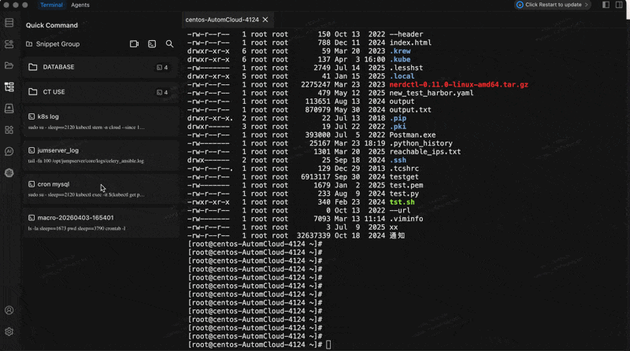
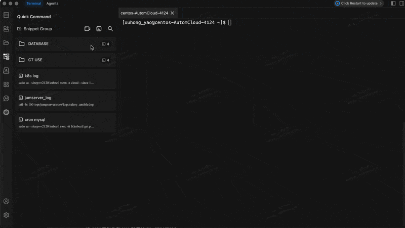

# Command Snippets

Save frequently used commands as reusable snippets and execute them with a single click from the terminal's snippet bar.

## Using Command Snippets

The snippet bar appears above the terminal input area. Each snippet displays a name and an execute button. Click the button to insert the command into the terminal, then press Enter to run it.

## Creating a Snippet

### Step by Step

1. Open the snippet manager from the snippet bar.
2. Click **Create Snippet** (or the "+" button).
3. Fill in the fields:
   - **Name** -- a short, descriptive label (e.g., "Check disk usage").
   - **Group** -- assign the snippet to a group for organization (e.g., "Monitoring", "Deployment").
   - **Command** -- the shell command or multi-command script to execute.
4. Save the snippet. It now appears in the snippet bar.

### Example Snippets

Here are practical snippets worth creating:

| Name                   | Command                                              | Purpose                                      |
| ---------------------- | ---------------------------------------------------- | -------------------------------------------- |
| Disk Usage             | `df -h`                                              | Quick check of filesystem usage              |
| Top Memory Processes   | `ps aux --sort=-%mem \| head -20`                    | Find the top 20 memory-consuming processes   |
| Tail App Logs          | `tail -f /var/log/app/application.log`               | Live-follow application logs                 |
| Restart Nginx          | `sudo systemctl restart nginx && sudo systemctl status nginx` | Restart and verify nginx status      |
| Backup Config          | `cp /etc/nginx/nginx.conf /etc/nginx/nginx.conf.bak` | Back up a config file before editing         |
| Docker Cleanup         | `docker system prune -af --volumes`                  | Remove unused Docker images, containers, and volumes |

## Macro Recording

## Macro Recording

## Use Cases

Instead of typing commands manually, you can record a sequence of terminal operations and save them as a snippet automatically.

### How to Record a Macro

1. Click the **Record** button in the snippet bar to start recording.
2. Execute the commands you want to capture in the terminal as you normally would.
3. Click **Stop Recording** when you are finished.
4. Chaterm generates a snippet from the recorded commands.
5. Give the snippet a name and group, then save it.

Macro recording is especially useful for capturing multi-step workflows that you perform regularly, such as deployment sequences or environment setup routines.

## Managing Snippets

### Command Groups

Organize snippets into groups to keep them manageable:

- **Monitoring** -- system status, logs, resource usage.
- **Deployment** -- build, deploy, rollback commands.
- **Database** -- backup, restore, query commands.
- **Networking** -- connectivity checks, firewall rules.

### Editing and Deleting

- Click on a snippet to edit its name, group, or command.
- Delete snippets you no longer need to keep the snippet bar clean.

## Tips

- **Combine with AI.** Use [Chat to AI](/docs/terminal/chattoai/) to generate a command, then save it as a snippet for future use.
- **Use multi-command snippets.** Chain commands with `&&` to create reliable multi-step operations (the chain stops if any command fails).
- **Name snippets clearly.** Use descriptive names so you can identify them at a glance in the snippet bar.
- **Avoid storing secrets.** Never put passwords, tokens, or API keys directly in a snippet. Use environment variables or secret managers instead.

::: warning Security Notice

- Review snippet commands before executing them, especially after editing.
- Avoid including sensitive information (passwords, tokens) in command snippets.
- Verify destructive commands in a test environment before running them in production.
- Regularly audit your snippets and remove those you no longer need.

:::
